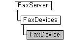

# FaxDevice object

The **FaxDevice** configuration object is used by a fax client application to retrieve and set fax device information, and to add and remove fax routing methods associated with a fax device. The object also includes methods to retrieve and set extension configuration properties stored at the device level. The **FaxDevice** object represents a single device associated with a fax server.

## Members

The **FaxDevice** object has these types of members:

-   [Methods](#methods)
-   [Properties](#properties)

### Methods

The **FaxDevice** object has these methods.

| Method                                                                  | Description                                                                                                                                                                                                                                                                                     |
|:------------------------------------------------------------------------|:------------------------------------------------------------------------------------------------------------------------------------------------------------------------------------------------------------------------------------------------------------------------------------------------|
| [**AnswerCall**](-mfax-faxdevice-answercall-vb.md)                     | The [**AnswerCall**](-mfax-faxdevice-answercall-vb.md) method causes the fax device to answer an incoming call.                                                                                                                                                                      |
| [**GetExtensionProperty**](-mfax-faxdevice-getextensionproperty-vb.md) | The [**GetExtensionProperty**](-mfax-faxdevice-getextensionproperty-vb.md) method retrieves an extension configuration property stored at the device level.                                                                                                                          |
| [**Refresh**](-mfax-faxdevice-refresh-vb.md)                           | The [**Refresh**](-mfax-faxdevice-refresh-vb.md) method refreshes **FaxDevice** object information from the fax server. When the **Refresh** method is called, any configuration changes made after the last [**Save**](-mfax-faxdevice-save-vb.md) method call are lost.           |
| [**Save**](-mfax-faxdevice-save-vb.md)                                 | The [**Save**](-mfax-faxdevice-save-vb.md) method saves the **FaxDevice** object's data.                                                                                                                                                                                             |
| [**SetExtensionProperty**](-mfax-faxdevice-setextensionproperty-vb.md) | The [**SetExtensionProperty**](-mfax-faxdevice-setextensionproperty-vb.md) method stores an extension configuration property at the device level.                                                                                                                                    |
| [**UseRoutingMethod**](-mfax-faxdevice-useroutingmethod-vb.md)         | The [**UseRoutingMethod**](-mfax-faxdevice-useroutingmethod-vb.md) method adds an inbound fax routing method to or removes a fax routing method ([**FaxInboundRoutingMethod**](-mfax-faxinboundroutingmethod.md)) from the list of routing methods associated with the fax device.  |

 

### Properties

The **FaxDevice** object has these properties.

<table>
<colgroup>
<col style="width: 33%" />
<col style="width: 33%" />
<col style="width: 33%" />
</colgroup>
<thead>
<tr class="header">
<th style="text-align: left;">Property</th>
<th style="text-align: left;">Access type</th>
<th style="text-align: left;">Description</th>
</tr>
</thead>
<tbody>
<tr class="odd">
<td style="text-align: left;">[<strong>CSID</strong>](-mfax-faxdevice-csid-vb.md) </td>
<td style="text-align: left;">Read/write </td>
<td style="text-align: left;">The [<strong>CSID</strong>](-mfax-faxdevice-csid-vb.md) property is a null-terminated string that contains the CSID for the device. </td>
</tr>
<tr class="even">
<td style="text-align: left;">[<strong>Description</strong>](-mfax-faxdevice-description-vb.md) </td>
<td style="text-align: left;">Read/write </td>
<td style="text-align: left;">The [<strong>Description</strong>](-mfax-faxdevice-description-vb.md) property is a null-terminated string that contains a user-friendly description for the fax device. This string is suitable for display to users. </td>
</tr>
<tr class="odd">
<td style="text-align: left;">[<strong>DeviceName</strong>](-mfax-faxdevice-devicename-vb.md) </td>
<td style="text-align: left;">Read-only </td>
<td style="text-align: left;">The [<strong>DeviceName</strong>](-mfax-faxdevice-devicename-vb.md) property is a null-terminated string that contains the name of the fax device. </td>
</tr>
<tr class="even">
<td style="text-align: left;">[<strong>Id</strong>](-mfax-faxdevice-id-vb.md) </td>
<td style="text-align: left;">Read-only </td>
<td style="text-align: left;">The [<strong>Id</strong>](-mfax-faxdevice-id-vb.md) is a numeric value that uniquely identifies a fax device. </td>
</tr>
<tr class="odd">
<td style="text-align: left;">[<strong>PoweredOff</strong>](-mfax-faxdevice-poweredoff-vb.md) </td>
<td style="text-align: left;">Read-only </td>
<td style="text-align: left;">The [<strong>PoweredOff</strong>](-mfax-faxdevice-poweredoff-vb.md) property is a Boolean value that indicates whether the fax device is currently available for sending and receiving faxes. </td>
</tr>
<tr class="even">
<td style="text-align: left;">[<strong>ProviderUniqueName</strong>](-mfax-faxdevice-provideruniquename-vb.md) </td>
<td style="text-align: left;">Read-only </td>
<td style="text-align: left;">The [<strong>ProviderUniqueName</strong>](-mfax-faxdevice-provideruniquename-vb.md) property is a null-terminated string that contains the unique name for the FSP associated with the device. </td>
</tr>
<tr class="odd">
<td style="text-align: left;">[<strong>ReceiveMode</strong>](-mfax-faxdevice-receivemode.md) </td>
<td style="text-align: left;">Read/write </td>
<td style="text-align: left;">The [<strong>ReceiveMode</strong>](-mfax-faxdevice-receivemode.md) property is a value from the [<strong>FAX_DEVICE_RECEIVE_MODE_ENUM</strong>](-mfax-fax-device-receive-mode-enum.md) enumeration that defines the way a device answers an incoming call. The value assigned to this property indicates whether the device does not answer the call, the device can answer the call manually, or the device answers the call automatically. </td>
</tr>
<tr class="even">
<td style="text-align: left;">[<strong>ReceivingNow</strong>](-mfax-faxdevice-receivingnow-vb.md) </td>
<td style="text-align: left;">Read/write </td>
<td style="text-align: left;">The [<strong>ReceivingNow</strong>](-mfax-faxdevice-receivingnow-vb.md) property is a Boolean value that indicates whether the fax device is receiving a fax at the moment the property is retrieved (the status could change immediately thereafter). </td>
</tr>
<tr class="odd">
<td style="text-align: left;">[<strong>RingingNow</strong>](-mfax-faxdevice-ringingnow-vb.md) </td>
<td style="text-align: left;">Read-only </td>
<td style="text-align: left;">The [<strong>RingingNow</strong>](-mfax-faxdevice-ringingnow-vb.md) property is a Boolean value that indicates whether the fax device is ringing at the moment the property is retrieved (the status could change immediately thereafter). </td>
</tr>
<tr class="even">
<td style="text-align: left;">[<strong>RingsBeforeAnswer</strong>](-mfax-faxdevice-ringsbeforeanswer-vb.md) </td>
<td style="text-align: left;">Read/write </td>
<td style="text-align: left;">The [<strong>RingsBeforeAnswer</strong>](-mfax-faxdevice-ringsbeforeanswer-vb.md) property is a number that specifies the number of rings that occur before the fax device answers an incoming fax call. </td>
</tr>
<tr class="odd">
<td style="text-align: left;">[<strong>SendEnabled</strong>](-mfax-faxdevice-sendenabled-vb.md) </td>
<td style="text-align: left;">Read/write </td>
<td style="text-align: left;">The [<strong>SendEnabled</strong>](-mfax-faxdevice-sendenabled-vb.md) property is a Boolean value that indicates whether the fax device is enabled for sending faxes. </td>
</tr>
<tr class="even">
<td style="text-align: left;">[<strong>SendingNow</strong>](-mfax-faxdevice-sendingnow-vb.md) </td>
<td style="text-align: left;">Read-only </td>
<td style="text-align: left;">The [<strong>SendingNow</strong>](-mfax-faxdevice-sendingnow-vb.md) property is a Boolean value that indicates whether the fax device is sending a fax at the moment the property is retrieved (the status could change immediately thereafter).  
<blockquote>
[!Note] 
The value of this property is set at the time that the <strong>FaxDevice</strong> object is created and is refreshed when you call the [<strong>Refresh</strong>](-mfax-faxdevice-refresh-vb.md) method.
</blockquote>
 </td>
</tr>
<tr class="odd">
<td style="text-align: left;">[<strong>TSID</strong>](-mfax-faxdevice-tsid-vb.md) </td>
<td style="text-align: left;">Read/write </td>
<td style="text-align: left;">The [<strong>TSID</strong>](-mfax-faxdevice-tsid-vb.md) property is a null-terminated string that contains the TSID for the device. </td>
</tr>
<tr class="even">
<td style="text-align: left;">[<strong>UsedRoutingMethods</strong>](-mfax-faxdevice-usedroutingmethods-vb.md) </td>
<td style="text-align: left;">Read-only </td>
<td style="text-align: left;">The [<strong>UsedRoutingMethods</strong>](-mfax-faxdevice-usedroutingmethods-vb.md) property is an array of strings that contains the GUIDs associated with the routing methods that the device uses, where each GUID represents an inbound routing method ([<strong>FaxInboundRoutingMethod</strong>](-mfax-faxinboundroutingmethod.md)). </td>
</tr>
</tbody>
</table>

 

## Remarks

A **FaxDevice** object is accessed through a [**FaxDevices**](-mfax-faxdevices.md) object.

> [!Note]  
> Changes made to the **FaxDevice** object will not be saved until you call the [**Save**](-mfax-faxdevice-save-vb.md) method.

 

To create a **FaxDevice** object in Microsoft Visual Basic, call the [**Item**](-mfax-faxdevices-item.md) or [**get\_ItemById**](-mfax-faxdevices-itembyid.md) property of the [**FaxDevices**](-mfax-faxdevices.md) object.

To create a **FaxDevice** object in C++, call the [**Item**](-mfax-faxdevices-item.md) or [**get\_ItemById**](-mfax-faxdevices-itembyid.md) method.

When the properties [**PoweredOff**](-mfax-faxdevice-poweredoff-vb.md), [**ReceivingNow**](-mfax-faxdevice-receivingnow-vb.md), [**SendingNow**](-mfax-faxdevice-sendingnow-vb.md), and [**RingingNow**](-mfax-faxdevice-ringingnow-vb.md) are all **False**, then the fax device is active and idle.

## Requirements

|                                     |                                                                                         |
|-------------------------------------|-----------------------------------------------------------------------------------------|
| Minimum supported client  | Windows XP \[desktop apps only\]                                              |
| Minimum supported server  | Windows Server 2003 \[desktop apps only\]                                     |
| Header                    | <dl> <dt>Faxcomex.h</dt> </dl>   |
| DLL                       | <dl> <dt>Fxscomex.dll</dt> </dl> |
| IID                       | CLSID\_FaxDevice                                                              |

## See also

<dl> <dt>

[Fax Service object hierarchy](-mfax-fax-service-extended-com-object-model.md)
</dt> <dt>

[**IFaxDevice**](-mfax-faxdevice-cpp.md)
</dt> </dl>

 

 

