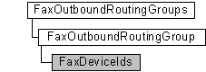

# FaxDeviceIds object

The **FaxDeviceIds** configuration collection is used by a fax client application to enumerate the ordered fax device IDs associated with a [**FaxOutboundRoutingGroup**](-mfax-faxoutboundroutinggroup.md) object. The collection includes methods to add, remove, and change the order of devices. The order of the devices in the collection determines the relative order in which available fax devices send outgoing transmissions.

## Members

The **FaxDeviceIds** object has these types of members:

-   [Methods](#methods)
-   [Properties](#properties)

### Methods

The **FaxDeviceIds** object has these methods.

| Method                                             | Description                                                                                                                                        |
|:---------------------------------------------------|:---------------------------------------------------------------------------------------------------------------------------------------------------|
| [**Add**](-mfax-faxdeviceids-add-vb.md)           | The [**Add**](-mfax-faxdeviceids-add-vb.md) method adds a fax device to the **FaxDeviceIds** collection, using the device's ID.         |
| [**Remove**](-mfax-faxdeviceids-remove-vb.md)     | The [**Remove**](-mfax-faxdeviceids-remove-vb.md) method removes an item from the **FaxDeviceIds** collection.                          |
| [**SetOrder**](-mfax-faxdeviceids-setorder-vb.md) | The [**SetOrder**](-mfax-faxdeviceids-setorder-vb.md) method changes the order of a device in the ordered **FaxDeviceIds** collection.  |

 

### Properties

The **FaxDeviceIds** object has these properties.

| Property                                                | Access type           | Description                                                                                                                                                                                                      |
|:--------------------------------------------------------|:----------------------|:-----------------------------------------------------------------------------------------------------------------------------------------------------------------------------------------------------------------|
| [**Count**](-mfax-faxdeviceids-count-vb.md)  | Read-only   | The [**Count**](-mfax-faxdeviceids-count-vb.md) property represents the number of objects in the **FaxDeviceIds** collection. This is the total number of device IDs associated with the fax server.  |
| [**Item**](-mfax-faxdeviceids-item.md)       | Read/write  | The [**Item**](-mfax-faxdeviceids-item.md) property represents a device ID from the **FaxDeviceIds** collection.                                                                                      |

 

## Remarks

A **FaxDeviceIds** object is accessed through a [**FaxOutboundRoutingGroup**](-mfax-faxoutboundroutinggroup.md) object.

To create a **FaxDeviceIds** object in Microsoft Visual Basic, call the [**DeviceIds**](-mfax-faxoutboundroutinggroup-deviceids.md) property of the [**FaxOutboundRoutingGroup**](-mfax-faxoutboundroutinggroup.md) object.

To create a **FaxDeviceIds** object in C++, call the [**DeviceIds**](-mfax-faxoutboundroutinggroup-deviceids.md) method.

## Requirements

|                                     |                                                                                         |
|-------------------------------------|-----------------------------------------------------------------------------------------|
| Minimum supported client  | Windows XP \[desktop apps only\]                                              |
| Minimum supported server  | Windows Server 2003 \[desktop apps only\]                                     |
| Header                    | <dl> <dt>Faxcomex.h</dt> </dl>   |
| DLL                       | <dl> <dt>Fxscomex.dll</dt> </dl> |
| IID                       | CLSID\_FaxDeviceIds                                                           |

## See also

<dl> <dt>

[Fax Service object hierarchy](-mfax-fax-service-extended-com-object-model.md)
</dt> <dt>

[**IFaxDeviceIds**](/previous-versions/windows/desktop/api/FaxComex/nn-faxcomex-ifaxdeviceids)
</dt> </dl>

 

 

