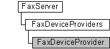

# FaxDeviceProvider object

The **FaxDeviceProvider** configuration object is used by a fax client application to retrieve information about a fax service provider (FSP) registered with the fax service.

## Members

The **FaxDeviceProvider** object has these types of members:

-   [Properties](#properties)

### Properties

The **FaxDeviceProvider** object has these properties.

| Property                                                                           | Access type          | Description                                                                                                                                                                                                                                                                       |
|:-----------------------------------------------------------------------------------|:---------------------|:----------------------------------------------------------------------------------------------------------------------------------------------------------------------------------------------------------------------------------------------------------------------------------|
| [**Debug**](-mfax-faxdeviceprovider-debug-vb.md)                        | Read-only  | The [**Debug**](-mfax-faxdeviceprovider-debug-vb.md) property is a Boolean value that indicates whether the FSP DLL was created in a debug environment.                                                                                                                |
| [**DeviceIds**](-mfax-faxdeviceprovider-deviceids-vb.md)                | Read-only  | The [**DeviceIds**](-mfax-faxdeviceprovider-deviceids-vb.md) property returns a variant safe array of long (VT\_I4 \| VT\_ARRAY). Each long value in the array is a device ID.                                                                                         |
| [**FriendlyName**](-mfax-faxdeviceprovider-friendlyname-vb.md)          | Read-only  | The [**FriendlyName**](-mfax-faxdeviceprovider-friendlyname-vb.md) property is a null-terminated string that contains the user-friendly name for the FSP. This string is suitable for display to users.                                                                |
| [**ImageName**](-mfax-faxdeviceprovider-imagename-vb.md)                | Read-only  | The [**ImageName**](-mfax-faxdeviceprovider-imagename-vb.md) property is a null-terminated string that contains the executable image name (DLL path and file name) of the FSP.                                                                                         |
| [**InitErrorCode**](-mfax-faxdeviceprovider-initerrorcode-vb.md)        | Read-only  | The [**InitErrorCode**](-mfax-faxdeviceprovider-initerrorcode-vb.md) property is a value that specifies the last error code that the FSP returned while the fax service was loading and initializing the FSP DLL. This may be an HRESULT value or a Win32 error code.  |
| [**MajorBuild**](-mfax-faxdeviceprovider-majorbuild-vb.md)              | Read-only  | The [**MajorBuild**](-mfax-faxdeviceprovider-majorbuild-vb.md) property is a value that specifies the major part of the build number for the FSP DLL.                                                                                                                  |
| [**MajorVersion**](-mfax-faxdeviceprovider-majorversion-vb.md)          | Read-only  | The [**MajorVersion**](-mfax-faxdeviceprovider-majorversion-vb.md) property is a value that specifies the major part of the version number for the FSP DLL.                                                                                                            |
| [**MinorBuild**](-mfax-faxdeviceprovider-minorbuild-vb.md)              | Read-only  | The [**MinorBuild**](-mfax-faxdeviceprovider-minorbuild-vb.md) property is a value that specifies the minor part of the build number for the FSP DLL.                                                                                                                  |
| [**MinorVersion**](-mfax-faxdeviceprovider-minorversion-vb.md)          | Read-only  | The [**MinorVersion**](-mfax-faxdeviceprovider-minorversion-vb.md) property is a value that specifies the minor part of the version number for the FSP DLL.                                                                                                            |
| [**Status**](-mfax-faxdeviceprovider-status-vb.md)                      | Read-only  | The [**Status**](/previous-versions/windows/desktop/api/FaxComex/nf-faxcomex-ifaxdeviceprovider-get_status) property is a number that indicates whether the FSP loaded and initialized successfully.                                                                                                                           |
| [**TapiProviderName**](-mfax-faxdeviceprovider-tapiprovidername-vb.md)  | Read-only  | The [**TapiProviderName**](-mfax-faxdeviceprovider-tapiprovidername-vb.md) property is a null-terminated string that contains the name of the TSP associated with the FSP fax devices.                                                                                 |
| [**UniqueName**](-mfax-faxdeviceprovider-uniquename-vb.md)              | Read-only  | The [**UniqueName**](-mfax-faxdeviceprovider-uniquename-vb.md) property is a null-terminated string that contains the unique name that identifies the FSP.                                                                                                             |

 

## Remarks

A **FaxDeviceProvider** object is accessed through a [**FaxDeviceProviders**](-mfax-faxdeviceproviders.md) object.

To create a **FaxDeviceProvider** object in Microsoft Visual Basic, call the [**Item**](-mfax-faxdeviceproviders-item.md) property of the [**FaxDeviceProviders**](-mfax-faxdeviceproviders.md) object.

To create a **FaxDeviceProvider** object in C++, call the [**get\_Item**](/previous-versions/windows/desktop/api/FaxComex/nf-faxcomex-ifaxdeviceproviders-get_item) method.

## Requirements

|                                     |                                                                                         |
|-------------------------------------|-----------------------------------------------------------------------------------------|
| Minimum supported client  | Windows XP \[desktop apps only\]                                              |
| Minimum supported server  | Windows Server 2003 \[desktop apps only\]                                     |
| Header                    | <dl> <dt>Faxcomex.h</dt> </dl>   |
| DLL                       | <dl> <dt>Fxscomex.dll</dt> </dl> |
| IID                       | CLSID\_FaxDeviceProvider                                                      |

## See also

<dl> <dt>

[Fax Service object hierarchy](-mfax-fax-service-extended-com-object-model.md)
</dt> <dt>

[**IFaxDeviceProvider**](/previous-versions/windows/desktop/api/FaxComex/nn-faxcomex-ifaxdeviceprovider)
</dt> </dl>

 

 

