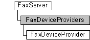

---
Description: 'The FaxDeviceProviders configuration collection contains the fax device providers on a connected fax server.'
ms.assetid: '3abb80d7-fedf-469d-b17a-604ca78f4b8b'
title: FaxDeviceProviders object
---

# FaxDeviceProviders object

The **FaxDeviceProviders** configuration collection contains the fax device providers on a connected fax server. This collection is used by a fax client application to retrieve information about the fax service providers (FSPs) registered with the fax service, represented by [**FaxDeviceProvider**](-mfax-faxdeviceprovider.md) objects.

## Members

The **FaxDeviceProviders** object has these types of members:

-   [Properties](#properties)

### Properties

The **FaxDeviceProviders** object has these properties.

| Property                                                      | Access type           | Description                                                                                                                                                                             |
|:--------------------------------------------------------------|:----------------------|:----------------------------------------------------------------------------------------------------------------------------------------------------------------------------------------|
| [**Count**](-mfax-faxdeviceproviders-count-vb.md)  | Read-only   | The Count property represents the number of objects in the FaxDeviceProviders collection. This is the total number of fax device providers associated with the fax server.    |
| [**Item**](-mfax-faxdeviceproviders-item.md)       | Read/write  | The [**Item**](-mfax-faxdeviceproviders-item.md) property returns a [**FaxDeviceProvider**](-mfax-faxdeviceprovider.md) object from the **FaxDeviceProviders** collection.  |

 

## Remarks

A **FaxDeviceProviders** object is accessed through a [**FaxServer**](-mfax-faxserver.md) object.

To create a **FaxDeviceProviders** object in Microsoft Visual Basic, call the [**GetDeviceProviders**](-mfax-faxserver-getdeviceproviders.md) property of the [**FaxServer**](-mfax-faxserver.md) object.

To create a **FaxDeviceProviders** object in C++, call the [**GetDeviceProviders**](-mfax-faxserver-getdeviceproviders.md) method.

## Requirements

|                                     |                                                                                         |
|-------------------------------------|-----------------------------------------------------------------------------------------|
| Minimum supported client  | Windows XP \[desktop apps only\]                                              |
| Minimum supported server  | Windows Server 2003 \[desktop apps only\]                                     |
| Header                    | <dl> <dt>Faxcomex.h</dt> </dl>   |
| DLL                       | <dl> <dt>Fxscomex.dll</dt> </dl> |
| IID                       | CLSID\_FaxDeviceProviders                                                     |

## See also

<dl> <dt>

[Fax Service object hierarchy](-mfax-fax-service-extended-com-object-model.md)
</dt> <dt>

[**IFaxDeviceProvider**](-mfax-faxdeviceprovider-cpp.md)
</dt> </dl>

 

 

