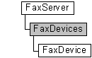

# FaxDevices object

The **FaxDevices** collection is used by a fax client application to manage fax devices, where each device is represented by a [**FaxDevice**](-mfax-faxdevice.md) object.

## Members

The **FaxDevices** object has these types of members:

-   [Properties](#properties)

### Properties

The **FaxDevices** object has these properties.

| Property                                                    | Access type          | Description                                                                                                                                                                                       |
|:------------------------------------------------------------|:---------------------|:--------------------------------------------------------------------------------------------------------------------------------------------------------------------------------------------------|
| [**Count**](-mfax-faxdevices-count-vb.md)        | Read-only  | The [**Count**](-mfax-faxdevices-count-vb.md) property represents the number of objects in the **FaxDevices** collection. This is the total number of devices used by the fax server.  |
| [**Item**](-mfax-faxdevices-item.md)             | Read-only  | The [**Item**](-mfax-faxdevices-item.md) property returns a [**FaxDevice**](-mfax-faxdevice.md) object from the **FaxDevices** collection, using its index.                           |
| [**ItemById**](-mfax-faxdevices-itembyid-vb.md)  | Read-only  | The [**get\_ItemById**](/windows/previous-versions/FaxComex/nf-faxcomex-ifaxdevices-get_itembyid?branch=master) property returns a [**FaxDevice**](-mfax-faxdevice.md) object from the **FaxDevices** collection, using its device ID.          |

 

## Remarks

A **FaxDevices** object is accessed through a [**FaxServer**](-mfax-faxserver.md) object.

To create a **FaxDevices** object in Microsoft Visual Basic, call the [**GetDevices**](-mfax-faxserver-getdevices.md) property of the [**FaxServer**](-mfax-faxserver.md) object.

To create a **FaxDevices** object in C++, call the [**GetDevices**](-mfax-faxserver-getdevices.md) method.

## Requirements

|                                     |                                                                                         |
|-------------------------------------|-----------------------------------------------------------------------------------------|
| Minimum supported client  | Windows XP \[desktop apps only\]                                              |
| Minimum supported server  | Windows Server 2003 \[desktop apps only\]                                     |
| Header                    | <dl> <dt>Faxcomex.h</dt> </dl>   |
| DLL                       | <dl> <dt>Fxscomex.dll</dt> </dl> |
| IID                       | CLSID\_FaxDevices                                                             |

## See also

<dl> <dt>

[Fax Service object hierarchy](-mfax-fax-service-extended-com-object-model.md)
</dt> <dt>

[**IFaxDevices**](/windows/previous-versions/FaxComex/nn-faxcomex-ifaxdevices?branch=master)
</dt> </dl>

 

 

