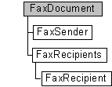

# FaxDocument object

The **FaxDocument** messaging object is used by a fax client application to compose a fax document and submit it to the fax service for processing.

## Members

The **FaxDocument** object has these types of members:

-   [Methods](#methods)
-   [Properties](#properties)

### Methods

The **FaxDocument** object has these methods.

<table>
<colgroup>
<col style="width: 50%" />
<col style="width: 50%" />
</colgroup>
<thead>
<tr class="header">
<th style="text-align: left;">Method</th>
<th style="text-align: left;">Description</th>
</tr>
</thead>
<tbody>
<tr class="odd">
<td style="text-align: left;">[<strong>ConnectedSubmit</strong>](-mfax-faxdocument-connectedsubmit.md)</td>
<td style="text-align: left;">The [<strong>ConnectedSubmit</strong>](-mfax-faxdocument-connectedsubmit.md) method submits a single fax document to the connected [<strong>FaxServer</strong>](-mfax-faxserver.md). The method returns an array of fax job ID strings, one for each recipient of the fax. </td>
</tr>
<tr class="even">
<td style="text-align: left;">[<strong>ConnectedSubmit2</strong>](-mfax-faxdocument2-connectedsubmit2-vb.md)</td>
<td style="text-align: left;">Submits one or more fax documents to the connected [<strong>FaxServer</strong>](-mfax-faxserver.md). This method returns an array of fax job ID strings, one for each recipient of the fax. 
<blockquote>
[!Note] 
This method is supported only in Windows Vista and later.
</blockquote>
 </td>
</tr>
<tr class="odd">
<td style="text-align: left;">[<strong>Submit</strong>](-mfax-faxdocument-submit-vb.md)</td>
<td style="text-align: left;">The [<strong>Submit</strong>](-mfax-faxdocument-submit-vb.md) method submits a single fax document to the fax service for processing. </td>
</tr>
<tr class="even">
<td style="text-align: left;">[<strong>Submit2</strong>](-mfax-faxdocument2-submit2-vb.md)</td>
<td style="text-align: left;">Submits one or more documents to the fax service for processing. 
<blockquote>
[!Note] 
This method is supported only in Windows Vista and later.
</blockquote>
 </td>
</tr>
</tbody>
</table>

 

### Properties

The **FaxDocument** object has these properties.

<table>
<colgroup>
<col style="width: 33%" />
<col style="width: 33%" />
<col style="width: 33%" />
</colgroup>
<thead>
<tr class="header">
<th style="text-align: left;">Property</th>
<th style="text-align: left;">Access type</th>
<th style="text-align: left;">Description</th>
</tr>
</thead>
<tbody>
<tr class="odd">
<td style="text-align: left;">[<strong>AttachFaxToReceipt</strong>](-mfax-faxdocument-attachfaxtoreceipt-vb.md) </td>
<td style="text-align: left;">Read/write </td>
<td style="text-align: left;">The [<strong>AttachFaxToReceipt</strong>](-mfax-faxdocument-attachfaxtoreceipt-vb.md) property indicates whether to attach a fax to the receipt. </td>
</tr>
<tr class="even">
<td style="text-align: left;">[<strong>Bodies</strong>](-mfax-faxdocument2-bodies-vb.md) </td>
<td style="text-align: left;">Read/write </td>
<td style="text-align: left;">Provides a collection of one or more documents to the fax document.  
<blockquote>
[!Note] 
This property is supported only in Windows Vista and later.
</blockquote>
 </td>
</tr>
<tr class="odd">
<td style="text-align: left;">[<strong>Body</strong>](-mfax-faxdocument-body-vb.md) </td>
<td style="text-align: left;">Read/write </td>
<td style="text-align: left;">The [<strong>Body</strong>](-mfax-faxdocument-body-vb.md) property provides the path to the file that comprises the body of a fax. The body of a fax consists of the fax pages other than the cover page. </td>
</tr>
<tr class="even">
<td style="text-align: left;">[<strong>CoverPage</strong>](-mfax-faxdocument-coverpage-vb.md) </td>
<td style="text-align: left;">Read/write </td>
<td style="text-align: left;">The [<strong>CoverPage</strong>](-mfax-faxdocument-coverpage-vb.md) property is a null-terminated string that contains the name of the cover page template file (.cov) to associate with the fax document. </td>
</tr>
<tr class="odd">
<td style="text-align: left;">[<strong>CoverPageType</strong>](-mfax-faxdocument-coverpagetype-vb.md) </td>
<td style="text-align: left;">Read/write </td>
<td style="text-align: left;">The [<strong>CoverPageType</strong>](-mfax-faxdocument-coverpagetype-vb.md) property is a value from an enumeration that indicates whether a specified cover page template file (.cov) is a server-based cover page file or a local-computer-based cover page file. You can also specify that no file is used. </td>
</tr>
<tr class="even">
<td style="text-align: left;">[<strong>DocumentName</strong>](-mfax-faxdocument-documentname-vb.md) </td>
<td style="text-align: left;">Read/write </td>
<td style="text-align: left;">The [<strong>DocumentName</strong>](-mfax-faxdocument-documentname-vb.md) property is a null-terminated string that contains the user-friendly name to display for the fax document. The value is for display purposes only. </td>
</tr>
<tr class="odd">
<td style="text-align: left;">[<strong>GroupBroadcastReceipts</strong>](-mfax-faxdocument-groupbroadcastreceipts-vb.md) </td>
<td style="text-align: left;">Read/write </td>
<td style="text-align: left;">The [<strong>GroupBroadcastReceipts</strong>](-mfax-faxdocument-groupbroadcastreceipts-vb.md) property is a Boolean value that indicates whether to send an individual delivery receipt for each recipient of the broadcast, or to send a summary receipt for all the recipients. </td>
</tr>
<tr class="even">
<td style="text-align: left;">[<strong>Note</strong>](-mfax-faxdocument-note-vb.md) </td>
<td style="text-align: left;">Read/write </td>
<td style="text-align: left;">The [<strong>Note</strong>](-mfax-faxdocument-note-vb.md) property is a null-terminated string that contains the contents of the note field on the cover page of the fax. </td>
</tr>
<tr class="odd">
<td style="text-align: left;">[<strong>Priority</strong>](-mfax-faxdocument-priority-vb.md) </td>
<td style="text-align: left;">Read/write </td>
<td style="text-align: left;">The [<strong>Priority</strong>](-mfax-faxdocument-priority-vb.md) property specifies the priority to use when sending the fax; for example, normal, low, or high priority. </td>
</tr>
<tr class="even">
<td style="text-align: left;">[<strong>ReceiptAddress</strong>](-mfax-faxdocument-receiptaddress-vb.md) </td>
<td style="text-align: left;">Read/write </td>
<td style="text-align: left;">The [<strong>ReceiptAddress</strong>](-mfax-faxdocument-receiptaddress-vb.md) property is a null-terminated string that indicates the email address to which the fax service should send a delivery receipt when the fax job reaches a final state. </td>
</tr>
<tr class="odd">
<td style="text-align: left;">[<strong>ReceiptType</strong>](-mfax-faxdocument-receipttype-vb.md) </td>
<td style="text-align: left;">Read/write </td>
<td style="text-align: left;">The [<strong>ReceiptType</strong>](-mfax-faxdocument-receipttype-vb.md) property specifies the type of delivery receipt to deliver when the fax job reaches a final state. </td>
</tr>
<tr class="even">
<td style="text-align: left;">[<strong>Recipients</strong>](-mfax-faxdocument-recipients-vb.md) </td>
<td style="text-align: left;">Read-only </td>
<td style="text-align: left;">The [<strong>Recipients</strong>](-mfax-faxdocument-recipients-vb.md) property retrieves a collection of one or more recipients for the fax document. </td>
</tr>
<tr class="odd">
<td style="text-align: left;">[<strong>ScheduleTime</strong>](-mfax-faxdocument-scheduletime-vb.md) </td>
<td style="text-align: left;">Read/write </td>
<td style="text-align: left;">The [<strong>ScheduleTime</strong>](-mfax-faxdocument-scheduletime-vb.md) property indicates the time to submit the fax for processing to the fax service. </td>
</tr>
<tr class="even">
<td style="text-align: left;">[<strong>ScheduleType</strong>](-mfax-faxdocument-scheduletype-vb.md) </td>
<td style="text-align: left;">Read/write </td>
<td style="text-align: left;">The [<strong>ScheduleType</strong>](-mfax-faxdocument-scheduletype-vb.md) property indicates when to schedule the fax job; for example, you can specify that the fax service send the fax immediately, at a specified time, or during a predefined discount period. </td>
</tr>
<tr class="odd">
<td style="text-align: left;">[<strong>Sender</strong>](-mfax-faxdocument-sender-vb.md) </td>
<td style="text-align: left;">Read-only </td>
<td style="text-align: left;">Retrieves an object containing information about the sender of the fax document. </td>
</tr>
<tr class="even">
<td style="text-align: left;">[<strong>Subject</strong>](-mfax-faxdocument-subject-vb.md) </td>
<td style="text-align: left;">Read/write </td>
<td style="text-align: left;">The [<strong>Subject</strong>](-mfax-faxdocument-subject-vb.md) property is a null-terminated string that contains the contents of the subject field on the cover page of the fax. </td>
</tr>
<tr class="odd">
<td style="text-align: left;">[<strong>SubmissionId</strong>](-mfax-faxdocument2-submissionid-vb.md) </td>
<td style="text-align: left;">Read-only </td>
<td style="text-align: left;">Retrieves the submission identifier for the fax document. Every job in a given broadcast receives the same submission identifier. 
<blockquote>
[!Note] 
This property is supported only in Windows Vista and later.
</blockquote>
 </td>
</tr>
</tbody>
</table>

 

## Remarks

The **FaxDocument** object implements the [**IFaxDocument**](/previous-versions/windows/desktop/api/FaxComex/nn-faxcomex-ifaxdocument) interface in Windows XP and earlier. It implements the [**IFaxDocument2**](/previous-versions/windows/desktop/api/FaxComex/nn-faxcomex-ifaxdocument2) interface in Windows Vista and later.

Use the **FaxDocument** object to set and retrieve information about fax transmissions. This includes information about fax recipients, contained in the [**FaxRecipients**](-mfax-faxrecipients.md) object, and information about the fax sender, contained in the [**FaxSender**](-mfax-faxsender.md) object.

You can send a fax to one or more recipients.

To create a **FaxDocument** object in Microsoft Visual Basic, call the Visual Basic [**CreateObject**](ec11fd03-b420-412f-b25a-057f877cefbc) function.

To create a [**FaxDevices**](-mfax-faxdevices.md) object in C++, call the [CoCreateInstance](http://msdn.microsoft.com/en-us/library/ms686615.aspx) function. An example of the creation of a **FaxDocument** object is provided in the topic [Creating the Root Object in C++](-mfax-creating-the-root-object-in-c-.md).

## Requirements

|                                     |                                                                                         |
|-------------------------------------|-----------------------------------------------------------------------------------------|
| Minimum supported client  | Windows XP \[desktop apps only\]                                              |
| Minimum supported server  | Windows Server 2003 \[desktop apps only\]                                     |
| Header                    | <dl> <dt>Faxcomex.h</dt> </dl>   |
| DLL                       | <dl> <dt>Fxscomex.dll</dt> </dl> |
| IID                       | CLSID\_FaxDocument                                                            |

## See also

<dl> <dt>

[Fax Service object hierarchy](-mfax-fax-service-extended-com-object-model.md)
</dt> <dt>

[**IFaxDocument**](/previous-versions/windows/desktop/api/FaxComex/nn-faxcomex-ifaxdocument)
</dt> <dt>

[**IFaxDocument2**](/previous-versions/windows/desktop/api/FaxComex/nn-faxcomex-ifaxdocument2)
</dt> </dl>

 

 

