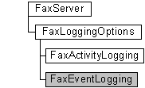

# FaxEventLogging object

The **FaxEventLogging** configuration object is used by a fax client application to configure the event logging categories used by the fax service. You can specify the level of detail at which the fax service logs events in the application log.

## Members

The **FaxEventLogging** object has these types of members:

-   [Methods](#methods)
-   [Properties](#properties)

### Methods

The **FaxEventLogging** object has these methods.

| Method                                              | Description                                                                                                                                     |
|:----------------------------------------------------|:------------------------------------------------------------------------------------------------------------------------------------------------|
| [**Refresh**](-mfax-faxeventlogging-refresh-vb.md) | The [**Refresh**](-mfax-faxeventlogging-refresh-vb.md) method refreshes **FaxEventLogging** object information from the fax server.  |
| [**Save**](-mfax-faxeventlogging-save-vb.md)       | The [**Save**](-mfax-faxeventlogging-save-vb.md) method saves the **FaxEventLogging** object's data.                                 |

 

### Properties

The **FaxEventLogging** object has these properties.

| Property                                                                               | Access type           | Description                                                                                                                                                                                                                                                                                                                        |
|:---------------------------------------------------------------------------------------|:----------------------|:-----------------------------------------------------------------------------------------------------------------------------------------------------------------------------------------------------------------------------------------------------------------------------------------------------------------------------------|
| [**GeneralEventsLevel**](-mfax-faxeventlogging-generaleventslevel-vb.md)    | Read/write  | The [**GeneralEventsLevel**](-mfax-faxeventlogging-generaleventslevel-vb.md) property indicates the level of detail at which the fax service logs general events in the application log. General events include those that are not related to initialization and termination or to inbound and outbound transmissions.  |
| [**InboundEventsLevel**](-mfax-faxeventlogging-inboundeventslevel-vb.md)    | Read/write  | The [**InboundEventsLevel**](-mfax-faxeventlogging-inboundeventslevel-vb.md) property indicates the level of detail at which the fax service logs events about inbound fax transmissions in the application log.                                                                                                        |
| [**InitEventsLevel**](-mfax-faxeventlogging-initeventslevel-vb.md)          | Read/write  | The [**InitEventsLevel**](-mfax-faxeventlogging-initeventslevel-vb.md) property indicates the level of detail at which the fax service logs initialization (starting the server) and termination (shutting down the server) events in the application log.                                                              |
| [**OutboundEventsLevel**](-mfax-faxeventlogging-outboundeventslevel-vb.md)  | Read/write  | The [**OutboundEventsLevel**](-mfax-faxeventlogging-outboundeventslevel-vb.md) property indicates the level of detail at which the fax service logs events about outbound fax transmissions in the application log.                                                                                                     |

 

## Remarks

> [!Note]  
> Changes made to the **FaxEventLogging** object will not be saved until you call the [**Save**](-mfax-faxeventlogging-save-vb.md) method.

 

A **FaxEventLogging** object is accessed through a [**FaxLoggingOptions**](-mfax-faxloggingoptions.md) object.

To create a **FaxEventLogging** object in Microsoft Visual Basic, call the [**EventLogging**](-mfax-faxloggingoptions-eventlogging-vb.md) property of the [**FaxLoggingOptions**](-mfax-faxloggingoptions.md) object.

To create a **FaxEventLogging** object in C++, call the [**EventLogging**](-mfax-faxloggingoptions-eventlogging-vb.md) method.

## Requirements

|                                     |                                                                                         |
|-------------------------------------|-----------------------------------------------------------------------------------------|
| Minimum supported client  | Windows XP \[desktop apps only\]                                              |
| Minimum supported server  | Windows Server 2003 \[desktop apps only\]                                     |
| Header                    | <dl> <dt>Faxcomex.h</dt> </dl>   |
| DLL                       | <dl> <dt>Fxscomex.dll</dt> </dl> |
| IID                       | CLSID\_FaxEventLogging                                                        |

## See also

<dl> <dt>

[Fax Service object hierarchy](-mfax-fax-service-extended-com-object-model.md)
</dt> <dt>

[**IFaxEventLogging**](-mfax-faxeventlogging-cpp.md)
</dt> </dl>

 

 

