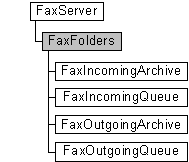

# FaxFolders object

The **FaxFolders** configuration object is used by a fax client application to access the folders, queued jobs, and archived messages on a fax server.

## Members

The **FaxFolders** object has these types of members:

-   [Properties](#properties)

### Properties

The **FaxFolders** object has these properties.

| Property                                                                  | Access type          | Description                                                                                                                      |
|:--------------------------------------------------------------------------|:---------------------|:---------------------------------------------------------------------------------------------------------------------------------|
| [**IncomingArchive**](-mfax-faxfolders-incomingarchive-vb.md)  | Read-only  | The [**IncomingArchive**](-mfax-faxfolders-incomingarchive-vb.md) property represents the archive of incoming faxes.  |
| [**IncomingQueue**](-mfax-faxfolders-incomingqueue-vb.md)      | Read-only  | The [**IncomingQueue**](-mfax-faxfolders-incomingqueue-vb.md) property represents the queue of incoming faxes.        |
| [**OutgoingArchive**](-mfax-faxfolders-outgoingarchive-vb.md)  | Read-only  | The [**OutgoingArchive**](-mfax-faxfolders-outgoingarchive-vb.md) property represents the archive of outgoing faxes.  |
| [**OutgoingQueue**](-mfax-faxfolders-outgoingqueue-vb.md)      | Read-only  | The [**OutgoingQueue**](-mfax-faxfolders-outgoingqueue-vb.md) property represents the queue of outgoing faxes.        |

 

## Remarks

Use the FaxFolders object to create and access the following objects:

-   [**FaxIncomingArchive**](-mfax-faxincomingarchive.md), which is the archive of inbound fax messages received successfully by the fax service
-   [**FaxIncomingQueue**](-mfax-faxincomingqueue.md), which is the queue of inbound fax jobs
-   [**FaxOutgoingArchive**](-mfax-faxoutgoingarchive.md), which is the archive of outbound fax messages sent successfully by the fax service
-   [**FaxOutgoingQueue**](-mfax-faxoutgoingqueue.md), which is the queue of outbound fax jobs

A **FaxFolders** object is accessed through a [**FaxServer**](-mfax-faxserver.md) object.

To create a **FaxFolders** object in Microsoft Visual Basic, call the [**Folders**](-mfax-faxserver-folders.md) property of the [**FaxServer**](-mfax-faxserver.md) object.

To create a **FaxFolders** object in C++, call the [**Folders**](-mfax-faxserver-folders.md) method.

## Requirements

|                                     |                                                                                         |
|-------------------------------------|-----------------------------------------------------------------------------------------|
| Minimum supported client  | Windows XP \[desktop apps only\]                                              |
| Minimum supported server  | Windows Server 2003 \[desktop apps only\]                                     |
| Header                    | <dl> <dt>Faxcomex.h</dt> </dl>   |
| DLL                       | <dl> <dt>Fxscomex.dll</dt> </dl> |
| IID                       | CLSID\_FaxFolders                                                             |

## See also

<dl> <dt>

[Fax Service object hierarchy](-mfax-fax-service-extended-com-object-model.md)
</dt> <dt>

[**IFaxFolders**](-mfax-faxfolders-cpp.md)
</dt> </dl>

 

 

