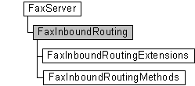

# FaxInboundRouting object

The **FaxInboundRouting** configuration object is used by a fax client application to access the inbound routing extensions registered with the fax service, represented by [**FaxInboundRoutingExtensions**](-mfax-faxinboundroutingextensions.md) objects, and the routing methods the extensions expose, represented by [**FaxInboundRoutingMethods**](-mfax-faxinboundroutingmethods.md) objects.

## Members

The **FaxInboundRouting** object has these types of members:

-   [Methods](#methods)

### Methods

The **FaxInboundRouting** object has these methods.

| Method                                                         | Description                                                                                                                                                                                                                                 |
|:---------------------------------------------------------------|:--------------------------------------------------------------------------------------------------------------------------------------------------------------------------------------------------------------------------------------------|
| [**GetExtensions**](-mfax-faxinboundrouting-getextensions.md) | The [**GetExtensions**](-mfax-faxinboundrouting-getextensions.md) method retrieves the collection of inbound routing extensions registered with the fax service.                                                                 |
| [**GetMethods**](-mfax-faxinboundrouting-getmethods.md)       | The [**GetMethods**](-mfax-faxinboundrouting-getmethods.md) method retrieves the ordered collection of all the inbound routing methods exposed by all the inbound routing extensions currently registered with the fax service.  |

 

## Remarks

A **FaxInboundRouting** object is accessed through a [**FaxServer**](-mfax-faxserver.md) object.

To create a **FaxInboundRouting** object in Microsoft Visual Basic, call the [**InboundRouting**](-mfax-faxserver-inboundrouting.md) property of the [**FaxServer**](-mfax-faxserver.md) object.

To create a **FaxInboundRouting** object in C++, call the [**InboundRouting**](-mfax-faxserver-inboundrouting.md) method.

## Requirements

|                                     |                                                                                         |
|-------------------------------------|-----------------------------------------------------------------------------------------|
| Minimum supported client  | Windows XP \[desktop apps only\]                                              |
| Minimum supported server  | Windows Server 2003 \[desktop apps only\]                                     |
| Header                    | <dl> <dt>Faxcomex.h</dt> </dl>   |
| DLL                       | <dl> <dt>Fxscomex.dll</dt> </dl> |
| IID                       | CLSID\_FaxInboundRouting                                                      |

## See also

<dl> <dt>

[Fax Service object hierarchy](-mfax-fax-service-extended-com-object-model.md)
</dt> <dt>

[**IFaxInboundRouting**](/windows/previous-versions/FaxComex/nn-faxcomex-ifaxinboundrouting?branch=master)
</dt> </dl>

 

 

