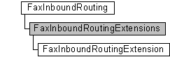

# FaxInboundRoutingExtensions object

The **FaxInboundRoutingExtensions** configuration collection is used by a fax client application to manage the inbound fax routing extensions registered with the fax service. Each extension is represented by a [**FaxInboundRoutingExtension**](-mfax-faxinboundroutingextension.md) object.

## Members

The **FaxInboundRoutingExtensions** object has these types of members:

-   [Properties](#properties)

### Properties

The **FaxInboundRoutingExtensions** object has these properties.

| Property                                                               | Access type          | Description                                                                                                                                                                                                                                                    |
|:-----------------------------------------------------------------------|:---------------------|:---------------------------------------------------------------------------------------------------------------------------------------------------------------------------------------------------------------------------------------------------------------|
| [**Count**](-mfax-faxinboundroutingextensions-count-vb.md)  | Read-only  | The [**Count**](-mfax-faxinboundroutingextensions-count-vb.md) property represents the number of objects in the **FaxInboundRoutingExtensions** collection. This is the total number of inbound routing extensions associated with the fax server.  |
| [**Item**](-mfax-faxinboundroutingextensions-item.md)       | Read-only  | The [**Item**](-mfax-faxinboundroutingextensions-item.md) property returns a [**FaxInboundRoutingExtension**](-mfax-faxinboundroutingextension.md) object from the **FaxInboundRoutingExtensions** collection.                                     |

 

## Remarks

A **FaxInboundRoutingExtensions** object is accessed through a [**FaxInboundRouting**](-mfax-faxinboundrouting.md) object.

To create a **FaxInboundRoutingExtensions** object in Microsoft Visual Basic, call the [**GetExtensions**](-mfax-faxinboundrouting-getextensions.md) property of the [**FaxInboundRouting**](-mfax-faxinboundrouting.md) object.

To create a **FaxInboundRoutingExtensions** object in C++, call the [**GetExtensions**](-mfax-faxinboundrouting-getextensions.md) method.

## Requirements

|                                     |                                                                                         |
|-------------------------------------|-----------------------------------------------------------------------------------------|
| Minimum supported client  | Windows XP \[desktop apps only\]                                              |
| Minimum supported server  | Windows Server 2003 \[desktop apps only\]                                     |
| Header                    | <dl> <dt>Faxcomex.h</dt> </dl>   |
| DLL                       | <dl> <dt>Fxscomex.dll</dt> </dl> |
| IID                       | CLSID\_FaxInboundRoutingExtensions                                            |

## See also

<dl> <dt>

[Fax Service object hierarchy](-mfax-fax-service-extended-com-object-model.md)
</dt> <dt>

[**IFaxInboundRoutingExtensions**](-mfax-faxinboundroutingextensions-cpp.md)
</dt> </dl>

 

 

