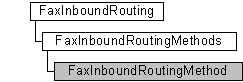

# FaxInboundRoutingMethod object

The **FaxInboundRoutingMethod** configuration object is used by a fax client application to retrieve information about an individual fax inbound routing method on a connected fax server.

## Members

The **FaxInboundRoutingMethod** object has these types of members:

-   [Methods](#methods)
-   [Properties](#properties)

### Methods

The **FaxInboundRoutingMethod** object has these methods.

| Method                                                      | Description                                                                                                                                                     |
|:------------------------------------------------------------|:----------------------------------------------------------------------------------------------------------------------------------------------------------------|
| [**Refresh**](-mfax-faxinboundroutingmethod-refresh-vb.md) | The [**Refresh**](-mfax-faxinboundroutingmethod-refresh-vb.md) method refreshes **FaxInboundRoutingMethod** object information from the fax server.  |
| [**Save**](-mfax-faxinboundroutingmethod-save-vb.md)       | The [**Save**](-mfax-faxinboundroutingmethod-save-vb.md) method saves the **FaxInboundRoutingMethod** object's data.                                 |

 

### Properties

The **FaxInboundRoutingMethod** object has these properties.

| Property                                                                                           | Access type           | Description                                                                                                                                                                                                                                                              |
|:---------------------------------------------------------------------------------------------------|:----------------------|:-------------------------------------------------------------------------------------------------------------------------------------------------------------------------------------------------------------------------------------------------------------------------|
| [**ExtensionFriendlyName**](-mfax-faxinboundroutingmethod-extensionfriendlyname-vb.md)  | Read-only   | The [**ExtensionFriendlyName**](-mfax-faxinboundroutingmethod-extensionfriendlyname-vb.md) property is the user-friendly name for the fax routing extension that exports the inbound fax routing method.                                                      |
| [**ExtensionImageName**](-mfax-faxinboundroutingmethod-extensionimagename-vb.md)        | Read-only   | The [**ExtensionImageName**](-mfax-faxinboundroutingmethod-extensionimagename-vb.md) property is a null-terminated string that contains the executable image name (DLL path and file name) of the fax routing extension that exports the fax routing method.  |
| [**FunctionName**](-mfax-faxinboundroutingmethod-functionname-vb.md)                    | Read-only   | The [**FunctionName**](-mfax-faxinboundroutingmethod-functionname-vb.md) property is a null-terminated string that contains the name of the function that executes a specific fax routing procedure.                                                          |
| [**GUID**](-mfax-faxinboundroutingmethod-guid-vb.md)                                    | Read-only   | The [**GUID**](-mfax-faxinboundroutingmethod-guid-vb.md) property is a null-terminated string that specifies the GUID that uniquely identifies the fax routing method.                                                                                        |
| [**Name**](-mfax-faxinboundroutingmethod-name-vb.md)                                    | Read-only   | The [**Name**](-mfax-faxinboundroutingmethod-name-vb.md) property is a null-terminated string that contains the user-friendly name associated with the inbound fax routing method. The string is suitable for display to users.                               |
| [**Priority**](-mfax-faxinboundroutingmethod-priority.md)                               | Read/write  | The [**Priority**](-mfax-faxinboundroutingmethod-priority.md) property is a value associated with the order in which the fax service calls the routing method when the service receives a fax job.                                                            |

 

## Remarks

A **FaxInboundRoutingMethod** object is accessed through a [**FaxInboundRoutingMethods**](-mfax-faxinboundroutingmethods.md) object.

> [!Note]  
> Changes made to the **FaxInboundRoutingMethod** object will not be saved until you call the [**Save**](-mfax-faxinboundroutingmethod-save-vb.md) method.

 

To create a **FaxInboundRoutingMethod** object in Microsoft Visual Basic, call the [**Item**](-mfax-faxinboundroutingmethods-item.md) property of the [**FaxInboundRoutingMethods**](-mfax-faxinboundroutingmethods.md) object.

To create a **FaxInboundRoutingMethod** object in C++, call the [**get\_Item**](/previous-versions/windows/desktop/api/FaxComex/nf-faxcomex-ifaxinboundroutingmethods-get_item) method.

## Requirements

|                                     |                                                                                         |
|-------------------------------------|-----------------------------------------------------------------------------------------|
| Minimum supported client  | Windows XP \[desktop apps only\]                                              |
| Minimum supported server  | Windows Server 2003 \[desktop apps only\]                                     |
| Header                    | <dl> <dt>Faxcomex.h</dt> </dl>   |
| DLL                       | <dl> <dt>Fxscomex.dll</dt> </dl> |
| IID                       | CLSID\_FaxInboundRoutingMethod                                                |

## See also

<dl> <dt>

[Fax Service object hierarchy](-mfax-fax-service-extended-com-object-model.md)
</dt> <dt>

[**IFaxInboundRoutingMethod**](/previous-versions/windows/desktop/api/FaxComex/nn-faxcomex-ifaxinboundroutingmethod)
</dt> </dl>

 

 

