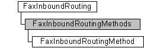

# FaxInboundRoutingMethods object

The **FaxInboundRoutingMethods** configuration collection is used by a fax client application to manage the ordered inbound fax routing methods.

## Members

The **FaxInboundRoutingMethods** object has these types of members:

-   [Properties](#properties)

### Properties

The **FaxInboundRoutingMethods** object has these properties.

| Property                                                            | Access type          | Description                                                                                                                                                                                                                                           |
|:--------------------------------------------------------------------|:---------------------|:------------------------------------------------------------------------------------------------------------------------------------------------------------------------------------------------------------------------------------------------------|
| [**Count**](-mfax-faxinboundroutingmethods-count-vb.md)  | Read-only  | The [**Count**](-mfax-faxinboundroutingmethods-count-vb.md) property represents the number of objects in the **FaxInboundRoutingMethods** collection. This is the total number of inbound routing methods associated with the fax server.  |
| [**Item**](-mfax-faxinboundroutingmethods-item.md)       | Read-only  | The [**Item**](-mfax-faxinboundroutingmethods-item.md) property returns a [**FaxInboundRoutingMethod**](-mfax-faxinboundroutingmethod.md) object from the **FaxInboundRoutingMethods** collection.                                        |

 

## Remarks

Each inbound routing method is represented by a [**FaxInboundRoutingMethod**](-mfax-faxinboundroutingmethod.md) object. The order of the routing methods in the collection determines the relative order in which the methods execute when an inbound fax requires routing.

A **FaxInboundRoutingMethods** object is accessed through a [**FaxInboundRouting**](-mfax-faxinboundrouting.md) object.

To create a **FaxInboundRoutingMethods** object in Microsoft Visual Basic, call the [**GetMethods**](-mfax-faxinboundrouting-getmethods.md) property of the [**FaxInboundRouting**](-mfax-faxinboundrouting.md) object.

To create a **FaxInboundRoutingMethods** object in C++, call the [**GetMethods**](-mfax-faxinboundrouting-getmethods-cpp.md) method.

## Requirements

|                                     |                                                                                         |
|-------------------------------------|-----------------------------------------------------------------------------------------|
| Minimum supported client  | Windows XP \[desktop apps only\]                                              |
| Minimum supported server  | Windows Server 2003 \[desktop apps only\]                                     |
| Header                    | <dl> <dt>Faxcomex.h</dt> </dl>   |
| DLL                       | <dl> <dt>Fxscomex.dll</dt> </dl> |
| IID                       | CLSID\_FaxInboundRoutingMethods                                               |

## See also

<dl> <dt>

[Fax Service object hierarchy](-mfax-fax-service-extended-com-object-model.md)
</dt> <dt>

[**IFaxInboundRoutingMethods**](-mfax-faxinboundroutingmethods-cpp.md)
</dt> </dl>

 

 

