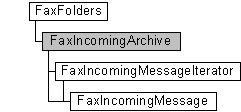

# FaxIncomingArchive object

The **FaxIncomingArchive** object is used by a fax client application to access and configure the archive of inbound fax messages received successfully by the fax service. Use this object to set and retrieve parameters related to configuring the archive of sent faxes. You can also use the **FaxIncomingArchive** object to retrieve a message from the archive by specifying its message ID.

A **FaxIncomingArchive** object is accessed through a [**FaxFolders**](-mfax-faxfolders.md) object. **FaxIncomingArchive** objects provide access to [**FaxIncomingMessageIterator**](-mfax-faxincomingmessageiterator.md) objects and [**FaxIncomingMessage**](-mfax-faxincomingmessage.md) objects.

To create a **FaxIncomingArchive** object in Microsoft Visual Basic, call the [**IncomingArchive**](-mfax-faxfolders-incomingarchive-vb.md) property of the [**FaxFolders**](-mfax-faxfolders.md) object.

To create a **FaxIncomingArchive** object in C++, call the [**IncomingArchive**](-mfax-faxfolders-incomingarchive-vb.md) property.

## Members

The **FaxIncomingArchive** object has these types of members:

-   [Methods](#methods)
-   [Properties](#properties)

### Methods

The **FaxIncomingArchive** object has these methods.

<table>
<colgroup>
<col style="width: 50%" />
<col style="width: 50%" />
</colgroup>
<thead>
<tr class="header">
<th style="text-align: left;">Method</th>
<th style="text-align: left;">Description</th>
</tr>
</thead>
<tbody>
<tr class="odd">
<td style="text-align: left;">[<strong>GetMessage</strong>](-mfax-faxincomingarchive-getmessage-vb.md)</td>
<td style="text-align: left;">The [<strong>GetMessage</strong>](-mfax-faxincomingarchive-getmessage-vb.md) method gets a fax message from the archive of inbound faxes by using the fax message ID. </td>
</tr>
<tr class="even">
<td style="text-align: left;">[<strong>GetMessages</strong>](-mfax-faxincomingarchive-getmessages-vb.md)</td>
<td style="text-align: left;">The [<strong>GetMessages</strong>](-mfax-faxincomingarchive-getmessages-vb.md) method gets a new iterator (archive cursor) for the archive of inbound fax messages. </td>
</tr>
<tr class="odd">
<td style="text-align: left;">[<strong>Refresh</strong>](-mfax-faxincomingarchive-refresh-vb.md)</td>
<td style="text-align: left;">The [<strong>Refresh</strong>](-mfax-faxincomingarchive-refresh-vb.md) method refreshes <strong>FaxIncomingArchive</strong> object information from the fax server. When the <strong>Refresh</strong> method is called, any configuration changes made after the last [<strong>Save</strong>](-mfax-faxincomingarchive-save-vb.md) method call are lost. 
<blockquote>
[!Note] 
In Windows Vista, Windows Server 2008, and later versions of Windows, this method is not supported and returns an error.
</blockquote>
 </td>
</tr>
<tr class="even">
<td style="text-align: left;">[<strong>Save</strong>](-mfax-faxincomingarchive-save-vb.md)</td>
<td style="text-align: left;">Saves the <strong>FaxIncomingArchive</strong> object's data. 
<blockquote>
[!Note] 
In Windows Vista, Windows Server 2008, and later versions of Windows, this method is not supported and returns an error.
</blockquote>
 </td>
</tr>
</tbody>
</table>

 

### Properties

The **FaxIncomingArchive** object has these properties.

<table>
<colgroup>
<col style="width: 33%" />
<col style="width: 33%" />
<col style="width: 33%" />
</colgroup>
<thead>
<tr class="header">
<th style="text-align: left;">Property</th>
<th style="text-align: left;">Access type</th>
<th style="text-align: left;">Description</th>
</tr>
</thead>
<tbody>
<tr class="odd">
<td style="text-align: left;">[<strong>AgeLimit</strong>](-mfax-faxincomingarchive-agelimit-vb.md) </td>
<td style="text-align: left;">Read/write </td>
<td style="text-align: left;">The [<strong>AgeLimit</strong>](-mfax-faxincomingarchive-agelimit-vb.md) property is a value that indicates the number of days that the fax service retains fax messages in the archive of inbound faxes. The fax service deletes messages from the inbound archive when they exceed the age limit. If the value of this property is zero, the fax service does not enforce an age limit. 
<blockquote>
[!Note] 
This property is not supported in Windows Vista, Windows Server 2008, and later versions of Windows. To access this property in Windows Vista, Windows Server 2008, and later versions of Windows, get the [<strong>FaxConfiguration.ArchiveAgeLimit</strong>](-mfax-faxconfiguration-archiveagelimit-vb.md) property from the [<strong>FaxServer</strong>](-mfax-faxserver.md) object.
</blockquote>
 </td>
</tr>
<tr class="even">
<td style="text-align: left;">[<strong>ArchiveFolder</strong>](-mfax-faxincomingarchive-archivefolder-vb.md) </td>
<td style="text-align: left;">Read/write </td>
<td style="text-align: left;">The [<strong>ArchiveFolder</strong>](-mfax-faxincomingarchive-archivefolder-vb.md) property is a null-terminated string that specifies the folder location on the fax server for archived inbound faxes. 
<blockquote>
[!Note] 
This property is not supported in Windows Vista, Windows Server 2008, and later versions of Windows. To access this property in Windows Vista, Windows Server 2008, and later versions of Windows, get the [<strong>FaxConfiguration.ArchiveLocation</strong>](-mfax-faxconfiguration-archivelocation-vb.md) property from the [<strong>FaxServer</strong>](-mfax-faxserver.md) object.
</blockquote>
 </td>
</tr>
<tr class="odd">
<td style="text-align: left;">[<strong>HighQuotaWaterMark</strong>](-mfax-faxincomingarchive-highquotawatermark-vb.md) </td>
<td style="text-align: left;">Read/write </td>
<td style="text-align: left;">The [<strong>HighQuotaWaterMark</strong>](-mfax-faxincomingarchive-highquotawatermark-vb.md) property is a value that specifies the upper warning threshold for the size of the archive of inbound fax messages, in megabytes. If the size of the archive exceeds this value, and the [<strong>SizeQuotaWarning</strong>](-mfax-faxincomingarchive-sizequotawarning-vb.md) property is equal to <strong>True</strong>, the fax service issues a warning in the event log. 
<blockquote>
[!Note] 
This property is not supported in Windows Vista, Windows Server 2008, and later versions of Windows. To access this property in Windows Vista, Windows Server 2008, and later versions of Windows, get the [<strong>FaxConfiguration.HighQuotaWaterMark</strong>](-mfax-faxconfiguration-highquotawatermark-vb.md) property from the [<strong>FaxServer</strong>](-mfax-faxserver.md) object.
</blockquote>
 </td>
</tr>
<tr class="even">
<td style="text-align: left;">[<strong>LowQuotaWaterMark</strong>](-mfax-faxincomingarchive-lowquotawatermark-vb.md) </td>
<td style="text-align: left;">Read/write </td>
<td style="text-align: left;">The [<strong>LowQuotaWaterMark</strong>](-mfax-faxincomingarchive-lowquotawatermark-vb.md) property is a value that specifies the lower warning threshold for the archive of inbound fax messages, in megabytes. If the fax service has issued a warning in the event log, the service does not issue additional warnings until the size of the inbound archive drops below this value. 
<blockquote>
[!Note] 
This property is not supported in Windows Vista, Windows Server 2008, and later versions of Windows. To access this property in Windows Vista, Windows Server 2008, and later versions of Windows, get the [<strong>FaxConfiguration.LowQuotaWaterMark</strong>](-mfax-faxconfiguration-lowquotawatermark-vb.md) property from the [<strong>FaxServer</strong>](-mfax-faxserver.md) object.
</blockquote>
 </td>
</tr>
<tr class="odd">
<td style="text-align: left;">[<strong>SizeHigh</strong>](-mfax-faxincomingarchive-sizehigh-vb.md) </td>
<td style="text-align: left;">Read-only </td>
<td style="text-align: left;">The [<strong>SizeHigh</strong>](-mfax-faxincomingarchive-sizehigh-vb.md) property is a value that specifies the high 32-bit value (in bytes) for the size of the archive of inbound fax messages. 
<blockquote>
[!Note] 
This property is not supported in Windows Vista, Windows Server 2008, and later versions of Windows.
</blockquote>
 </td>
</tr>
<tr class="even">
<td style="text-align: left;">[<strong>SizeLow</strong>](-mfax-faxincomingarchive-sizelow-vb.md) </td>
<td style="text-align: left;">Read-only </td>
<td style="text-align: left;">The [<strong>SizeLow</strong>](-mfax-faxincomingarchive-sizelow-vb.md) property is a value that specifies the low 32-bit value (in bytes) for the size of the archive of inbound fax messages. 
<blockquote>
[!Note] 
This property is not supported in Windows Vista, Windows Server 2008, and later versions of Windows.
</blockquote>
 </td>
</tr>
<tr class="odd">
<td style="text-align: left;">[<strong>SizeQuotaWarning</strong>](-mfax-faxincomingarchive-sizequotawarning-vb.md) </td>
<td style="text-align: left;">Read/write </td>
<td style="text-align: left;">The [<strong>SizeQuotaWarning</strong>](-mfax-faxincomingarchive-sizequotawarning-vb.md) property is a Boolean value that indicates whether the fax service issues a warning in the event log when the size of the inbound archive exceeds the limit defined by the [<strong>HighQuotaWaterMark</strong>](-mfax-faxincomingarchive-highquotawatermark-vb.md) property. 
<blockquote>
[!Note] 
This property is not supported in Windows Vista, Windows Server 2008, and later versions of Windows. To access this property in Windows Vista, Windows Server 2008, and later versions of Windows, get the [<strong>FaxConfiguration.SizeQuotaWarning</strong>](-mfax-faxconfiguration-sizequotawarning-vb.md) property from the [<strong>FaxServer</strong>](-mfax-faxserver.md) object.
</blockquote>
 </td>
</tr>
<tr class="even">
<td style="text-align: left;">[<strong>UseArchive</strong>](-mfax-faxincomingarchive-usearchive-vb.md) </td>
<td style="text-align: left;">Read/write </td>
<td style="text-align: left;">The [<strong>UseArchive</strong>](-mfax-faxincomingarchive-usearchive-vb.md) property is a Boolean value that indicates whether the fax service archives inbound fax messages. If this property is equal to <strong>True</strong>, the fax service archives inbound fax messages. If this property is equal to <strong>False</strong>, the fax service does not archive inbound faxes. 
<blockquote>
[!Note] 
This property is not supported in Windows Vista, Windows Server 2008, and later versions of Windows. To access this property in Windows Vista, Windows Server 2008, and later versions of Windows, get the [<strong>FaxConfiguration.UseArchive</strong>](-mfax-faxconfiguration-usearchive-vb.md) property from the [<strong>FaxServer</strong>](-mfax-faxserver.md) object.
</blockquote>
 </td>
</tr>
</tbody>
</table>

 

## Requirements

|                                     |                                                                                         |
|-------------------------------------|-----------------------------------------------------------------------------------------|
| Minimum supported client  | Windows XP \[desktop apps only\]                                              |
| Minimum supported server  | Windows Server 2003 \[desktop apps only\]                                     |
| Header                    | <dl> <dt>Faxcomex.h</dt> </dl>   |
| DLL                       | <dl> <dt>Fxscomex.dll</dt> </dl> |
| IID                       | 76062CC7-F714-4FBD-AA06-ED6E4A4B70F3                                          |

## See also

<dl> <dt>

[Fax Service object hierarchy](-mfax-fax-service-extended-com-object-model.md)
</dt> <dt>

[**IFaxIncomingArchive**](-mfax-faxincomingarchive-cpp.md)
</dt> </dl>

 

 

