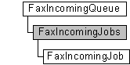

---
Description: 'The FaxIncomingJobs collection is used by a fax client application to manage the inbound fax jobs in a fax server''s job queue. Each incoming job is represented by a FaxIncomingJob object.'
ms.assetid: '05b2ceec-d8e9-4ee8-be0c-e31bb12edfc8'
title: FaxIncomingJobs object
---

# FaxIncomingJobs object

The **FaxIncomingJobs** collection is used by a fax client application to manage the inbound fax jobs in a fax server's job queue. Each incoming job is represented by a [**FaxIncomingJob**](-mfax-faxincomingjob.md) object.

A **FaxIncomingJobs** object is accessed through a [**FaxIncomingQueue**](-mfax-faxincomingqueue.md) object.

## Members

The **FaxIncomingJobs** object has these types of members:

-   [Properties](#properties)

### Properties

The **FaxIncomingJobs** object has these properties.

| Property                                                   | Access type          | Description                                                                                                                                                                                                   |
|:-----------------------------------------------------------|:---------------------|:--------------------------------------------------------------------------------------------------------------------------------------------------------------------------------------------------------------|
| [**Count**](-mfax-faxincomingjobs-count-vb.md)  | Read-only  | The [**Count**](-mfax-faxincomingjobs-count-vb.md) property represents the number of objects in the **FaxIncomingJobs** collection. This is the total number of incoming jobs for the fax server.  |
| [**Item**](-mfax-faxincomingjobs-item.md)       | Read-only  | The [**Item**](-mfax-faxincomingjobs-item.md) property returns a [**FaxIncomingJob**](-mfax-faxincomingjob.md) object from the **FaxIncomingJobs** collection.                                    |

 

## Remarks

To create a **FaxIncomingJobs** object in Microsoft Visual Basic, call the [**GetJobs**](-mfax-faxincomingqueue-getjobs-vb.md) property of the [**FaxIncomingQueue**](-mfax-faxincomingqueue.md) object.

## Requirements

|                                     |                                                                                         |
|-------------------------------------|-----------------------------------------------------------------------------------------|
| Minimum supported client  | Windows XP \[desktop apps only\]                                              |
| Minimum supported server  | Windows Server 2003 \[desktop apps only\]                                     |
| Header                    | <dl> <dt>Faxcomex.h</dt> </dl>   |
| DLL                       | <dl> <dt>Fxscomex.dll</dt> </dl> |
| IID                       | CLSID\_FaxIncomingJobs                                                        |

## See also

<dl> <dt>

[Fax Service object hierarchy](-mfax-fax-service-extended-com-object-model.md)
</dt> <dt>

[**FaxIncomingQueue**](-mfax-faxincomingqueue.md)
</dt> <dt>

[**IFaxIncomingJobs**](-mfax-faxincomingjobs-cpp.md)
</dt> </dl>

 

 

