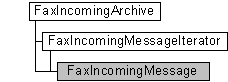

---
Description: 'The FaxIncomingMessage messaging object is used by a fax client application to retrieve information about a received fax message in the archive of inbound faxes.'
ms.assetid: 'ee546d4c-e580-4738-a5d2-0b10c5d8a1ab'
title: FaxIncomingMessage object
---

# FaxIncomingMessage object

The **FaxIncomingMessage** messaging object is used by a fax client application to retrieve information about a received fax message in the archive of inbound faxes. The archive contains faxes received successfully by the fax service. The object also includes methods to delete a message from the archive and to copy the Tagged Image File Format Class F (TIFF Class F) file associated with the fax message, to a file on the local computer.

A **FaxIncomingMessage** object is accessed through a [**FaxIncomingArchive**](-mfax-faxincomingarchive.md) object or a [**FaxIncomingMessageIterator**](-mfax-faxincomingmessageiterator.md) object.

## Members

The **FaxIncomingMessage** object has these types of members:

-   [Methods](#methods)
-   [Properties](#properties)

### Methods

The **FaxIncomingMessage** object has these methods.

<table>
<colgroup>
<col style="width: 50%" />
<col style="width: 50%" />
</colgroup>
<thead>
<tr class="header">
<th style="text-align: left;">Method</th>
<th style="text-align: left;">Description</th>
</tr>
</thead>
<tbody>
<tr class="odd">
<td style="text-align: left;">[<strong>CopyTiff</strong>](-mfax-faxincomingmessage-copytiff-vb.md)</td>
<td style="text-align: left;">The [<strong>CopyTiff</strong>](-mfax-faxincomingmessage-copytiff-vb.md) method copies the TIFF Class F file associated with the inbound fax message to a file on the local computer. </td>
</tr>
<tr class="even">
<td style="text-align: left;">[<strong>Delete</strong>](-mfax-faxincomingmessage-delete-vb.md)</td>
<td style="text-align: left;">The [<strong>Delete</strong>](-mfax-faxincomingmessage-delete-vb.md) method deletes the specified fax message from the inbound fax archive. </td>
</tr>
<tr class="odd">
<td style="text-align: left;">[<strong>Reassign</strong>](-mfax-faxincomingmessage-reassign-vb.md)</td>
<td style="text-align: left;">[Reassign](-mfax-glossary.md) the fax to one or more recipients. It also commits changes to the [<strong>Subject</strong>](-mfax-faxincomingmessage-subject-vb.md), [<strong>SenderName</strong>](-mfax-faxincomingmessage-sendername-vb.md), [<strong>SenderFaxNumber</strong>](-mfax-faxincomingmessage-senderfaxnumber-vb.md), and [<strong>HasCoverPage</strong>](-mfax-faxincomingmessage-hascoverpage-vb.md) properties. 
<blockquote>
[!Note] 
This method is supported only in Windows Vista and later.
</blockquote>
 </td>
</tr>
<tr class="even">
<td style="text-align: left;">[<strong>Refresh</strong>](-mfax-faxincomingmessage-refresh-vb.md)</td>
<td style="text-align: left;">Refreshes <strong>FaxIncomingMessage</strong> object information from the fax server. When the [<strong>Refresh</strong>](-mfax-faxincomingmessage-refresh-vb.md) method is called, any configuration changes made after the last [<strong>Save</strong>](-mfax-faxincomingmessage-save-vb.md) method call are lost, except for the properties that are committed with the [<strong>Reassign</strong>](-mfax-faxincomingmessage-reassign-vb.md) method: [<strong>Subject</strong>](-mfax-faxincomingmessage-subject-vb.md), [<strong>SenderName</strong>](-mfax-faxincomingmessage-sendername-vb.md), [<strong>SenderFaxNumber</strong>](-mfax-faxincomingmessage-senderfaxnumber-vb.md), and [<strong>HasCoverPage</strong>](-mfax-faxincomingmessage-hascoverpage-vb.md). 
<blockquote>
[!Note] 
This method is supported only in Windows Vista and later.
</blockquote>
 </td>
</tr>
<tr class="odd">
<td style="text-align: left;">[<strong>Save</strong>](-mfax-faxincomingmessage-save-vb.md)</td>
<td style="text-align: left;">Saves the <strong>FaxIncomingMessage</strong> object's data. 
<blockquote>
[!Note] 
This method is supported only in Windows Vista and later.
</blockquote>
 </td>
</tr>
</tbody>
</table>

 

### Properties

The **FaxIncomingMessage** object has these properties.

<table>
<colgroup>
<col style="width: 33%" />
<col style="width: 33%" />
<col style="width: 33%" />
</colgroup>
<thead>
<tr class="header">
<th style="text-align: left;">Property</th>
<th style="text-align: left;">Access type</th>
<th style="text-align: left;">Description</th>
</tr>
</thead>
<tbody>
<tr class="odd">
<td style="text-align: left;">[<strong>CallerId</strong>](-mfax-faxincomingmessage-callerid-vb.md) </td>
<td style="text-align: left;">Read-only </td>
<td style="text-align: left;">The [<strong>CallerId</strong>](-mfax-faxincomingmessage-callerid-vb.md) property is a null-terminated string that identifies the calling device associated with the inbound fax message. </td>
</tr>
<tr class="even">
<td style="text-align: left;">[<strong>CSID</strong>](-mfax-faxincomingmessage-csid-vb.md) </td>
<td style="text-align: left;">Read-only </td>
<td style="text-align: left;">The [<strong>CSID</strong>](-mfax-faxincomingmessage-csid-vb.md) property is a null-terminated string that contains the CSID for the inbound fax message. </td>
</tr>
<tr class="odd">
<td style="text-align: left;">[<strong>DeviceName</strong>](-mfax-faxincomingmessage-devicename-vb.md) </td>
<td style="text-align: left;">Read-only </td>
<td style="text-align: left;">The [<strong>DeviceName</strong>](-mfax-faxincomingmessage-devicename-vb.md) property is a null-terminated string that contains the name of the device on which the inbound fax message was received. </td>
</tr>
<tr class="even">
<td style="text-align: left;">[<strong>HasCoverPage</strong>](-mfax-faxincomingmessage-hascoverpage-vb.md) </td>
<td style="text-align: left;">Read/write </td>
<td style="text-align: left;">A flag that indicates whether the fax has a cover page.  
<blockquote>
[!Note] 
This property is supported only in Windows Vista and later.
</blockquote>
 </td>
</tr>
<tr class="odd">
<td style="text-align: left;">[<strong>Id</strong>](-mfax-faxincomingmessage-id-vb.md) </td>
<td style="text-align: left;">Read-only </td>
<td style="text-align: left;">The [<strong>Id</strong>](-mfax-faxincomingmessage-id-vb.md) property is a null-terminated string that contains a unique ID for the inbound fax message. </td>
</tr>
<tr class="even">
<td style="text-align: left;">[<strong>Pages</strong>](-mfax-faxincomingmessage-pages-vb.md) </td>
<td style="text-align: left;">Read-only </td>
<td style="text-align: left;">The [<strong>Pages</strong>](-mfax-faxincomingmessage-pages-vb.md) property is a value that indicates the total number of pages in the inbound fax message. </td>
</tr>
<tr class="odd">
<td style="text-align: left;">[<strong>Read</strong>](-mfax-faxincomingmessage-read-vb.md) </td>
<td style="text-align: left;">Read/write </td>
<td style="text-align: left;">A flag that indicates if the fax has been read.  
<blockquote>
[!Note] 
This property is supported only in Windows Vista and later.
</blockquote>
 </td>
</tr>
<tr class="even">
<td style="text-align: left;">[<strong>Recipients</strong>](-mfax-faxincomingmessage-recipients-vb.md) </td>
<td style="text-align: left;">Read/write </td>
<td style="text-align: left;">Contains the recipients associated with the inbound fax message. This property is a null-terminated string. 
<blockquote>
[!Note] 
This property is supported only in Windows Vista and later.
</blockquote>
 </td>
</tr>
<tr class="odd">
<td style="text-align: left;">[<strong>Retries</strong>](-mfax-faxincomingmessage-retries-vb.md) </td>
<td style="text-align: left;">Read-only </td>
<td style="text-align: left;">The [<strong>Retries</strong>](-mfax-faxincomingmessage-retries-vb.md) property is a value that indicates the number of times that the fax service attempted to route an inbound fax message after the initial routing attempt failed. </td>
</tr>
<tr class="even">
<td style="text-align: left;">[<strong>RoutingInformation</strong>](-mfax-faxincomingmessage-routinginformation-vb.md) </td>
<td style="text-align: left;">Read-only </td>
<td style="text-align: left;">The [<strong>RoutingInformation</strong>](-mfax-faxincomingmessage-routinginformation-vb.md) property is a null-terminated string that indicates inbound routing information for the fax message. </td>
</tr>
<tr class="odd">
<td style="text-align: left;">[<strong>SenderFaxNumber</strong>](-mfax-faxincomingmessage-senderfaxnumber-vb.md) </td>
<td style="text-align: left;">Read/write </td>
<td style="text-align: left;">Contains the sender's fax number associated with the inbound fax message. This property is a null-terminated string.  
<blockquote>
[!Note] 
This property is supported only in Windows Vista and later.
</blockquote>
 </td>
</tr>
<tr class="even">
<td style="text-align: left;">[<strong>SenderName</strong>](-mfax-faxincomingmessage-sendername-vb.md) </td>
<td style="text-align: left;">Read/write </td>
<td style="text-align: left;">Contains the name of the sender that is associated with the inbound fax message. This property is a null-terminated string. 
<blockquote>
[!Note] 
This property is supported only in Windows Vista and later.
</blockquote>
 </td>
</tr>
<tr class="odd">
<td style="text-align: left;">[<strong>Size</strong>](-mfax-faxincomingmessage-size-vb.md) </td>
<td style="text-align: left;">Read-only </td>
<td style="text-align: left;">The [<strong>Size</strong>](-mfax-faxincomingmessage-size-vb.md) property is a value that indicates the size of the TIFF Class F file associated with the inbound fax message. </td>
</tr>
<tr class="even">
<td style="text-align: left;">[<strong>Subject</strong>](-mfax-faxincomingmessage-subject-vb.md) </td>
<td style="text-align: left;">Read/write </td>
<td style="text-align: left;">The [<strong>Subject</strong>](-mfax-faxincomingmessage-subject-vb.md) property contains the subject associated with the inbound fax message. This property is a null-terminated string. 
<blockquote>
[!Note] 
This property is supported only in Windows Vista and later.
</blockquote>
 </td>
</tr>
<tr class="odd">
<td style="text-align: left;">[<strong>TransmissionEnd</strong>](-mfax-faxincomingmessage-transmissionend-vb.md) </td>
<td style="text-align: left;">Read-only </td>
<td style="text-align: left;">The [<strong>TransmissionEnd</strong>](-mfax-faxincomingmessage-transmissionend-vb.md) property indicates the time that the inbound fax message completed transmission. </td>
</tr>
<tr class="even">
<td style="text-align: left;">[<strong>TransmissionStart</strong>](-mfax-faxincomingmessage-transmissionstart-vb.md) </td>
<td style="text-align: left;">Read-only </td>
<td style="text-align: left;">The [<strong>TransmissionStart</strong>](-mfax-faxincomingmessage-transmissionstart-vb.md) property indicates the time that the inbound fax message began transmitting. </td>
</tr>
<tr class="odd">
<td style="text-align: left;">[<strong>TSID</strong>](-mfax-faxincomingmessage-tsid-vb.md) </td>
<td style="text-align: left;">Read-only </td>
<td style="text-align: left;">The [<strong>TSID</strong>](-mfax-faxincomingmessage-tsid-vb.md) property is a null-terminated string that contains the TSID associated with the inbound fax message. </td>
</tr>
<tr class="even">
<td style="text-align: left;">[<strong>WasReAssigned</strong>](-mfax-faxincomingmessage-wasreassigned-vb.md) </td>
<td style="text-align: left;">Read-only </td>
<td style="text-align: left;">Indicates if the fax has been reassigned.  
<blockquote>
[!Note] 
This property is supported only in Windows Vista and later.
</blockquote>
 </td>
</tr>
</tbody>
</table>

 

## Remarks

To create a **FaxIncomingMessage** object in Microsoft Visual Basic, call the [**GetMessage**](-mfax-faxincomingarchive-getmessage-vb.md) method of the [**FaxIncomingArchive**](-mfax-faxincomingarchive.md) object or the [**Message**](-mfax-faxincomingmessageiterator-message-vb.md) property of the [**FaxIncomingMessageIterator**](-mfax-faxincomingmessageiterator.md) object.

The **FaxIncomingMessage** object implements the [**IFaxIncomingMessage**](-mfax-faxincomingmessage-cpp.md) interface in Windows XP and earlier. It implements the [**IFaxIncomingMessage2**](-mfax-faxincomingmessage2-cpp.md) interface in Windows Vista and later.

## Requirements

|                                     |                                                                                         |
|-------------------------------------|-----------------------------------------------------------------------------------------|
| Minimum supported client  | Windows XP \[desktop apps only\]                                              |
| Minimum supported server  | Windows Server 2003 \[desktop apps only\]                                     |
| Header                    | <dl> <dt>Faxcomex.h</dt> </dl>   |
| DLL                       | <dl> <dt>Fxscomex.dll</dt> </dl> |
| IID                       | CLSID\_FaxIncomingMessage                                                     |

## See also

<dl> <dt>

[Fax Service Extended COM Object Model](-mfax-fax-service-extended-com-object-model.md)
</dt> <dt>

[**FaxIncomingArchive**](-mfax-faxincomingarchive.md)
</dt> <dt>

[**FaxIncomingMessageIterator**](-mfax-faxincomingmessageiterator.md)
</dt> <dt>

[**IFaxIncomingMessage**](-mfax-faxincomingmessage-cpp.md)
</dt> </dl>

 

 

