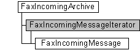

# FaxIncomingMessageIterator object

The **FaxIncomingMessageIterator** messaging object is used by a fax client application to move through the archive of inbound fax messages that the fax service has successfully received. Because the **FaxIncomingMessageIterator** object is a forward iterator, you can only move forward through the archive from beginning to end, and you can access only one fax message ([**FaxIncomingMessage**](-mfax-faxincomingmessage.md) object) at a time.

A **FaxIncomingMessageIterator** object is accessed through a [**FaxIncomingArchive**](-mfax-faxincomingarchive.md) object.

## Members

The **FaxIncomingMessageIterator** object has these types of members:

-   [Methods](#methods)
-   [Properties](#properties)

### Methods

The **FaxIncomingMessageIterator** object has these methods.

| Method                                                             | Description                                                                                                                                                                 |
|:-------------------------------------------------------------------|:----------------------------------------------------------------------------------------------------------------------------------------------------------------------------|
| [**MoveFirst**](-mfax-faxincomingmessageiterator-movefirst-vb.md) | The [**MoveFirst**](-mfax-faxincomingmessageiterator-movefirst-vb.md) method moves the archive cursor to the first fax message in the archive of inbound faxes.  |
| [**MoveNext**](-mfax-faxincomingmessageiterator-movenext-vb.md)   | The [**MoveNext**](-mfax-faxincomingmessageiterator-movenext-vb.md) method moves the archive cursor to the next message in the archive of inbound faxes.         |

 

### Properties

The **FaxIncomingMessageIterator** object has these properties.

| Property                                                                         | Access type           | Description                                                                                                                                                                                                                                                                                                                                                                              |
|:---------------------------------------------------------------------------------|:----------------------|:-----------------------------------------------------------------------------------------------------------------------------------------------------------------------------------------------------------------------------------------------------------------------------------------------------------------------------------------------------------------------------------------|
| [**AtEOF**](-mfax-faxincomingmessageiterator-ateof-vb.md)             | Read-only   | The [**AtEOF**](-mfax-faxincomingmessageiterator-ateof-vb.md) property is the end of file marker for the archive of inbound fax messages. If this property is equal to **True**, the archive cursor has moved beyond the last fax message in the inbound fax archive. If this property is equal to **False**, the archive cursor has not yet reached the end of the archive.  |
| [**Message**](-mfax-faxincomingmessageiterator-message-vb.md)         | Read-only   | The [**Message**](-mfax-faxincomingmessageiterator-message-vb.md) property retrieves the inbound fax message under the archive cursor.                                                                                                                                                                                                                                        |
| [**PrefetchSize**](-mfax-faxincomingmessageiterator-prefetchsize.md)  | Read/write  | The [**PrefetchSize**](-mfax-faxincomingmessageiterator-prefetchsize.md) property indicates the size of the prefetch (read-ahead) buffer.                                                                                                                                                                                                                                     |

 

## Remarks

To create a **FaxIncomingMessageIterator** object in Microsoft Visual Basic, call the [**GetMessages**](-mfax-faxincomingarchive-getmessages-vb.md) method of the [**FaxIncomingArchive**](-mfax-faxincomingarchive.md) object.

## Requirements

|                                     |                                                                                         |
|-------------------------------------|-----------------------------------------------------------------------------------------|
| Minimum supported client  | Windows XP \[desktop apps only\]                                              |
| Minimum supported server  | Windows Server 2003 \[desktop apps only\]                                     |
| Header                    | <dl> <dt>Faxcomex.h</dt> </dl>   |
| DLL                       | <dl> <dt>Fxscomex.dll</dt> </dl> |
| IID                       | CLSID\_FaxIncomingMessageIterator                                             |

## See also

<dl> <dt>

[Fax Service Extended COM Object Model](-mfax-fax-service-extended-com-object-model.md)
</dt> <dt>

[**FaxIncomingArchive**](-mfax-faxincomingarchive.md)
</dt> <dt>

[**IFaxIncomingMessageIterator**](-mfax-faxincomingmessageiterator-cpp.md)
</dt> </dl>

 

 

