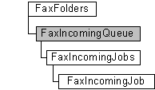

# FaxIncomingQueue object

The **FaxIncomingQueue** configuration object is used by a fax client application to manage the inbound fax jobs ([**FaxIncomingJobs**](-mfax-faxincomingjobs.md) object) in the job queue. The object also includes a method to block inbound faxes from the fax job queue.

A **FaxIncomingQueue** object is accessed through a [**FaxFolders**](-mfax-faxfolders.md) object.

> [!Note]  
> Changes made to the **FaxIncomingQueue** object will not be saved until you call the [**Save**](-mfax-faxincomingqueue-save-vb.md) method.

 

## Members

The **FaxIncomingQueue** object has these types of members:

-   [Methods](#methods)
-   [Properties](#properties)

### Methods

The **FaxIncomingQueue** object has these methods.

| Method                                               | Description                                                                                                                                                                                                                                                                                                 |
|:-----------------------------------------------------|:------------------------------------------------------------------------------------------------------------------------------------------------------------------------------------------------------------------------------------------------------------------------------------------------------------|
| [**GetJob**](-mfax-faxincomingqueue-getjob-vb.md)   | The [**GetJob**](-mfax-faxincomingqueue-getjob-vb.md) method returns an incoming fax job in the job queue according to its ID.                                                                                                                                                                   |
| [**GetJobs**](-mfax-faxincomingqueue-getjobs-vb.md) | The [**GetJobs**](-mfax-faxincomingqueue-getjobs-vb.md) method returns the collection of inbound fax jobs in the queue.                                                                                                                                                                          |
| [**Refresh**](-mfax-faxincomingqueue-refresh-vb.md) | The [**Refresh**](-mfax-faxincomingqueue-refresh-vb.md) method refreshes **FaxIncomingQueue** object information from the fax server. When the **Refresh** method is called, any configuration changes made after the last [**Save**](-mfax-faxincomingqueue-save-vb.md) method call are lost.  |
| [**Save**](-mfax-faxincomingqueue-save-vb.md)       | The [**Save**](-mfax-faxincomingqueue-save-vb.md) method saves the **FaxIncomingQueue** object's data.                                                                                                                                                                                           |

 

### Properties

The **FaxIncomingQueue** object has these properties.

| Property                                                        | Access type           | Description                                                                                                                                                          |
|:----------------------------------------------------------------|:----------------------|:---------------------------------------------------------------------------------------------------------------------------------------------------------------------|
| [**Blocked**](-mfax-faxincomingqueue-blocked-vb.md)  | Read/write  | The [**Blocked**](-mfax-faxincomingqueue-blocked-vb.md) property is a Boolean value that indicates whether the job queue for incoming faxes is blocked.   |

 

## Remarks

To create a **FaxIncomingQueue** object in Microsoft Visual Basic, call the [**IncomingQueue**](-mfax-faxfolders-incomingqueue-vb.md) method of the [**FaxFolders**](-mfax-faxfolders.md) object.

## Requirements

|                                     |                                                                                         |
|-------------------------------------|-----------------------------------------------------------------------------------------|
| Minimum supported client  | Windows XP \[desktop apps only\]                                              |
| Minimum supported server  | Windows Server 2003 \[desktop apps only\]                                     |
| Header                    | <dl> <dt>Faxcomex.h</dt> </dl>   |
| DLL                       | <dl> <dt>Fxscomex.dll</dt> </dl> |
| IID                       | CLSID\_FaxIncomingQueue                                                       |

## See also

<dl> <dt>

[Fax Service Extended COM Object Model](-mfax-fax-service-extended-com-object-model.md)
</dt> <dt>

[**FaxFolders**](-mfax-faxfolders.md)
</dt> <dt>

[**IFaxIncomingQueue**](/windows/previous-versions/FaxComex/nn-faxcomex-ifaxincomingqueue?branch=master)
</dt> </dl>

 

 

