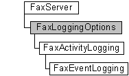

# FaxLoggingOptions object

The **FaxLoggingOptions** configuration object is used by a fax client application to access and configure the event logging categories and the activity logging options that the fax service is using.

A **FaxLoggingOptions** object is accessed through a [**FaxServer**](-mfax-faxserver.md) object. **FaxLoggingOptions** objects provide access to [**FaxActivityLogging**](-mfax-faxactivitylogging.md) objects and [**FaxEventLogging**](-mfax-faxeventlogging.md) objects.

## Members

The **FaxLoggingOptions** object has these types of members:

-   [Properties](#properties)

### Properties

The **FaxLoggingOptions** object has these properties.

| Property                                                                         | Access type          | Description                                                                                                                                                                              |
|:---------------------------------------------------------------------------------|:---------------------|:-----------------------------------------------------------------------------------------------------------------------------------------------------------------------------------------|
| [**ActivityLogging**](-mfax-faxloggingoptions-activitylogging-vb.md)  | Read-only  | The [**ActivityLogging**](-mfax-faxloggingoptions-activitylogging-vb.md) property retrieves the [**FaxActivityLogging**](-mfax-faxactivitylogging.md) configuration object.  |
| [**EventLogging**](-mfax-faxloggingoptions-eventlogging-vb.md)        | Read-only  | The [**EventLogging**](-mfax-faxloggingoptions-eventlogging-vb.md) property retrieves the [**FaxEventLogging**](-mfax-faxeventlogging.md) configuration object.              |

 

## Remarks

To create a **FaxLoggingOptions** object in Microsoft Visual Basic, call the [**LoggingOptions**](-mfax-faxserver-loggingoptions.md) property of the [**FaxServer**](-mfax-faxserver.md) object.

## Requirements

|                                     |                                                                                         |
|-------------------------------------|-----------------------------------------------------------------------------------------|
| Minimum supported client  | Windows XP \[desktop apps only\]                                              |
| Minimum supported server  | Windows Server 2003 \[desktop apps only\]                                     |
| Header                    | <dl> <dt>Faxcomex.h</dt> </dl>   |
| DLL                       | <dl> <dt>Fxscomex.dll</dt> </dl> |
| IID                       | CLSID\_FaxLoggingOptions                                                      |

## See also

<dl> <dt>

[Fax Service Extended COM Object Model](-mfax-fax-service-extended-com-object-model.md)
</dt> <dt>

[**FaxServer**](-mfax-faxserver.md)
</dt> <dt>

[**IFaxLoggingOptions**](-mfax-faxloggingoptions-cpp.md)
</dt> </dl>

 

 

