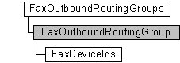

# FaxOutboundRoutingGroup object

The **FaxOutboundRoutingGroup** configuration object is used by a fax client application to retrieve information about an individual fax outbound routing group. The object also includes a method to retrieve the ordered collection of device IDs ([**FaxDeviceIds**](-mfax-faxdeviceids.md) object) that participate in the routing group. The order of the devices in the collection determines the relative order in which available devices send outgoing transmissions.

## Members

The **FaxOutboundRoutingGroup** object has these types of members:

-   [Properties](#properties)

### Properties

The **FaxOutboundRoutingGroup** object has these properties.

| Property                                                                | Access type          | Description                                                                                                                                                                                                                                                                                                          |
|:------------------------------------------------------------------------|:---------------------|:---------------------------------------------------------------------------------------------------------------------------------------------------------------------------------------------------------------------------------------------------------------------------------------------------------------------|
| [**DeviceIds**](-mfax-faxoutboundroutinggroup-deviceids.md)  | Read-only  | The [**DeviceIds**](-mfax-faxoutboundroutinggroup-deviceids.md) property retrieves the ordered collection of device IDs that participate in the outbound routing group. The order of the devices in the collection determines the relative order in which available devices send outgoing transmissions.  |
| [**Name**](-mfax-faxoutboundroutinggroup-name-vb.md)         | Read-only  | The [**Name**](-mfax-faxoutboundroutinggroup-name-vb.md) property is a null-terminated string that specifies the name of the outbound routing group.                                                                                                                                                      |
| [**Status**](-mfax-faxoutboundroutinggroup-status-vb.md)     | Read-only  | The [**Status**](-mfax-faxoutboundroutinggroup-status-vb.md) property indicates the collective status of the fax devices in the outbound routing group.                                                                                                                                                   |

 

## Remarks

A **FaxOutboundRoutingGroup** object is accessed through a [**FaxOutboundRoutingGroups**](-mfax-faxoutboundroutinggroups.md) object.

To create a **FaxOutboundRoutingGroup** object in Microsoft Visual Basic, call the [**Item**](-mfax-faxoutboundroutinggroups-item.md) property of the [**FaxOutboundRoutingGroups**](-mfax-faxoutboundroutinggroups.md) object.

To create a **FaxOutboundRoutingGroup** object in C++, call the [**Item**](-mfax-faxoutboundroutinggroups-item.md) method.

## Requirements

|                                     |                                                                                         |
|-------------------------------------|-----------------------------------------------------------------------------------------|
| Minimum supported client  | Windows XP \[desktop apps only\]                                              |
| Minimum supported server  | Windows Server 2003 \[desktop apps only\]                                     |
| Header                    | <dl> <dt>Faxcomex.h</dt> </dl>   |
| DLL                       | <dl> <dt>Fxscomex.dll</dt> </dl> |
| IID                       | CLSID\_FaxOutboundRoutingGroup                                                |

## See also

<dl> <dt>

[Fax Service object hierarchy](-mfax-fax-service-extended-com-object-model.md)
</dt> <dt>

[**FaxOutboundRoutingGroup**](-mfax-faxoutboundroutinggroup.md)
</dt> </dl>

 

 

