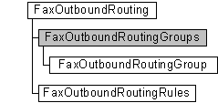

# FaxOutboundRoutingGroups object

The **FaxOutboundRoutingGroups** configuration collection is used by a fax client application to manage the fax outbound routing groups, represented by [**FaxOutboundRoutingGroup**](-mfax-faxoutboundroutinggroup.md) objects. The collection also includes methods to add and remove groups from the collection.

> [!Note]  
> The outbound routing group **All Devices** is always the first object in this collection. You cannot remove the **All Devices** group from the collection. If you attempt to remove it, you will receive an error message.

 

## Members

The **FaxOutboundRoutingGroups** object has these types of members:

-   [Methods](#methods)
-   [Properties](#properties)

### Methods

The **FaxOutboundRoutingGroups** object has these methods.

<table>
<colgroup>
<col style="width: 50%" />
<col style="width: 50%" />
</colgroup>
<thead>
<tr class="header">
<th style="text-align: left;">Method</th>
<th style="text-align: left;">Description</th>
</tr>
</thead>
<tbody>
<tr class="odd">
<td style="text-align: left;">[<strong>Add</strong>](-mfax-faxoutboundroutinggroups-add.md)</td>
<td style="text-align: left;">The [<strong>Add</strong>](-mfax-faxoutboundroutinggroups-add.md) method adds an outbound routing group to the <strong>FaxOutboundRoutingGroups</strong> collection. </td>
</tr>
<tr class="even">
<td style="text-align: left;">[<strong>Remove</strong>](-mfax-faxoutboundroutinggroups-remove-vb.md)</td>
<td style="text-align: left;">The [<strong>Remove</strong>](-mfax-faxoutboundroutinggroups-remove-vb.md) method removes an item from the <strong>FaxOutboundRoutingGroups</strong> collection.  
<blockquote>
[!Note] 
You cannot remove the special <strong>All Devices</strong> routing group.
</blockquote>
 </td>
</tr>
</tbody>
</table>

 

### Properties

The **FaxOutboundRoutingGroups** object has these properties.

| Property                                                            | Access type          | Description                                                                                                                                                                                                                                           |
|:--------------------------------------------------------------------|:---------------------|:------------------------------------------------------------------------------------------------------------------------------------------------------------------------------------------------------------------------------------------------------|
| [**Count**](-mfax-faxoutboundroutinggroups-count-vb.md)  | Read-only  | The [**Count**](-mfax-faxoutboundroutinggroups-count-vb.md) property represents the number of objects in the **FaxOutboundRoutingGroups** collection. This is the total number of outbound routing groups associated with the fax server.  |
| [**Item**](-mfax-faxoutboundroutinggroups-item.md)       | Read-only  | The Item property returns a [**FaxOutboundRoutingGroup**](-mfax-faxoutboundroutinggroup.md) object from the **FaxOutboundRoutingGroups** collection.                                                                                       |

 

## Remarks

A **FaxOutboundRoutingGroups** object is accessed through a [**FaxOutboundRouting**](-mfax-faxoutboundrouting.md) object.

To create a **FaxOutboundRoutingGroups** object in Microsoft Visual Basic, call the [**GetGroups**](-mfax-faxoutboundrouting-getgroups.md) method of the [**FaxOutboundRouting**](-mfax-faxoutboundrouting.md) object.

To create a **FaxOutboundRoutingGroups** object in C++, call the [**GetGroups**](-mfax-faxoutboundrouting-getgroups.md) method.

## Requirements

|                                     |                                                                                         |
|-------------------------------------|-----------------------------------------------------------------------------------------|
| Minimum supported client  | Windows XP \[desktop apps only\]                                              |
| Minimum supported server  | Windows Server 2003 \[desktop apps only\]                                     |
| Header                    | <dl> <dt>Faxcomex.h</dt> </dl>   |
| DLL                       | <dl> <dt>Fxscomex.dll</dt> </dl> |
| IID                       | CLSID\_FaxOutboundRoutingGroups                                               |

## See also

<dl> <dt>

[Fax Service object hierarchy](-mfax-fax-service-extended-com-object-model.md)
</dt> <dt>

[**FaxOutboundRoutingGroups**](-mfax-faxoutboundroutinggroups.md)
</dt> </dl>

 

 

