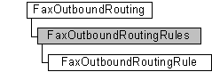

# FaxOutboundRoutingRules object

The **FaxOutboundRoutingRules** configuration collection is used by a fax client application to manage the fax outbound routing rules. The collection also includes methods to add and remove rules from the collection. Each outbound routing rule is represented by a [**FaxOutboundRoutingRule**](-mfax-faxoutboundroutingrule.md) object.

## Members

The **FaxOutboundRoutingRules** object has these types of members:

-   [Methods](#methods)
-   [Properties](#properties)

### Methods

The **FaxOutboundRoutingRules** object has these methods.

| Method                                                                                    | Description                                                                                                                                                                                                                                                                                              |
|:------------------------------------------------------------------------------------------|:---------------------------------------------------------------------------------------------------------------------------------------------------------------------------------------------------------------------------------------------------------------------------------------------------------|
| [**Add**](-mfax-faxoutboundroutingrules-add.md)                                          | The [**Add**](-mfax-faxoutboundroutingrules-add.md) method adds an outbound routing rule ([**FaxOutboundRoutingRule**](-mfax-faxoutboundroutingrule.md) object) to the **FaxOutboundRoutingRules** collection.                                                                               |
| [**ItemByCountryAndArea**](-mfax-faxoutboundroutingrules-itembycountryandarea-vb.md)     | The [**ItemByCountryAndArea**](-mfax-faxoutboundroutingrules-itembycountryandarea-vb.md) method returns an outbound routing rule ([**FaxOutboundRoutingRule**](-mfax-faxoutboundroutingrule.md) object) from the collection using the routing rule's country/region code and area code.      |
| [**Remove**](-mfax-faxoutboundroutingrules-remove-vb.md)                                 | The [**Remove**](-mfax-faxoutboundroutingrules-remove-vb.md) method removes an outbound routing rule ([**FaxOutboundRoutingRule**](-mfax-faxoutboundroutingrule.md) object) from the **FaxOutboundRoutingRules** collection using the routing rule's index.                                  |
| [**RemoveByCountryAndArea**](-mfax-faxoutboundroutingrules-removebycountryandarea-vb.md) | The [**RemoveByCountryAndArea**](-mfax-faxoutboundroutingrules-removebycountryandarea-vb.md) method removes an outbound routing rule ([**FaxOutboundRoutingRule**](-mfax-faxoutboundroutingrule.md) object) from the collection using the routing rule's country/region code and area code.  |

 

### Properties

The **FaxOutboundRoutingRules** object has these properties.

| Property                                                           | Access type          | Description                                                                                                                                                                                                                                        |
|:-------------------------------------------------------------------|:---------------------|:---------------------------------------------------------------------------------------------------------------------------------------------------------------------------------------------------------------------------------------------------|
| [**Count**](-mfax-faxoutboundroutingrules-count-vb.md)  | Read-only  | The [**Count**](-mfax-faxoutboundroutingrules-count-vb.md) property represents the number of objects in the **FaxOutboundRoutingRules** collection. This is the total number of outbound routing rules associated with the fax server.  |
| [**Item**](-mfax-faxoutboundroutingrules-item.md)       | Read-only  | The [**Item**](-mfax-faxoutboundroutingrules-item.md) property returns a [**FaxOutboundRoutingRule**](-mfax-faxoutboundroutingrule.md) object from the **FaxOutboundRoutingRules** collection using the routing rule's index.          |

 

## Remarks

A **FaxOutboundRoutingRules** object is accessed through a [**FaxOutboundRouting**](-mfax-faxoutboundrouting.md) object.

To create a **FaxOutboundRoutingRules** object in Microsoft Visual Basic, call the [**GetRules**](-mfax-faxoutboundrouting-getrules.md) method of the [**FaxOutboundRouting**](-mfax-faxoutboundrouting.md) object.

To create a **FaxOutboundRoutingRules** object in C++, call the [**GetRules**](-mfax-faxoutboundrouting-getrules.md) method.

## Requirements

|                                     |                                                                                         |
|-------------------------------------|-----------------------------------------------------------------------------------------|
| Minimum supported client  | Windows XP \[desktop apps only\]                                              |
| Minimum supported server  | Windows Server 2003 \[desktop apps only\]                                     |
| Header                    | <dl> <dt>Faxcomex.h</dt> </dl>   |
| DLL                       | <dl> <dt>Fxscomex.dll</dt> </dl> |
| IID                       | CLSID\_FaxOutboundRoutingRules                                                |

 

 

