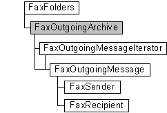

# FaxOutgoingArchive object

The **FaxOutgoingArchive** configuration object is used by a fax client application to access and configure the archive of outbound fax messages transmitted successfully by the fax service. You can also use the **FaxOutgoingArchive** object to retrieve a message from the archive using its message ID.

## Members

The **FaxOutgoingArchive** object has these types of members:

-   [Methods](#methods)
-   [Properties](#properties)

### Methods

The **FaxOutgoingArchive** object has these methods.

<table>
<colgroup>
<col style="width: 50%" />
<col style="width: 50%" />
</colgroup>
<thead>
<tr class="header">
<th style="text-align: left;">Method</th>
<th style="text-align: left;">Description</th>
</tr>
</thead>
<tbody>
<tr class="odd">
<td style="text-align: left;">[<strong>GetMessage</strong>](-mfax-faxoutgoingarchive-getmessage.md)</td>
<td style="text-align: left;">The [<strong>GetMessage</strong>](-mfax-faxoutgoingarchive-getmessage.md) method returns a fax message from the archive of outbound faxes by using the fax message ID. </td>
</tr>
<tr class="even">
<td style="text-align: left;">[<strong>GetMessages</strong>](-mfax-faxoutgoingarchive-getmessages.md)</td>
<td style="text-align: left;">The [<strong>GetMessages</strong>](-mfax-faxoutgoingarchive-getmessages.md) method returns a new iterator (archive cursor) for the archive of outbound fax messages. For more information, see [<strong>FaxOutgoingMessageIterator</strong>](-mfax-faxoutgoingmessageiterator.md). </td>
</tr>
<tr class="odd">
<td style="text-align: left;">[<strong>Refresh</strong>](-mfax-faxoutgoingarchive-refresh-vb.md)</td>
<td style="text-align: left;">The [<strong>Refresh</strong>](-mfax-faxoutgoingarchive-refresh-vb.md) method refreshes <strong>FaxOutgoingArchive</strong> object information from the fax server. When the <strong>Refresh</strong> method is called, any configuration changes made after the last [<strong>Save</strong>](-mfax-faxoutgoingarchive-save-vb.md) method call are lost. 
<blockquote>
[!Note] 
In Windows Vista, Windows Server 2008, and later versions of Windows, this method is not supported and returns an error.
</blockquote>
 </td>
</tr>
<tr class="even">
<td style="text-align: left;">[<strong>Save</strong>](-mfax-faxoutgoingarchive-save-vb.md)</td>
<td style="text-align: left;">The [<strong>Save</strong>](-mfax-faxoutgoingarchive-save-vb.md) method saves the <strong>FaxOutgoingArchive</strong> object data. 
<blockquote>
[!Note] 
In Windows Vista, Windows Server 2008, and later versions of Windows, this method is not supported and returns an error.
</blockquote>
 </td>
</tr>
</tbody>
</table>

 

### Properties

The **FaxOutgoingArchive** object has these properties.

<table>
<colgroup>
<col style="width: 33%" />
<col style="width: 33%" />
<col style="width: 33%" />
</colgroup>
<thead>
<tr class="header">
<th style="text-align: left;">Property</th>
<th style="text-align: left;">Access type</th>
<th style="text-align: left;">Description</th>
</tr>
</thead>
<tbody>
<tr class="odd">
<td style="text-align: left;">[<strong>AgeLimit</strong>](-mfax-faxoutgoingarchive-agelimit-vb.md) </td>
<td style="text-align: left;">Read/write </td>
<td style="text-align: left;">The [<strong>AgeLimit</strong>](-mfax-faxoutgoingarchive-agelimit-vb.md) property is a value that indicates the number of days that the fax service retains fax messages in the archive of outbound faxes. The fax service deletes messages from the outbound archive when they exceed the age limit. If the value of this property is zero, the fax service does not enforce an age limit. 
<blockquote>
[!Note] 
This property is not supported in Windows Vista, Windows Server 2008, and later versions of Windows. To access this property in Windows Vista, Windows Server 2008, and later versions of Windows, get the [<strong>FaxConfiguration.ArchiveAgeLimit</strong>](-mfax-faxconfiguration-archiveagelimit-vb.md) property from the [<strong>FaxServer</strong>](-mfax-faxserver.md) object.
</blockquote>
 </td>
</tr>
<tr class="even">
<td style="text-align: left;">[<strong>ArchiveFolder</strong>](-mfax-faxoutgoingarchive-archivefolder-vb.md) </td>
<td style="text-align: left;">Read-only </td>
<td style="text-align: left;">The [<strong>ArchiveFolder</strong>](-mfax-faxoutgoingarchive-archivefolder-vb.md) property is a null-terminated string that specifies the folder location on the fax server for archived outbound faxes. 
<blockquote>
[!Note] 
This property is not supported in Windows Vista, Windows Server 2008, and later versions of Windows. To access this property in Windows Vista, Windows Server 2008, and later versions of Windows, get the [<strong>FaxConfiguration.ArchiveLocation</strong>](-mfax-faxconfiguration-archivelocation-vb.md) property from the [<strong>FaxServer</strong>](-mfax-faxserver.md) object.
</blockquote>
 </td>
</tr>
<tr class="odd">
<td style="text-align: left;">[<strong>HighQuotaWaterMark</strong>](-mfax-faxoutgoingarchive-highquotawatermark-vb.md) </td>
<td style="text-align: left;">Read/write </td>
<td style="text-align: left;">The [<strong>HighQuotaWaterMark</strong>](-mfax-faxoutgoingarchive-highquotawatermark-vb.md) property is a value that specifies the upper threshold for the size of the archive of inbound fax messages, in megabytes. If the archived fax messages in the archive exceed this value, and the [<strong>SizeQuotaWarning</strong>](-mfax-faxoutgoingarchive-sizequotawarning-vb.md) property is equal to <strong>True</strong>, the fax service issues a warning in the event log. 
<blockquote>
[!Note] 
This property is not supported in Windows Vista, Windows Server 2008, and later versions of Windows. To access this property in Windows Vista, Windows Server 2008, and later versions of Windows, get the [<strong>FaxConfiguration.HighQuotaWaterMark</strong>](-mfax-faxconfiguration-highquotawatermark-vb.md) property from the [<strong>FaxServer</strong>](-mfax-faxserver.md) object.
</blockquote>
 </td>
</tr>
<tr class="even">
<td style="text-align: left;">[<strong>LowQuotaWaterMark</strong>](-mfax-faxoutgoingarchive-lowquotawatermark-vb.md) </td>
<td style="text-align: left;">Read/write </td>
<td style="text-align: left;">The [<strong>LowQuotaWaterMark</strong>](-mfax-faxoutgoingarchive-lowquotawatermark-vb.md) property is a value that specifies the lower threshold for the archive of outbound fax messages, in megabytes. If the fax service has issued a warning in the event log, the service does not issue additional warnings until the size of the outbound archive drops below this value.  
<blockquote>
[!Note] 
This property is not supported in Windows Vista, Windows Server 2008, and later versions of Windows. To access this property in Windows Vista, Windows Server 2008, and later versions of Windows, get the [<strong>FaxConfiguration.LowQuotaWaterMark</strong>](-mfax-faxconfiguration-lowquotawatermark-vb.md) property from the [<strong>FaxServer</strong>](-mfax-faxserver.md) object.
</blockquote>
 </td>
</tr>
<tr class="odd">
<td style="text-align: left;">[<strong>SizeHigh</strong>](-mfax-faxoutgoingarchive-sizehigh-vb.md) </td>
<td style="text-align: left;">Read-only </td>
<td style="text-align: left;">The [<strong>SizeHigh</strong>](-mfax-faxoutgoingarchive-sizehigh-vb.md) property is a value that specifies the high 32-bit value (in bytes) for the size of the archive of outgoing fax messages. 
<blockquote>
[!Note] 
This property is not supported in Windows Vista, Windows Server 2008, and later versions of Windows. To access this property in Windows Vista, Windows Server 2008, and later versions of Windows, get the [<strong>FaxConfiguration.ArchiveSizeHigh</strong>](-mfax-faxconfiguration-archivesizehigh-vb.md) property from the [<strong>FaxServer</strong>](-mfax-faxserver.md) object.
</blockquote>
 </td>
</tr>
<tr class="even">
<td style="text-align: left;">[<strong>SizeLow</strong>](-mfax-faxoutgoingarchive-sizelow-vb.md) </td>
<td style="text-align: left;">Read-only </td>
<td style="text-align: left;">The [<strong>SizeLow</strong>](-mfax-faxoutgoingarchive-sizelow-vb.md) property is a value that specifies the low 32-bit value (in bytes) for the size of the archive of outgoing fax messages. 
<blockquote>
[!Note] 
This property is not supported in Windows Vista, Windows Server 2008, and later versions of Windows. To access this property in Windows Vista, Windows Server 2008, and later versions of Windows, get the [<strong>FaxConfiguration.ArchiveSizeLow</strong>](-mfax-faxconfiguration-archivesizelow-vb.md) property from the [<strong>FaxServer</strong>](-mfax-faxserver.md) object.
</blockquote>
 </td>
</tr>
<tr class="odd">
<td style="text-align: left;">[<strong>SizeQuotaWarning</strong>](-mfax-faxoutgoingarchive-sizequotawarning-vb.md) </td>
<td style="text-align: left;">Read/write </td>
<td style="text-align: left;">The [<strong>SizeQuotaWarning</strong>](-mfax-faxoutgoingarchive-sizequotawarning-vb.md) property is a Boolean value that indicates whether the fax service issues a warning in the event log when the size of the outbound archive exceeds the limit defined by the [<strong>HighQuotaWaterMark</strong>](-mfax-faxoutgoingarchive-highquotawatermark-vb.md) property. 
<blockquote>
[!Note] 
This property is not supported in Windows Vista, Windows Server 2008, and later versions of Windows. To access this property in Windows Vista, Windows Server 2008, and later versions of Windows, get the [<strong>FaxConfiguration.SizeQuotaWarning</strong>](-mfax-faxconfiguration-sizequotawarning-vb.md) property from the [<strong>FaxServer</strong>](-mfax-faxserver.md) object.
</blockquote>
 </td>
</tr>
<tr class="even">
<td style="text-align: left;">[<strong>UseArchive</strong>](-mfax-faxoutgoingarchive-usearchive-vb.md) </td>
<td style="text-align: left;">Read/write </td>
<td style="text-align: left;">The [<strong>UseArchive</strong>](-mfax-faxoutgoingarchive-usearchive-vb.md) property is a Boolean value that indicates whether the fax service archives outbound fax messages. If this parameter is equal to <strong>True</strong>, the fax service archives outbound fax messages. If this parameter is equal to <strong>False</strong>, the fax service does not archive outbound faxes. 
<blockquote>
[!Note] 
This property is not supported in Windows Vista, Windows Server 2008, and later versions of Windows. To access this property in Windows Vista, Windows Server 2008, and later versions of Windows, get the [<strong>FaxConfiguration.UseArchive</strong>](-mfax-faxconfiguration-usearchive-vb.md) property from the [<strong>FaxServer</strong>](-mfax-faxserver.md) object.
</blockquote>
 </td>
</tr>
</tbody>
</table>

 

## Remarks

A **FaxOutgoingArchive** object is accessed through a [**FaxFolders**](-mfax-faxfolders.md) object.

To create a **FaxOutgoingArchive** object in Microsoft Visual Basic, retrieve the [**OutgoingArchive**](-mfax-faxfolders-outgoingarchive-vb.md) property of the [**FaxFolders**](-mfax-faxfolders.md) object.

To create a **FaxOutgoingArchive** object in C++, call the [**OutgoingArchive**](-mfax-faxfolders-outgoingarchive-vb.md) method.

## Requirements

|                                     |                                                                                         |
|-------------------------------------|-----------------------------------------------------------------------------------------|
| Minimum supported client  | Windows XP \[desktop apps only\]                                              |
| Minimum supported server  | Windows Server 2003 \[desktop apps only\]                                     |
| Header                    | <dl> <dt>Faxcomex.h</dt> </dl>   |
| DLL                       | <dl> <dt>Fxscomex.dll</dt> </dl> |
| IID                       | CLSID\_FaxOutgoingArchive                                                     |

 

 

