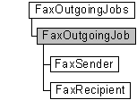

# FaxOutgoingJob object

The **FaxOutgoingJob** object is used by a fax client application to retrieve information about an outgoing fax job in a fax server's queue. The object also includes methods to cancel, pause, resume, or restart an outgoing fax job, and to copy the Tagged Image File Format Class F (TIFF Class F) file associated with an outbound fax job, to a file on the local computer.

## Members

The **FaxOutgoingJob** object has these types of members:

-   [Methods](#methods)
-   [Properties](#properties)

### Methods

The **FaxOutgoingJob** object has these methods.

| Method                                               | Description                                                                                                                                                                                                          |
|:-----------------------------------------------------|:---------------------------------------------------------------------------------------------------------------------------------------------------------------------------------------------------------------------|
| [**Cancel**](-mfax-faxoutgoingjob-cancel-vb.md)     | The [**Cancel**](-mfax-faxoutgoingjob-cancel-vb.md) method cancels the outbound fax job.                                                                                                                  |
| [**CopyTiff**](-mfax-faxoutgoingjob-copytiff-vb.md) | The [**CopyTiff**](-mfax-faxoutgoingjob-copytiff-vb.md) method copies the TIFF Class F file associated with the outbound fax job, to a file on the local computer.                                        |
| [**Pause**](-mfax-faxoutgoingjob-pause-vb.md)       | The [**Pause**](-mfax-faxoutgoingjob-pause-vb.md) method pauses the outbound fax job.                                                                                                                     |
| [**Refresh**](-mfax-faxoutgoingjob-refresh-vb.md)   | The Refresh method refreshes **FaxOutgoingJob** object information from the fax server.                                                                                                                    |
| [**Restart**](-mfax-faxoutgoingjob-restart-vb.md)   | The [**Restart**](-mfax-faxoutgoingjob-restart-vb.md) method restarts the failed outbound fax job. For example, if the fax job has exceeded the number of retries, **Restart** will restart the fax job.  |
| [**Resume**](-mfax-faxoutgoingjob-resume-vb.md)     | The [**Resume**](-mfax-faxoutgoingjob-resume-vb.md) method resumes the paused outbound fax job.                                                                                                           |

 

### Properties

The **FaxOutgoingJob** object has these properties.

| Property                                                                                    | Access type          | Description                                                                                                                                                                                                                                                                    |
|:--------------------------------------------------------------------------------------------|:---------------------|:-------------------------------------------------------------------------------------------------------------------------------------------------------------------------------------------------------------------------------------------------------------------------------|
| [**AvailableOperations**](-mfax-faxoutgoingjob-availableoperations-vb.md)        | Read-only  | The [**AvailableOperations**](-mfax-faxoutgoingjob-availableoperations-vb.md) property indicates the combination of valid operations that you can perform on the fax job, given its current status.                                                                 |
| [**CSID**](-mfax-faxoutgoingjob-csid-vb.md)                                      | Read-only  | The [**CSID**](-mfax-faxoutgoingjob-csid-vb.md) property is a null-terminated string that contains the CSID associated with the fax outbound job.                                                                                                                   |
| [**CurrentPage**](-mfax-faxoutgoingjob-currentpage-vb.md)                        | Read-only  | The [**CurrentPage**](-mfax-faxoutgoingjob-currentpage-vb.md) property is a number that identifies the page that the fax service is actively transmitting on an outbound fax job.                                                                                   |
| [**DeviceId**](-mfax-faxoutgoingjob-deviceid-vb.md)                              | Read-only  | The [**DeviceId**](-mfax-faxoutgoingjob-deviceid-vb.md) property indicates the device ID of the device transmitting the outbound fax job.                                                                                                                           |
| [**DocumentName**](-mfax-faxoutgoingjob-documentname-vb.md)                      | Read-only  | The [**DocumentName**](-mfax-faxoutgoingjob-documentname-vb.md) property is a null-terminated string that contains the user-friendly name to display for the fax document.                                                                                          |
| [**ExtendedStatus**](-mfax-faxoutgoingjob-extendedstatus-vb.md)                  | Read-only  | The [**ExtendedStatus**](-mfax-faxoutgoingjob-extendedstatus-vb.md) property is a null-terminated string that describes the job's extended status.                                                                                                                  |
| [**ExtendedStatusCode**](-mfax-faxoutgoingjob-extendedstatuscode-vb.md)          | Read-only  | The [**ExtendedStatusCode**](-mfax-faxoutgoingjob-extendedstatuscode-vb.md) property specifies a code describing the job's extended status.                                                                                                                         |
| [**GroupBroadcastReceipts**](-mfax-faxoutgoingjob-groupbroadcastreceipts-vb.md)  | Read-only  | The [**GroupBroadcastReceipts**](-mfax-faxoutgoingjob-groupbroadcastreceipts-vb.md) property is a Boolean value that indicates whether to send an individual delivery receipt for each recipient of the broadcast or to send a summary receipt for all recipients.  |
| [**HasCoverPage**](-mfax-faxoutgoingjob-hascoverpage-vb.md)                      | Read-only  | Specifies if the fax has a cover page.                                                                                                                                                                                                                               |
| [**Id**](-mfax-faxoutgoingjob-id-vb.md)                                          | Read-only  | The [**Id**](-mfax-faxoutgoingjob-id-vb.md) property is a null-terminated string that contains a unique identifier for the outbound fax job. You can use the identifier to retrieve the archived fax message after the job completes successfully.                  |
| [**OriginalScheduledTime**](-mfax-faxoutgoingjob-originalscheduledtime-vb.md)    | Read-only  | The [**OriginalScheduledTime**](-mfax-faxoutgoingjob-originalscheduledtime-vb.md) property specifies the time that the fax job was originally scheduled for transmission.                                                                                           |
| [**Pages**](-mfax-faxoutgoingjob-pages-vb.md)                                    | Read-only  | The [**Pages**](-mfax-faxoutgoingjob-pages-vb.md) property is a number that indicates the total number of pages in the outbound fax job.                                                                                                                            |
| [**Priority**](-mfax-faxoutgoingjob-priority-vb.md)                              | Read-only  | The [**Priority**](-mfax-faxoutgoingjob-priority-vb.md) property specifies the priority to use when sending the fax; for example, normal, low, or high priority.                                                                                                    |
| [**ReceiptAddress**](-mfax-faxoutgoingjob-receiptaddress-vb.md)                  | Read-only  | A null-terminated string containing the address to which a delivery report will be sent, indicating success or failure.                                                                                                                                              |
| [**ReceiptType**](-mfax-faxoutgoingjob-receipttype-vb.md)                        | Read-only  | The [**ReceiptType**](-mfax-faxoutgoingjob-receipttype-vb.md) property is a value that specifies the type of delivery receipt to deliver when the fax message reaches a final state. The receipt type can be SMTP mail, a message box, or no receipt.               |
| [**Recipient**](-mfax-faxoutgoingjob-recipient.md)                               | Read-only  | The [**Recipient**](-mfax-faxoutgoingjob-recipient.md) property retrieves an object containing information about the recipient of the fax job.                                                                                                                      |
| [**Retries**](-mfax-faxoutgoingjob-retries-vb.md)                                | Read-only  | The [**Retries**](-mfax-faxoutgoingjob-retries-vb.md) property is a value that indicates the number of times that the fax service attempted to transmit an outgoing fax after the initial transmission attempt failed.                                              |
| [**ScheduledTime**](-mfax-faxoutgoingjob-scheduledtime-vb.md)                    | Read-only  | The [**ScheduledTime**](-mfax-faxoutgoingjob-scheduledtime-vb.md) property indicates the time to submit the fax for processing to the fax service.                                                                                                                  |
| [**ScheduleType**](-mfax-faxoutgoingjob-scheduletype-vb.md)                      | Read-only  | Specifies the schedule type that was used for the transmission.                                                                                                                                                                                                      |
| [**Sender**](-mfax-faxoutgoingjob-sender.md)                                     | Read-only  | The [**Sender**](-mfax-faxoutgoingjob-sender.md) property retrieves an object that contains information about the sender of the fax.                                                                                                                                |
| [**Size**](-mfax-faxoutgoingjob-size-vb.md)                                      | Read-only  | The [**Size**](-mfax-faxoutgoingjob-size-vb.md) property is a value that indicates the size of the TIFF Class F file associated with the outbound fax job.                                                                                                          |
| [**Status**](-mfax-faxoutgoingjob-status-vb.md)                                  | Read-only  | The [**Status**](-mfax-faxoutgoingjob-status-vb.md) property is a number that indicates the current status of an outbound fax job in the job queue.                                                                                                                 |
| [**Subject**](-mfax-faxoutgoingjob-subject-vb.md)                                | Read-only  | The [**Subject**](-mfax-faxoutgoingjob-subject-vb.md) property is a null-terminated string that contains the contents of the subject field on the cover page of the fax.                                                                                            |
| [**SubmissionId**](-mfax-faxoutgoingjob-submissionid-vb.md)                      | Read-only  | The [**SubmissionId**](-mfax-faxoutgoingjob-submissionid-vb.md) property is a null-terminated string that contains the unique identifier assigned to the fax job during the submission process.                                                                     |
| [**SubmissionTime**](-mfax-faxoutgoingjob-submissiontime-vb.md)                  | Read-only  | The [**SubmissionTime**](-mfax-faxoutgoingjob-submissiontime-vb.md) property indicates the time that the outbound fax job was submitted for processing.                                                                                                             |
| [**TransmissionEnd**](-mfax-faxoutgoingjob-transmissionend-vb.md)                | Read-only  | The [**TransmissionEnd**](-mfax-faxoutgoingjob-transmissionend-vb.md) property indicates the time that the outbound fax job completed transmission.                                                                                                                 |
| [**TransmissionStart**](-mfax-faxoutgoingjob-transmissionstart-vb.md)            | Read-only  | The [**TransmissionStart**](-mfax-faxoutgoingjob-transmissionstart-vb.md) property indicates the time that the fax outbound job began transmitting. This property will have a value only after the transmission has started.                                        |
| [**TSID**](-mfax-faxoutgoingjob-tsid-vb.md)                                      | Read-only  | The [**TSID**](-mfax-faxoutgoingjob-tsid-vb.md) property is a null-terminated string that contains the TSID associated with the fax outbound job.                                                                                                                   |

 

## Remarks

A **FaxOutgoingJob** object is accessed through a [**FaxOutgoingJobs**](-mfax-faxoutgoingjobs.md) object.

To create a **FaxOutgoingJob** object in Microsoft Visual Basic, retrieve the [**Item**](-mfax-faxoutgoingjobs-item.md) property of the **FaxOutgoingJob** object.

To create a [**IFaxOutgoingJob**](/windows/previous-versions/FaxComex/nn-faxcomex-ifaxoutgoingjob?branch=master) object in C++, call the [**get\_Item**](/windows/previous-versions/FaxComex/nf-faxcomex-ifaxoutgoingjobs-get_item?branch=master) method.

## Requirements

|                                     |                                                                                         |
|-------------------------------------|-----------------------------------------------------------------------------------------|
| Minimum supported client  | Windows XP \[desktop apps only\]                                              |
| Minimum supported server  | Windows Server 2003 \[desktop apps only\]                                     |
| Header                    | <dl> <dt>Faxcomex.h</dt> </dl>   |
| DLL                       | <dl> <dt>Fxscomex.dll</dt> </dl> |
| IID                       | CLSID\_FaxOutgoingJob                                                         |

 

 

