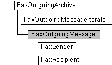

# FaxOutgoingMessage object

The **FaxOutgoingMessage** object is used by a fax client application to retrieve information about a fax message in the archive of outbound faxes. The archive contains faxes transmitted successfully by the fax service. The object enables you to retrieve information about the fax recipient, contained in the [**FaxRecipient**](-mfax-faxrecipient.md) object, and information about the fax sender, contained in the [**FaxSender**](-mfax-faxsender.md) object. It also includes methods to delete a message from the archive and to copy the Tagged Image File Format Class F (TIFF Class F) file associated with the fax message, to a file on the local computer.

## Members

The **FaxOutgoingMessage** object has these types of members:

-   [Methods](#methods)
-   [Properties](#properties)

### Methods

The **FaxOutgoingMessage** object has these methods.

<table>
<colgroup>
<col style="width: 50%" />
<col style="width: 50%" />
</colgroup>
<thead>
<tr class="header">
<th style="text-align: left;">Method</th>
<th style="text-align: left;">Description</th>
</tr>
</thead>
<tbody>
<tr class="odd">
<td style="text-align: left;">[<strong>CopyTiff</strong>](-mfax-faxoutgoingmessage-copytiff-vb.md)</td>
<td style="text-align: left;">The [<strong>CopyTiff</strong>](-mfax-faxoutgoingmessage-copytiff-vb.md) method copies the TIFF Class F file associated with the outbound fax message, to a file on the local computer. </td>
</tr>
<tr class="even">
<td style="text-align: left;">[<strong>Delete</strong>](-mfax-faxoutgoingmessage-delete-vb.md)</td>
<td style="text-align: left;">The [<strong>Delete</strong>](-mfax-faxoutgoingmessage-delete-vb.md) method deletes the fax message from the outbound archive. </td>
</tr>
<tr class="odd">
<td style="text-align: left;">[<strong>Refresh</strong>](-mfax-faxoutgoingmessage-refresh-vb.md)</td>
<td style="text-align: left;">Refreshes <strong>FaxOutgoingMessage</strong> object information from the fax server. When the [<strong>Refresh</strong>](-mfax-faxoutgoingmessage-refresh-vb.md) method is called, any configuration changes made after the last [<strong>Save</strong>](-mfax-faxoutgoingmessage-save-vb.md) method call are lost. 
<blockquote>
[!Note] 
This method is supported only on Windows Vista and later.
</blockquote>
 </td>
</tr>
<tr class="even">
<td style="text-align: left;">[<strong>Save</strong>](-mfax-faxoutgoingmessage-save-vb.md)</td>
<td style="text-align: left;">Saves the <strong>FaxOutgoingMessage</strong> object's data. 
<blockquote>
[!Note] 
This method is supported only on Windows Vista and later.
</blockquote>
 </td>
</tr>
</tbody>
</table>

 

### Properties

The **FaxOutgoingMessage** object has these properties.

<table>
<colgroup>
<col style="width: 33%" />
<col style="width: 33%" />
<col style="width: 33%" />
</colgroup>
<thead>
<tr class="header">
<th style="text-align: left;">Property</th>
<th style="text-align: left;">Access type</th>
<th style="text-align: left;">Description</th>
</tr>
</thead>
<tbody>
<tr class="odd">
<td style="text-align: left;">[<strong>CSID</strong>](-mfax-faxoutgoingmessage-csid-vb.md) </td>
<td style="text-align: left;">Read-only </td>
<td style="text-align: left;">The [<strong>CSID</strong>](-mfax-faxoutgoingmessage-csid-vb.md) property is a null-terminated string that contains the CSID for the fax message. </td>
</tr>
<tr class="even">
<td style="text-align: left;">[<strong>DeviceName</strong>](-mfax-faxoutgoingmessage-devicename-vb.md) </td>
<td style="text-align: left;">Read-only </td>
<td style="text-align: left;">The [<strong>DeviceName</strong>](-mfax-faxoutgoingmessage-devicename-vb.md) property is a null-terminated string that contains the name of the device on which the fax message was transmitted. </td>
</tr>
<tr class="odd">
<td style="text-align: left;">[<strong>DocumentName</strong>](-mfax-faxoutgoingmessage-documentname-vb.md) </td>
<td style="text-align: left;">Read-only </td>
<td style="text-align: left;">The [<strong>DocumentName</strong>](-mfax-faxoutgoingmessage-documentname-vb.md) property is a null-terminated string that contains the user-friendly name to display for the fax message. </td>
</tr>
<tr class="even">
<td style="text-align: left;">[<strong>HasCoverPage</strong>](-mfax-faxoutgoingmessage-hascoverpage-vb.md) </td>
<td style="text-align: left;">Read-only </td>
<td style="text-align: left;">Indicates if the fax has a cover page.  
<blockquote>
[!Note] 
This property is supported only on Windows Vista and later.
</blockquote>
 </td>
</tr>
<tr class="odd">
<td style="text-align: left;">[<strong>Id</strong>](-mfax-faxoutgoingmessage-id-vb.md) </td>
<td style="text-align: left;">Read-only </td>
<td style="text-align: left;">The [<strong>Id</strong>](-mfax-faxoutgoingmessage-id-vb.md) property is a null-terminated string that contains a unique identifier for the outbound fax message. </td>
</tr>
<tr class="even">
<td style="text-align: left;">[<strong>OriginalScheduledTime</strong>](-mfax-faxoutgoingmessage-originalscheduledtime-vb.md) </td>
<td style="text-align: left;">Read-only </td>
<td style="text-align: left;">The [<strong>OriginalScheduledTime</strong>](-mfax-faxoutgoingmessage-originalscheduledtime-vb.md) property specifies the time that the fax message was originally scheduled for transmission. </td>
</tr>
<tr class="odd">
<td style="text-align: left;">[<strong>Pages</strong>](-mfax-faxoutgoingmessage-pages-vb.md) </td>
<td style="text-align: left;">Read-only </td>
<td style="text-align: left;">The [<strong>Pages</strong>](-mfax-faxoutgoingmessage-pages-vb.md) property is a number that indicates the total number of pages in the outbound fax message. </td>
</tr>
<tr class="even">
<td style="text-align: left;">[<strong>Priority</strong>](-mfax-faxoutgoingmessage-priority-vb.md) </td>
<td style="text-align: left;">Read-only </td>
<td style="text-align: left;">The [<strong>Priority</strong>](-mfax-faxoutgoingmessage-priority-vb.md) property specifies the priority used when sending the fax; for example, normal, low, or high priority. </td>
</tr>
<tr class="odd">
<td style="text-align: left;">[<strong>Read</strong>](-mfax-faxoutgoingmessage-read-vb.md) </td>
<td style="text-align: left;">Read/write </td>
<td style="text-align: left;">Indicates if the fax has been read.  
<blockquote>
[!Note] 
This property is supported only on Windows Vista and later.
</blockquote>
 </td>
</tr>
<tr class="even">
<td style="text-align: left;">[<strong>ReceiptAddress</strong>](-mfax-faxoutgoingmessage-receiptaddress-vb.md) </td>
<td style="text-align: left;">Read-only </td>
<td style="text-align: left;">Specifies the address to which the delivery report is sent.  
<blockquote>
[!Note] 
This property is supported only on Windows Vista and later.
</blockquote>
 </td>
</tr>
<tr class="odd">
<td style="text-align: left;">[<strong>ReceiptType</strong>](-mfax-faxoutgoingmessage-receipttype-vb.md) </td>
<td style="text-align: left;">Read-only </td>
<td style="text-align: left;">Specifies the type of delivery report that is sent following an attempted transmission.  
<blockquote>
[!Note] 
This property is supported only on Windows Vista and later.
</blockquote>
 </td>
</tr>
<tr class="even">
<td style="text-align: left;">[<strong>Recipient</strong>](-mfax-faxoutgoingmessage-recipient.md) </td>
<td style="text-align: left;">Read-only </td>
<td style="text-align: left;">The [<strong>Recipient</strong>](-mfax-faxoutgoingmessage-recipient.md) property retrieves an object containing information about the recipient of the fax message. </td>
</tr>
<tr class="odd">
<td style="text-align: left;">[<strong>Retries</strong>](-mfax-faxoutgoingmessage-retries-vb.md) </td>
<td style="text-align: left;">Read-only </td>
<td style="text-align: left;">The [<strong>Retries</strong>](-mfax-faxoutgoingmessage-retries-vb.md) property is a value that indicates the number of times that the fax service attempted to transmit an outgoing fax after the initial transmission attempt failed. </td>
</tr>
<tr class="even">
<td style="text-align: left;">[<strong>Sender</strong>](-mfax-faxoutgoingmessage-sender.md) </td>
<td style="text-align: left;">Read-only </td>
<td style="text-align: left;">The [<strong>Sender</strong>](-mfax-faxoutgoingmessage-sender.md) property retrieves an object containing information about the sender of the fax message. </td>
</tr>
<tr class="odd">
<td style="text-align: left;">[<strong>Size</strong>](-mfax-faxoutgoingmessage-size-vb.md) </td>
<td style="text-align: left;">Read-only </td>
<td style="text-align: left;">The Size property is a value that indicates the size of the TIFF Class F file associated with the outbound fax message. </td>
</tr>
<tr class="even">
<td style="text-align: left;">[<strong>Subject</strong>](-mfax-faxoutgoingmessage-subject-vb.md) </td>
<td style="text-align: left;">Read-only </td>
<td style="text-align: left;">The [<strong>Subject</strong>](-mfax-faxoutgoingmessage-subject-vb.md) property is a null-terminated string that contains the contents of the subject field on the cover page of the fax. </td>
</tr>
<tr class="odd">
<td style="text-align: left;">[<strong>SubmissionId</strong>](-mfax-faxoutgoingmessage-submissionid-vb.md) </td>
<td style="text-align: left;">Read-only </td>
<td style="text-align: left;">The [<strong>SubmissionId</strong>](-mfax-faxoutgoingmessage-submissionid-vb.md) property is a null-terminated string that contains the unique identifier assigned to the fax message during the submission process. All fax jobs created by the same submission process share the same unique submission ID. </td>
</tr>
<tr class="even">
<td style="text-align: left;">[<strong>SubmissionTime</strong>](-mfax-faxoutgoingmessage-submissiontime-vb.md) </td>
<td style="text-align: left;">Read-only </td>
<td style="text-align: left;">The [<strong>SubmissionTime</strong>](-mfax-faxoutgoingmessage-submissiontime-vb.md) property indicates the time that the outbound fax message was submitted for processing. </td>
</tr>
<tr class="odd">
<td style="text-align: left;">[<strong>TransmissionEnd</strong>](-mfax-faxoutgoingmessage-transmissionend-vb.md) </td>
<td style="text-align: left;">Read-only </td>
<td style="text-align: left;">The [<strong>TransmissionEnd</strong>](-mfax-faxoutgoingmessage-transmissionend-vb.md) property indicates the time that the fax outbound message completed transmission. </td>
</tr>
<tr class="even">
<td style="text-align: left;">[<strong>TransmissionStart</strong>](-mfax-faxoutgoingmessage-transmissionstart-vb.md) </td>
<td style="text-align: left;">Read-only </td>
<td style="text-align: left;">The [<strong>TransmissionStart</strong>](-mfax-faxoutgoingmessage-transmissionstart-vb.md) property indicates the time that the fax outbound message began transmitting. </td>
</tr>
<tr class="odd">
<td style="text-align: left;">[<strong>TSID</strong>](-mfax-faxoutgoingmessage-tsid-vb.md) </td>
<td style="text-align: left;">Read-only </td>
<td style="text-align: left;">The [<strong>TSID</strong>](-mfax-faxoutgoingmessage-tsid-vb.md) property is a null-terminated string that contains the TSID associated with the fax outbound message. </td>
</tr>
</tbody>
</table>

 

## Remarks

A **FaxOutgoingMessage** object is accessed through a [**FaxOutgoingArchive**](-mfax-faxoutgoingarchive.md) object or a [**FaxOutgoingMessageIterator**](-mfax-faxoutgoingmessageiterator.md) object.

To create a **FaxOutgoingMessage** object in Microsoft Visual Basic, call the [**GetMessage**](-mfax-faxoutgoingarchive-getmessage.md) method of the [**FaxOutgoingArchive**](-mfax-faxoutgoingarchive.md) object, or retrieve the [**Message**](-mfax-faxoutgoingmessageiterator-message.md) property of the [**FaxOutgoingMessageIterator**](-mfax-faxoutgoingmessageiterator.md) object.

To create a **FaxOutgoingMessage** object in C++, call the [**GetMessage**](/windows/previous-versions/FaxComex/nf-faxcomex-ifaxoutgoingarchive-getmessage?branch=master) method, or the [**Message**](/windows/previous-versions/FaxComex/nf-faxcomex-ifaxoutgoingmessageiterator-get_message?branch=master) method.

## Requirements

|                                     |                                                                                         |
|-------------------------------------|-----------------------------------------------------------------------------------------|
| Minimum supported client  | Windows XP \[desktop apps only\]                                              |
| Minimum supported server  | Windows Server 2003 \[desktop apps only\]                                     |
| Header                    | <dl> <dt>Faxcomex.h</dt> </dl>   |
| DLL                       | <dl> <dt>Fxscomex.dll</dt> </dl> |
| IID                       | CLSID\_FaxOutgoingMessage                                                     |

 

 

