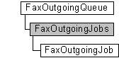

---
Description: 'The FaxOutgoingMessageIterator messaging object is used by a fax client application to move through the archive of fax messages that the fax service has successfully transmitted, represented by FaxOutgoingMessage objects.'
ms.assetid: '4eab8319-23ff-4f25-9402-bcb53a440879'
title: FaxOutgoingMessageIterator object
---

# FaxOutgoingMessageIterator object

The **FaxOutgoingMessageIterator** messaging object is used by a fax client application to move through the archive of fax messages that the fax service has successfully transmitted, represented by [**FaxOutgoingMessage**](-mfax-faxoutgoingmessage.md) objects. Because the **FaxOutgoingMessageIterator** object is a forward iterator, you can only move forward through the archive, from beginning to end, and you can access only one message at a time.

## Members

The **FaxOutgoingMessageIterator** object has these types of members:

-   [Methods](#methods)
-   [Properties](#properties)

### Methods

The **FaxOutgoingMessageIterator** object has these methods.

| Method                                                             | Description                                                                                                                                                         |
|:-------------------------------------------------------------------|:--------------------------------------------------------------------------------------------------------------------------------------------------------------------|
| [**MoveFirst**](-mfax-faxoutgoingmessageiterator-movefirst-vb.md) | The [**MoveFirst**](-mfax-faxoutgoingmessageiterator-movefirst-vb.md) method moves the archive cursor to the first fax message in the outbound archive.  |
| [**MoveNext**](-mfax-faxoutgoingmessageiterator-movenext-vb.md)   | The [**MoveNext**](-mfax-faxoutgoingmessageiterator-movenext-vb.md) method moves the archive cursor to the next fax message in the outbound archive.     |

 

### Properties

The **FaxOutgoingMessageIterator** object has these properties.

| Property                                                                            | Access type           | Description                                                                                                                                                                                                                                                                                     |
|:------------------------------------------------------------------------------------|:----------------------|:------------------------------------------------------------------------------------------------------------------------------------------------------------------------------------------------------------------------------------------------------------------------------------------------|
| [**AtEOF**](-mfax-faxoutgoingmessageiterator-ateof-vb.md)                | Read-only   | The AtEOF property is the end-of-file marker for the archive of outbound fax messages.                                                                                                                                                                                                |
| [**Message**](-mfax-faxoutgoingmessageiterator-message.md)               | Read-only   | The [**Message**](-mfax-faxoutgoingmessageiterator-message.md) property retrieves the outbound fax message under the archive cursor.                                                                                                                                                 |
| [**PrefetchSize**](-mfax-faxoutgoingmessageiterator-prefetchsize-vb.md)  | Read/write  | The [**PrefetchSize**](-mfax-faxoutgoingmessageiterator-prefetchsize-vb.md) property indicates the size of the prefetch (read-ahead) buffer. This determines how many fax messages the iterator object retrieves from the fax server when the object needs to refresh its contents.  |

 

## Remarks

A **FaxOutgoingMessageIterator** object is accessed through a [**FaxOutgoingArchive**](-mfax-faxoutgoingarchive.md) object.

To create a **FaxOutgoingMessageIterator** object in Microsoft Visual Basic, call the [**GetMessages**](-mfax-faxoutgoingarchive-getmessages.md) method of the [**FaxOutgoingArchive**](-mfax-faxoutgoingarchive.md) object.

To create a **FaxOutgoingMessageIterator** object in C++, call the [**GetMessages**](-mfax-faxoutgoingarchive-getmessages-cpp.md) method.

## Requirements

|                                     |                                                                                         |
|-------------------------------------|-----------------------------------------------------------------------------------------|
| Minimum supported client  | Windows XP \[desktop apps only\]                                              |
| Minimum supported server  | Windows Server 2003 \[desktop apps only\]                                     |
| Header                    | <dl> <dt>Faxcomex.h</dt> </dl>   |
| DLL                       | <dl> <dt>Fxscomex.dll</dt> </dl> |
| IID                       | CLSID\_FaxOutgoingMessageIterator                                             |

 

 

