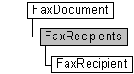

# FaxRecipients object

The **FaxRecipients** messaging collection is used by a fax client application to manage the fax recipient objects ([**FaxRecipient**](-mfax-faxrecipient.md)) that represent the recipients of a single fax document. The collection also includes methods to add and remove recipients.

## Members

The **FaxRecipients** object has these types of members:

-   [Methods](#methods)
-   [Properties](#properties)

### Methods

The **FaxRecipients** object has these methods.

| Method                                          | Description                                                                                                                                                        |
|:------------------------------------------------|:-------------------------------------------------------------------------------------------------------------------------------------------------------------------|
| [**Add**](-mfax-faxrecipients-add-vb.md)       | The [**Add**](-mfax-faxrecipients-add-vb.md) method adds a new [**FaxRecipient**](-mfax-faxrecipient.md) object to the **FaxRecipients** collection.   |
| [**Remove**](-mfax-faxrecipients-remove-vb.md) | The [**Remove**](-mfax-faxrecipients-remove-vb.md) method removes an item from the **FaxRecipients** collection.                                        |

 

### Properties

The **FaxRecipients** object has these properties.

| Property                                                 | Access type          | Description                                                                                                                                                                                                                        |
|:---------------------------------------------------------|:---------------------|:-----------------------------------------------------------------------------------------------------------------------------------------------------------------------------------------------------------------------------------|
| [**Count**](-mfax-faxrecipients-count-vb.md)  | Read-only  | The [**Count**](-mfax-faxrecipients-count-vb.md) property represents the number of objects in the **FaxRecipients** collection. This is the total number of recipients associated with the fax server or fax document.  |
| [**Item**](-mfax-faxrecipients-item.md)       | Read-only  | The [**Item**](-mfax-faxrecipients-item.md) property returns a [**FaxRecipient**](-mfax-faxrecipient.md) object from the **FaxRecipients** collection.                                                                 |

 

## Remarks

A **FaxRecipients** collection is accessed through a [**FaxDocument**](-mfax-faxdocument.md) object.

To create a **FaxRecipients** object in Microsoft Visual Basic, call the [**Recipients**](-mfax-faxdocument-recipients-vb.md) property of the object.

To create a **FaxRecipients** object in C++, call the [**Recipients**](-mfax-faxdocument-recipients-vb.md) method.

## Requirements

|                                     |                                                                                         |
|-------------------------------------|-----------------------------------------------------------------------------------------|
| Minimum supported client  | Windows XP \[desktop apps only\]                                              |
| Minimum supported server  | Windows Server 2003 \[desktop apps only\]                                     |
| Header                    | <dl> <dt>Faxcomex.h</dt> </dl>   |
| DLL                       | <dl> <dt>Fxscomex.dll</dt> </dl> |
| IID                       | CLSID\_FaxRecipients                                                          |

 

 

