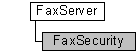

# FaxSecurity object

The **FaxSecurity** configuration object is used by a fax client application to configure the security on a fax server, and permits the calling application to set and retrieve a security descriptor for the fax server.

## Members

The **FaxSecurity** object has these types of members:

-   [Methods](#methods)
-   [Properties](#properties)

### Methods

The **FaxSecurity** object has these methods.

| Method                                          | Description                                                                                                                             |
|:------------------------------------------------|:----------------------------------------------------------------------------------------------------------------------------------------|
| [**Refresh**](-mfax-faxsecurity-refresh-vb.md) | The [**Refresh**](-mfax-faxsecurity-refresh-vb.md) method refreshes **FaxSecurity** object information from the fax server.  |
| [**Save**](-mfax-faxsecurity-save-vb.md)       | The [**Save**](-mfax-faxsecurity-save-vb.md) method saves the **FaxSecurity** object data.                                   |

 

### Properties

The **FaxSecurity** object has these properties.

| Property                                                                | Access type           | Description                                                                                                                                                                                                                                                                                                                                     |
|:------------------------------------------------------------------------|:----------------------|:------------------------------------------------------------------------------------------------------------------------------------------------------------------------------------------------------------------------------------------------------------------------------------------------------------------------------------------------|
| [**Descriptor**](-mfax-faxsecurity-descriptor.md)            | Read/write  | The [**Descriptor**](-mfax-faxsecurity-descriptor.md) property represents the security descriptor for a [**FaxServer**](-mfax-faxserver.md) object.                                                                                                                                                                                 |
| [**GrantedRights**](-mfax-faxsecurity-grantedrights-vb.md)   | Read-only   | The [**GrantedRights**](-mfax-faxsecurity-grantedrights-vb.md) property is a combination of the fax server access rights granted to the user referencing this property. For example, some users have permission to submit fax jobs with high priority while others have permission to submit jobs with normal or low priority only.  |
| [**InformationType**](-mfax-faxsecurity-informationtype.md)  | Read/write  | The [**InformationType**](-mfax-faxsecurity-informationtype.md) property retrieves the security information type.                                                                                                                                                                                                                    |

 

## Remarks

Only an administrator with permissions can configure the security of the fax server. For more information, see [Access Control](http://msdn.microsoft.com/library/en-us/secauthz/security/access_control.asp).

A **FaxSecurity** object is accessed through a [**FaxServer**](-mfax-faxserver.md) object.

> [!Note]  
> Changes made to the **FaxSecurity** object will not be saved until you call the [**Save**](-mfax-faxsecurity-save-vb.md) method.

 

To create a **FaxSecurity** object in Microsoft Visual Basic, call the [**Security**](-mfax-faxserver-security.md) property of the [**FaxServer**](-mfax-faxserver.md) object.

To create a **FaxSecurity** object in C++, call the [**Security**](-mfax-faxserver-security.md) method.

## Requirements

|                                     |                                                                                         |
|-------------------------------------|-----------------------------------------------------------------------------------------|
| Minimum supported client  | Windows XP \[desktop apps only\]                                              |
| Minimum supported server  | Windows Server 2003 \[desktop apps only\]                                     |
| Header                    | <dl> <dt>Faxcomex.h</dt> </dl>   |
| DLL                       | <dl> <dt>Fxscomex.dll</dt> </dl> |
| IID                       | CLSID\_FaxSecurity                                                            |

## See also

<dl> <dt>

[Fax Service object hierarchy](-mfax-fax-service-extended-com-object-model.md)
</dt> <dt>

[**IFaxSecurity**](/windows/previous-versions/FaxComex/nn-faxcomex-ifaxsecurity?branch=master)
</dt> </dl>

 

 

