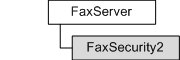

# FaxSecurity2 object

Used by a fax client application to configure the security on a fax server, and permit the calling application to set and retrieve a security descriptor for the fax server.

## Members

The **FaxSecurity2** object has these types of members:

-   [Methods](#methods)
-   [Properties](#properties)

### Methods

The **FaxSecurity2** object has these methods.

| Method                                           | Description                                                                   |
|:-------------------------------------------------|:------------------------------------------------------------------------------|
| [**Refresh**](-mfax-faxsecurity2-refresh-vb.md) | Refreshes **FaxSecurity2** object information from the fax server.  |
| [**Save**](-mfax-faxsecurity2-save-vb.md)       | Saves the [**FaxSecurity**](-mfax-faxsecurity.md) object data.     |

 

### Properties

The **FaxSecurity2** object has these properties.

| Property                                                                    | Access type           | Description                                                                                                                                                                                                                                                                   |
|:----------------------------------------------------------------------------|:----------------------|:------------------------------------------------------------------------------------------------------------------------------------------------------------------------------------------------------------------------------------------------------------------------------|
| [**Descriptor**](-mfax-faxsecurity2-descriptor.md)               | Read/write  | Represents the security descriptor for a [**IFaxServer2**](-mfax-faxserver2-cpp.md) interface.                                                                                                                                                                     |
| [**GrantedRights**](-mfax-faxsecurity2-grantedrights-vb.md)      | Read-only   | Retrieves a combination of the fax server access rights granted to the user referencing this property. For example, some users have permission to submit fax jobs with high priority while others have permission to submit jobs with normal or low priority only.  |
| [**InformationType**](-mfax-faxsecurity2-informationtype-vb.md)  | Read/write  | Retrieves the security information type.                                                                                                                                                                                                                            |

 

## Remarks

This object is supported only on Windows Vista or later. For earlier versions of Windows use [**FaxSecurity**](-mfax-faxsecurity.md).

Only an administrator with permissions can configure the security of the fax server. For more information, see [Access Control](http://msdn.microsoft.com/library/en-us/secauthz/security/access_control.asp).

A **FaxSecurity2** object is accessed through a [**IFaxServer2**](-mfax-faxserver2-cpp.md) interface.

> [!Note]  
> Changes made to the **FaxSecurity2** object will not be saved until you call the [**Save**](-mfax-faxsecurity2-save-vb.md) method.

 

To create a **FaxSecurity2** object in Microsoft Visual Basic, call the [**Security2**](-mfax-faxserver2-security2-vb.md) property of the [**IFaxServer2**](-mfax-faxserver2-cpp.md) interface.

To create a **FaxSecurity2** object in C++, call the [**Security2**](-mfax-faxserver2-security2-vb.md) method.

## Requirements

|                                     |                                                                                         |
|-------------------------------------|-----------------------------------------------------------------------------------------|
| Minimum supported client  | Windows Vista \[desktop apps only\]                                           |
| Minimum supported server  | Windows Server 2008 \[desktop apps only\]                                     |
| Header                    | <dl> <dt>Faxcomex.h</dt> </dl>   |
| DLL                       | <dl> <dt>Fxscomex.dll</dt> </dl> |
| IID                       | CLSID\_FaxSecurity2                                                           |

## See also

<dl> <dt>

[Fax Service object hierarchy](-mfax-fax-service-extended-com-object-model.md)
</dt> <dt>

[**IFaxSecurity2**](-mfax-faxsecurity2-cpp.md)
</dt> </dl>

 

 

