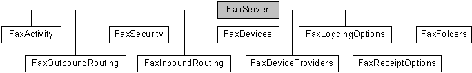

# FaxServer object

The **FaxServer** object is used by a fax client application to manage a connection to the fax service. The object includes methods to create and terminate connections with a fax server, and to retrieve information about a connected fax server. The object also includes methods to store extension configuration properties.

## Members

The **FaxServer** object has these types of members:

-   [Methods](#methods)
-   [Properties](#properties)

### Methods

The **FaxServer** object has these methods.

| Method                                                                                            | Description                                                                                                                                                                                                                                                                                                                                                                                                                               |
|:--------------------------------------------------------------------------------------------------|:------------------------------------------------------------------------------------------------------------------------------------------------------------------------------------------------------------------------------------------------------------------------------------------------------------------------------------------------------------------------------------------------------------------------------------------|
| [**Connect**](-mfax-faxserver-connect-vb.md)                                                     | The [**Connect**](-mfax-faxserver-connect-vb.md) method connects a fax client application to the specified fax server.                                                                                                                                                                                                                                                                                                         |
| [**Disconnect**](-mfax-faxserver-disconnect-vb.md)                                               | The [**Disconnect**](-mfax-faxserver-disconnect-vb.md) method terminates a fax client application's connection to a fax server. The method fails if the client is not connected to an active fax server.                                                                                                                                                                                                                       |
| [**GetDeviceProviders**](-mfax-faxserver-getdeviceproviders.md)                                  | The [**GetDeviceProviders**](-mfax-faxserver-getdeviceproviders.md) method creates a [**FaxDeviceProviders**](-mfax-faxdeviceproviders.md) object, a collection of FSPs that are currently registered with the fax service. You can use the **FaxDeviceProviders** object to enumerate the FSPs associated with a fax server and to create and access [**FaxDeviceProvider**](-mfax-faxdeviceprovider.md) objects for them.  |
| [**GetDevices**](-mfax-faxserver-getdevices.md)                                                  | The [**GetDevices**](-mfax-faxserver-getdevices.md) method creates a [**FaxDevices**](-mfax-faxdevices.md) object, a collection of all the fax devices exposed by all the FSPs currently registered with the fax service.                                                                                                                                                                                                     |
| [**GetExtensionProperty**](-mfax-faxserver-getextensionproperty-vb.md)                           | The [**GetExtensionProperty**](-mfax-faxserver-getextensionproperty-vb.md) method retrieves an extension configuration property stored at the server level.                                                                                                                                                                                                                                                                    |
| [**ListenToServerEvents**](-mfax-faxserver-listentoserverevents-vb.md)                           | The [**ListenToServerEvents**](-mfax-faxserver-listentoserverevents-vb.md) method registers the **FaxServer** object to receive notifications about one or more types of server events, or to stop these notifications.                                                                                                                                                                                                        |
| [**RegisterDeviceProvider**](-mfax-faxserver-registerdeviceprovider-vb.md)                       | The [**RegisterDeviceProvider**](-mfax-faxserver-registerdeviceprovider-vb.md) method registers a FSP with the fax service. Registration takes place after the fax service restarts.                                                                                                                                                                                                                                           |
| [**RegisterInboundRoutingExtension**](-mfax-faxserver-registerinboundroutingextension-vb.md)     | The [**RegisterInboundRoutingExtension**](-mfax-faxserver-registerinboundroutingextension-vb.md) method registers a fax inbound routing extension with the fax service. Registration takes place after the fax service restarts.                                                                                                                                                                                               |
| [**SetExtensionProperty**](-mfax-faxserver-setextensionproperty-vb.md)                           | The [**SetExtensionProperty**](-mfax-faxserver-setextensionproperty-vb.md) method stores an extension configuration property at the server level.                                                                                                                                                                                                                                                                              |
| [**UnregisterDeviceProvider**](-mfax-faxserver-unregisterdeviceprovider-vb.md)                   | The [**UnregisterDeviceProvider**](-mfax-faxserver-unregisterdeviceprovider-vb.md) method unregisters (removes the registration of) an existing device provider. Unregistration will take place only after the fax server is restarted.                                                                                                                                                                                        |
| [**UnregisterInboundRoutingExtension**](-mfax-faxserver-unregisterinboundroutingextension-vb.md) | The [**UnregisterInboundRoutingExtension**](-mfax-faxserver-unregisterinboundroutingextension-vb.md) method unregisters an existing inbound routing extension. Unregistration will take place only after the fax server is restarted.                                                                                                                                                                                          |

 

### Properties

The **FaxServer** object has these properties.

| Property                                                                   | Access type          | Description                                                                                                                                                                                                                                                                                                     |
|:---------------------------------------------------------------------------|:---------------------|:----------------------------------------------------------------------------------------------------------------------------------------------------------------------------------------------------------------------------------------------------------------------------------------------------------------|
| [**Activity**](-mfax-faxserver-activity.md)                     | Read-only  | The [**Activity**](-mfax-faxserver-activity.md) property creates a [**FaxActivity**](-mfax-faxactivity.md) configuration object. The object permits a fax client application to access information about the activity on a connected fax server, and the fax server status.                         |
| [**APIVersion**](-mfax-faxserver-apiversion-vb.md)              | Read-only  | The [**APIVersion**](-mfax-faxserver-apiversion-vb.md) property is a value that indicates the version of the fax server API.                                                                                                                                                                         |
| [**Configuration**](-mfax-faxserver2-configuration-vb.md)       | Read-only  | The [**Configuration**](-mfax-faxserver2-configuration-vb.md) property holds a [**IFaxConfiguration**](/previous-versions/windows/desktop/api/Faxcomex/nn-faxcomex-ifaxconfiguration) object. The object permits a fax client application to access information about the configuration of the connected fax server.                                   |
| [**CurrentAccount**](-mfax-faxserver2-currentaccount-vb.md)     | Read-only  | The [**CurrentAccount**](-mfax-faxserver2-currentaccount-vb.md) property returns the fax account for the user account that has connected to the fax server.                                                                                                                                          |
| [**Debug**](-mfax-faxserver-debug-vb.md)                        | Read-only  | The [**Debug**](-mfax-faxserver-debug-vb.md) property is a Boolean value that indicates whether the fax server was created in a debug environment.                                                                                                                                                   |
| [**FaxAccountSet**](-mfax-faxserver2-faxaccountset-vb.md)       | Read-only  | The [**FaxAccountSet**](-mfax-faxserver2-faxaccountset-vb.md) property returns a [**IFaxAccountSet**](/previous-versions/windows/desktop/api/FaxComex/nn-faxcomex-ifaxaccountset) object used to manage the fax accounts on the fax server.                                                                                                         |
| [**Folders**](-mfax-faxserver-folders.md)                       | Read-only  | The [**Folders**](-mfax-faxserver-folders.md) property accesses a [**FaxFolders**](-mfax-faxfolders.md) configuration object. You can use the object to access the folders, jobs, and messages on a connected fax server.                                                                           |
| [**InboundRouting**](-mfax-faxserver-inboundrouting.md)         | Read-only  | The [**InboundRouting**](-mfax-faxserver-inboundrouting.md) property creates a [**FaxInboundRouting**](-mfax-faxinboundrouting.md) configuration object. The object permits access to an inbound fax routing extension and its methods.                                                             |
| [**LoggingOptions**](-mfax-faxserver-loggingoptions.md)         | Read-only  | The [**LoggingOptions**](-mfax-faxserver-loggingoptions.md) property creates a [**FaxLoggingOptions**](-mfax-faxloggingoptions.md) configuration object. The object permits configuration of both the activity logging options and the event logging categories that the fax service uses.          |
| [**MajorBuild**](-mfax-faxserver-majorbuild-vb.md)              | Read-only  | The [**MajorBuild**](-mfax-faxserver-majorbuild-vb.md) property is a value that specifies the major part of the build number for the fax service.                                                                                                                                                    |
| [**MajorVersion**](-mfax-faxserver-majorversion-vb.md)          | Read-only  | The [**MajorVersion**](-mfax-faxserver-majorversion-vb.md) property is a value that specifies the major part of the version number for the fax service.                                                                                                                                              |
| [**MinorBuild**](-mfax-faxserver-minorbuild-vb.md)              | Read-only  | The [**MinorBuild**](-mfax-faxserver-minorbuild-vb.md) property is a value that specifies the minor part of the build number for the fax service.                                                                                                                                                    |
| [**MinorVersion**](-mfax-faxserver-minorversion-vb.md)          | Read-only  | The [**MinorVersion**](-mfax-faxserver-minorversion-vb.md) property is a value that specifies the minor part of the version number for the fax service.                                                                                                                                              |
| [**OutboundRouting**](-mfax-faxserver-outboundrouting.md)       | Read-only  | The [**OutboundRouting**](-mfax-faxserver-outboundrouting.md) property creates a [**FaxOutboundRouting**](-mfax-faxoutboundrouting.md) configuration object. The object permits users to configure outbound routing groups and rules.                                                               |
| [**ReceiptOptions**](-mfax-faxserver-receiptoptions.md)         | Read-only  | The [**ReceiptOptions**](-mfax-faxserver-receiptoptions.md) property creates a [**FaxReceiptOptions**](-mfax-faxreceiptoptions.md) configuration object. The object permits a fax client application to set and retrieve the receipt configuration that the fax service uses to send fax receipts.  |
| [**RegisteredEvents**](-mfax-faxserver-registeredevents-vb.md)  | Read-only  | The [**RegisteredEvents**](-mfax-faxserver-registeredevents-vb.md) property is a value from an enumeration that indicates the types of fax service events a client application is listening for.                                                                                                     |
| [**Security**](-mfax-faxserver-security.md)                     | Read-only  | The [**Security**](-mfax-faxserver-security.md) property creates a [**FaxSecurity**](-mfax-faxsecurity.md) configuration object. The object permits the calling application to set and retrieve a security descriptor for the fax server.                                                           |
| [**Security2**](-mfax-faxserver2-security2-vb.md)               | Read-only  | The [**Security2**](-mfax-faxserver2-security2-vb.md) property returns a [**IFaxSecurity2**](/previous-versions/windows/desktop/api/FaxComex/nn-faxcomex-ifaxsecurity2) object used to configure security on the fax server.                                                                                                                        |
| [**ServerName**](-mfax-faxserver-servername-vb.md)              | Read-only  | The [**ServerName**](-mfax-faxserver-servername-vb.md) property retrieves the name of the active fax server to which the fax client is connected.                                                                                                                                                    |

 

## Remarks

You must call the [**Connect**](-mfax-faxserver-connect-vb.md) method to initiate a connection with an active fax server before calling other methods on the **FaxServer** object, and before accessing most of the extended Component Object Model (COM) fax objects. A fax server connection is not required to access a [**FaxDocument**](-mfax-faxdocument.md) object.

The **FaxServer** object is the root object of the fax service extended COM implementation. Call the [CoCreateInstance](http://msdn.microsoft.com/en-us/library/ms686615.aspx) function to create a **FaxServer** object. After you obtain a connection to an active fax server, you can create and access other objects to manage fax jobs, view the inbound and outbound fax archives, and configure the fax server.

## Requirements

|                                     |                                                                                         |
|-------------------------------------|-----------------------------------------------------------------------------------------|
| Minimum supported client  | Windows XP \[desktop apps only\]                                              |
| Minimum supported server  | Windows Server 2003 \[desktop apps only\]                                     |
| DLL                       | <dl> <dt>Fxscomex.dll</dt> </dl> |
| IID                       | CLSID\_FaxServer                                                              |

 

 

