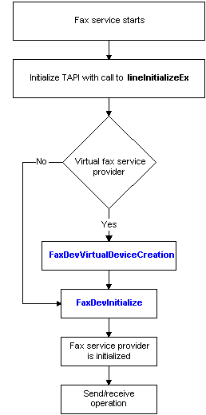

# Initializing a Fax Service Provider

Each time the fax service starts, it calls the Telephony Application Programming Interface (TAPI) [lineInitializeEx](http://msdn.microsoft.com/library/en-us/tapi/tapi2/lineinitializeex.asp) function to retrieve the number of available line devices.

During initialization, the fax service checks the fax service provider (FSP) DLL for the [**FaxDevVirtualDeviceCreation**](/previous-versions/windows/desktop/api/FaxDev/nf-faxdev-faxdevvirtualdevicecreation) function. If the provider exports **FaxDevVirtualDeviceCreation**, an optional function, the fax service expects the FSP to present one or more virtual fax devices. For more information, see [Virtual Fax Devices](-mfax-virtual-fax-devices.md).

The fax service also calls the [**FaxDevInitialize**](/previous-versions/windows/desktop/api/FaxDev/nf-faxdev-faxdevinitialize) function each time the service starts to initialize the communication between the service and the FSP DLL.

The FSP must register the [**FaxLineCallback**](/previous-versions/windows/desktop/api/FaxDev/nc-faxdev-pfax_linecallback) function by supplying a function pointer when the fax service calls [**FaxDevInitialize**](/previous-versions/windows/desktop/api/FaxDev/nf-faxdev-faxdevinitialize). The service calls **FaxLineCallback** to deliver TAPI events to the FSP.

The FSP must export [**FaxDevInitialize**](/previous-versions/windows/desktop/api/FaxDev/nf-faxdev-faxdevinitialize).

The following diagram illustrates the general flow of events during initialization of a FSP.

Once the FSP has been initialized, the provider can send and receive faxes on the devices it supports.

 

 

