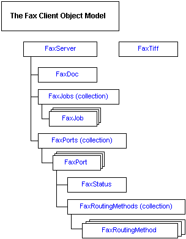

# The Fax Client Object Model

Most of the objects in the fax client object model are organized in a hierarchical manner. The [FaxTiff](-mfax-faxtiff.md) object is an exception; it is a stand-alone object.

The diagram that follows illustrates this hierarchy. Multiple [FaxJob](-mfax-faxjob.md), [FaxPort](-mfax-faxport.md), and [FaxRoutingMethod](-mfax-faxroutingmethod.md) objects can exist.

## Related topics

<dl> <dt>

[Fax Client Object Hierarchy](-mfax-fax-client-object-hierarchy.md)
</dt> <dt>

[Fax Service Client API Objects](-mfax-fax-service-client-api-objects.md)
</dt> </dl>

 

 

