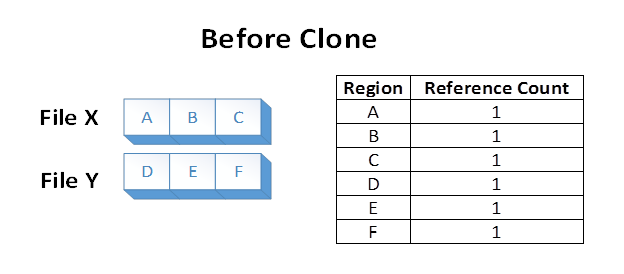
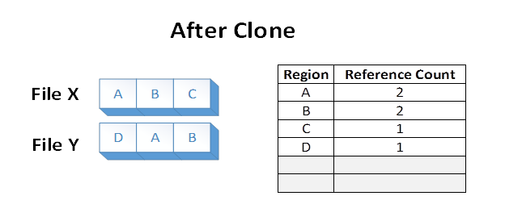
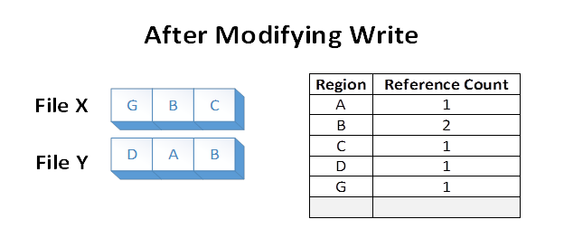

# Block Cloning

A *block clone* operation instructs the file system to copy a range of file bytes on behalf of an application. The destination file may be the same as, or different from, the source file.

A file system manages the mappings of [Clusters and Extents](clusters-and-extents.md), and may be able to perform the copy by altering the virtual cluster number (VCN) to logical cluster number (LCN) mappings as a low-cost metadata operation, rather than reading and writing the underlying file data. This allows the copy to complete faster and generates less I/O to the underlying storage. Moreover, multiple files may now share logical clusters after the block clone, saving capacity by not storing identical clusters multiple times on disk.

A block clone operation does not break the isolation provided between files. After a block clone completes, writes to the source file do not appear in the destination, or vice versa.

Block cloning is available only on the [ReFS file system](/windows/desktop/w8cookbook/resilient-file-system--refs-) type beginning with Windows Server 2016. Starting with the Windows 11 Moment 5 update (KB5034848) and later releases of Windows client and Windows Server builds, block cloning occurs natively in supported Windows copy operations.

## Block Cloning on ReFS

Starting in Windows Server 2016, ReFS implements block cloning by remapping logical clusters (that is, physical locations on a volume) from the source region to the destination region. It then uses an allocate-on-write mechanism to ensure isolation between those regions. The source and destination regions may be in the same, or different, files.

This implementation requires that the starting and ending file offsets be aligned to cluster boundaries. In ReFS starting in Windows Server 2016, clusters are 4KB in size by default, but can optionally be set to 64KB. The cluster size is a volume-wide parameter set at format time.

### Cluster Size and Performance Implications

The cluster size of a ReFS volume directly affects block cloning behavior and performance characteristics:

- **Default cluster size**: 4KB (recommended for most workloads)
- **Alternative cluster size**: 64KB (appropriate for large, sequential I/O workloads)

The cluster size determines the granularity at which block cloning and copy-on-write operations occur. When a write is made to a file region that shares clusters with another file (after a block clone), ReFS uses an allocate-on-write mechanism that operates at the cluster level:

- Only the modified cluster is duplicated and written to a new physical location
- Unmodified clusters within the same region remain shared
- This behavior applies regardless of whether block cloning was initiated explicitly via [FSCTL_DUPLICATE_EXTENTS_TO_FILE](/windows/win32/api/winioctl/ni-winioctl-fsctl_duplicate_extents_to_file) or automatically by the system (Windows 11 Moment 5 and later)

#### Performance considerations

The choice of cluster size has important implications for performance and space consumption:

- **4KB clusters**: Provide better space efficiency for workloads with small, random writes (KB to MB range), as only 4KB is duplicated per modified cluster. However, this may result in more frequent copy-on-write operations.
- **64KB clusters**: Reduce metadata overhead and improve sequential I/O performance, but may result in up to 64KB being duplicated for each write to a shared region, even if the write is smaller than 64KB.

The cluster size is determined at format time and cannot be changed without reformatting the volume. To check the current cluster size of a ReFS volume, use the following command:

```console
fsutil fsinfo refsinfo <volume>
```

For volumes formatted by Windows automatically (such as when block cloning is enabled by default), the system uses the 4KB default cluster size unless explicitly configured otherwise during volume creation.

## Restrictions and Remarks

- The source and destination regions must begin and end at a cluster boundary.
- The cloned region must be less than 4GB in length.
- The destination region must not extend past the end of file. If the application wishes to extend the destination with cloned data, it must first call [SetEndOfFile](/windows/win32/api/FileAPI/nf-fileapi-setendoffile).
- If the source and destination regions are in the same file, they must not overlap. (The application may able to proceed by splitting up the block clone operation into multiple block clones that no longer overlap.)
- The source and destination files must be on the same ReFS volume.
- The source and destination files must have the same [Integrity Streams](file-attribute-constants.md) setting (that is, Integrity Streams must be enabled in both files, or disabled in both files).
- If the source file is sparse, the destination file must also be sparse.
- The block clone operation will break Shared Opportunistic Locks (also known as [Level 2 Opportunistic Locks](types-of-opportunistic-locks.md)).
- The ReFS volume must have been formatted with Windows Server 2016 or later, and if Windows Failover Clustering is in use, the Clustering Functional Level must have been Windows Server 2016 or later at format time.

## Example

Suppose we have two files, X and Y, where each file is composed of 3 distinct regions. Each file region is stored on a distinct region of the volume. The file system stores the knowledge that each of those volume regions is referenced in one file region:



Now suppose an application issues a block clone operation from File X, over file regions A and B, to File Y at the offset where E currently is. The following file system state would result:



The data in regions A and B were effectively duplicated from File X to File Y by altering the VCN to LCN mappings within the ReFS volume. The disk extents backing regions A and B were not read, nor were the disk extents backing the old regions E and F overwritten during the operation.

Files X and Y now share logical clusters on disk. This is reflected in the reference counts shown in the table. The sharing results in lower volume capacity consumption than if regions A and B were duplicated on the underlying volume.

Now, suppose the application overwrites region A in File X. ReFS makes a duplicate copy of A, which we'll now call G. ReFS then maps G into File X, and applies the modification. This ensures that isolation between the files is preserved. Reference counts are updated appropriately:



After the modifying write, region B is still shared on disk. Note that if region A were larger than a cluster, only the modified cluster would have been duplicated, and the remaining portion would have remained shared.

### Copy-on-Write Behavior

The allocate-on-write mechanism operates at the cluster level, which has important implications for performance and space consumption:

- **Writes smaller than cluster size**: A write of any size to a shared cluster (even 1 byte) causes the entire cluster to be duplicated. With the default 4KB cluster size, a 1KB write to a shared region results in 4KB being copied.
- **Writes spanning multiple clusters**: If a write spans multiple clusters, only the clusters that are modified are duplicated. For example, an 8KB write with 4KB clusters duplicates 2 clusters (8KB total), while the same 8KB write with 64KB clusters duplicates 1 cluster (64KB total).
- **Large sequential writes**: For workloads that frequently modify large contiguous regions after cloning, larger cluster sizes (64KB) may reduce overhead by minimizing the number of copy-on-write operations.

This cluster-level granularity applies to all writes after block cloning, including scenarios where Windows 11 Moment 5 and later automatically perform block cloning during copy operations.

## Related content

[DUPLICATE\_EXTENTS\_DATA](/windows/win32/api/WinIoCtl/ns-winioctl-duplicate_extents_data)

[FSCTL\_DUPLICATE\_EXTENTS\_TO\_FILE](/windows/win32/api/winioctl/ni-winioctl-fsctl_duplicate_extents_to_file)
