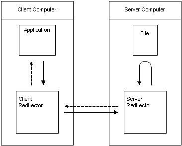

# Description of a Network I/O Operation

The following figure illustrates the process of a network I/O operation under Windows.

When an application calls a file I/O function to access a file on a remote computer, the following events occur:

-   The I/O request is intercepted by a [network redirector](network-redirectors.md), also referred to simply as a redirector, on the local computer. This is depicted in the preceding figure by the solid arrow between the application and the client redirector.
-   The redirector constructs a data packet containing all of the information about the request, and sends it to the server where the file is located. This is depicted in the preceding figure by the solid arrow between the client redirector and the server redirector.
-   The redirector on the server receives the packet from the client, authenticates the access to the file required by the I/O request, and, if authenticated, executes the request on behalf of the client. If not, it returns an error code to the redirector on the client. This is depicted in the preceding figure by the curved solid arrow between the server redirector and the file.
-   When the request has been executed, the redirector on the server sends any data resulting from the I/O request to the redirector on the client along with a success notification. This is depicted in the preceding figure by the dotted arrow between the server and the client redirector.
-   The redirector on the client receives the packet from the server and passes the data in the packet to the application along with a success notification. This is depicted in the preceding figure by the dotted arrow between the client redirector and the application.

Windows can use a variety of networking protocols to perform a network I/O operation, including [Microsoft SMB Protocol and CIFS Protocol Overview](microsoft-smb-protocol-and-cifs-protocol-overview.md) and NFS.

## In this section

| Topic                                                                                       | Description                                                          |
|---------------------------------------------------------------------------------------------|----------------------------------------------------------------------|
| [Differences in Local and Network I/O](differences-in-local-and-network-i-o.md)  | Differences between local I/O and network I/O on Windows.  |
| [Network Redirectors](network-redirectors.md)                                    | Describes the functionality of a network redirector.       |

 

 

 

