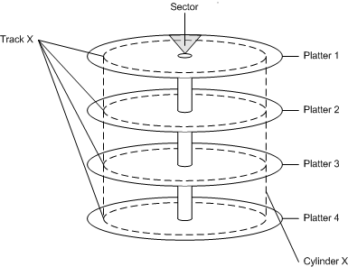

# Disk Devices and Partitions

A hard disk consists of a set of stacked platters, each of which has data stored electromagnetically in concentric circles, or *tracks*. Each platter has two heads, one on each side of the platter, that reads or writes data as the disk spins. A *hard disk drive* controls the positioning, reading, and writing of the hard disk. Note that the heads of all platters are positioned as a unit.

The smallest addressable unit of a track is a *sector*. A *cylinder* is defined as the set of tracks that appear in the same location on each platter. For example, the following diagram shows a hard disk with four platters. Cylinder X consists of eight tracks (track X from each side of each platter).

A hard disk can contain one or more logical regions called *partitions*. Partitions are created when the user formats a hard disk as a *basic disk*. Windows also supports *dynamic disks*, which are not discussed in this topic. For more information about basic disks and dynamic disks, see [Basic and Dynamic Disks](basic-and-dynamic-disks.md).

The creation of multiple partitions on a disk allows the appearance of having separate hard drives. For example, a system with one hard disk that has one partition contains a single volume, designated by the system as drive C. A system with a hard disk with two partitions typically contains drives C and D. Having multiple partitions on a hard disk can make it easier to manage the system, for example to organize files or to support multiple users.

The first physical sector on a basic disk contains a data structure known as the Master Boot Record (MBR). The MBR contains the following:

-   A boot program (up to 442 bytes in size)
-   A disk signature (a unique 4-byte number)
-   A partition table (up to four entries)
-   An end-of-MBR marker (always 0x55AA)

## Related topics

<dl> <dt>

[About Volume Management](about-volume-management.md)
</dt> <dt>

[Basic and Dynamic Disks](basic-and-dynamic-disks.md)
</dt> </dl>

 

 

