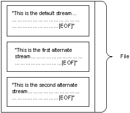

# Files and Clusters

A *file* is a unit of data in the file system that a user can access and manage. A file must have a unique name in its directory. It consists of one or more streams of bytes that hold a set of related data, plus a set of attributes (also called properties) that describe the file or the data within the file. The creation time of a file is an example of a file attribute.

When a file is created, one unnamed default stream is created to store all data written to the file while it is open. You can also create additional streams within the file. These additional streams are referred to as alternate streams. The following figure depicts a file with the default stream and two alternate streams.

File attributes are not stored in the data streams with the file data, but are stored elsewhere and managed by the operating system.

All file system data, including the system bootstrap code and directories, are stored by the NTFS file system in files. Other file systems store this information in disk regions external to the file system. An advantage of storing this information in files is that Windows can locate, access, and maintain the information easily. Other advantages are that each of these files may be protected by a security descriptor and, in the case of partial disk corruption, they may be quickly relocated to a safer part of the disk.

The fundamental storage unit of all supported file systems is a *cluster*, which is a group of sectors. This allows the file system to optimize the administration of disk data independently of the disk sector size set by the hardware disk controller. If the disk to be administered is large and large amounts of data are moved and organized in a single operation, the administrator can adjust the cluster size to accommodate this.

Windows manages files through [file objects](file-objects.md), [file handles](file-handles.md), and [file pointers](file-pointers.md).

For more information on file streams, see [File Streams](file-streams.md). For more information on clusters, see [Clusters and Extents](clusters-and-extents.md). For more information on how to access and manage files, see [File Management](file-management.md) and [File Management Reference](file-management-reference.md).

## In this section

| Topic                                                       | Description                                                                                                                                                                                                                                                  |
|-------------------------------------------------------------|--------------------------------------------------------------------------------------------------------------------------------------------------------------------------------------------------------------------------------------------------------------|
| [File Streams](file-streams.md)                  | In the NTFS file system, streams contain the data that is written to a file, and that gives more information about a file than attributes and properties.                                                                                          |
| [File Objects](file-objects.md)                  | *File objects* function as the logical interface between kernel and user-mode processes and the file data that resides on the physical disk.                                                                                                       |
| [File Handles](file-handles.md)                  | When a file is opened by a process using the [**CreateFile**](/windows/desktop/api/FileAPI/nf-fileapi-createfilea) function, a *file handle* is associated with it until either the process terminates or the handle is closed using the [**CloseHandle**](/windows/desktop/api/handleapi/nf-handleapi-closehandle) function.  |
| [File Pointers](file-pointers.md)                | A file pointer is a 64-bit offset value that specifies the next byte to be read or the location to receive the next byte written.                                                                                                                  |
| [Clusters and Extents](clusters-and-extents.md)  | Clusters may be referred to from two different perspectives: within the file and on the volume.                                                                                                                                                    |

 

 

