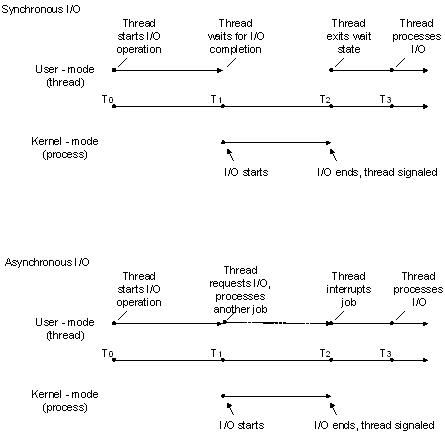

# Synchronous and Asynchronous I/O

Also see [I/O-related sample applications](https://github.com/microsoft/Windows-classic-samples/tree/master/Samples/Win7Samples/winbase/io).

There are two types of input/output (I/O) synchronization: synchronous I/O and asynchronous I/O. Asynchronous I/O is also referred to as overlapped I/O.

In *synchronous file I/O*, a thread starts an I/O operation and immediately enters a wait state until the I/O request has completed. A thread performing *asynchronous file I/O* sends an I/O request to the kernel by calling an appropriate function. If the request is accepted by the kernel, the calling thread continues processing another job until the kernel signals to the thread that the I/O operation is complete. It then interrupts its current job and processes the data from the I/O operation as necessary.

The two synchronization types are illustrated in the following figure.

In situations where an I/O request is expected to take a large amount of time, such as a refresh or backup of a large database or a slow communications link, asynchronous I/O is generally a good way to optimize processing efficiency. However, for relatively fast I/O operations, the overhead of processing kernel I/O requests and kernel signals may make asynchronous I/O less beneficial, particularly if many fast I/O operations need to be made. In this case, synchronous I/O would be better. The mechanisms and implementation details of how to accomplish these tasks vary depending on the type of device handle that is used and the particular needs of the application. In other words, there are usually multiple ways to solve the problem.

## Synchronous and Asynchronous I/O Considerations

If a file or device is opened for synchronous I/O (that is, **FILE\_FLAG\_OVERLAPPED** is not specified), subsequent calls to functions such as [**WriteFile**](/windows/desktop/api/FileAPI/nf-fileapi-writefile) can block execution of the calling thread until one of the following events occurs:

-   The I/O operation completes (in this example, a data write).
-   An I/O error occurs. (For example, the pipe is closed from the other end.)
-   An error was made in the call itself (for example, one or more parameters are not valid).
-   Another thread in the process calls the [**CancelSynchronousIo**](cancelsynchronousio-func.md) function using the blocked thread's thread handle, which terminates I/O for that thread, failing the I/O operation.
-   The blocked thread is terminated by the system; for example, the process itself is terminated, or another thread calls the [**TerminateThread**](/windows/desktop/api/processthreadsapi/nf-processthreadsapi-terminatethread) function using the blocked thread's handle. (This is generally considered a last resort and not good application design.)

In some cases, this delay may be unacceptable to the application's design and purpose, so application designers should consider using asynchronous I/O with appropriate thread synchronization objects such as [I/O completion ports](i-o-completion-ports.md). For more information about thread synchronization, see [About Synchronization](/windows/desktop/Sync/about-synchronization).

A process opens a file for asynchronous I/O in its call to [**CreateFile**](/windows/desktop/api/FileAPI/nf-fileapi-createfilea) by specifying the **FILE\_FLAG\_OVERLAPPED** flag in the *dwFlagsAndAttributes* parameter. If **FILE\_FLAG\_OVERLAPPED** is not specified, the file is opened for synchronous I/O. When the file has been opened for asynchronous I/O, a pointer to an [**OVERLAPPED**](/windows/desktop/api/MinWinBase/ns-minwinbase-overlapped_entry) structure is passed into the call to [**ReadFile**](/windows/desktop/api/FileAPI/nf-fileapi-readfile) and [**WriteFile**](/windows/desktop/api/FileAPI/nf-fileapi-writefile). When performing synchronous I/O, this structure is not required in calls to **ReadFile** and **WriteFile**.

> [!Note]  
> If a file or device is opened for asynchronous I/O, subsequent calls to functions such as [**WriteFile**](/windows/desktop/api/FileAPI/nf-fileapi-writefile) using that handle generally return immediately but can also behave synchronously with respect to blocked execution. For more information, see [https://support.microsoft.com/kb/156932](https://support.microsoft.com/kb/156932).

 

Although [**CreateFile**](/windows/desktop/api/FileAPI/nf-fileapi-createfilea) is the most common function to use for opening files, disk volumes, anonymous pipes, and other similar devices, I/O operations can also be performed using a handle *typecast* from other system objects such as a socket created by the [**socket**](/windows/desktop/api/winsock2/nf-winsock2-socket) or [**accept**](/windows/desktop/api/winsock2/nf-winsock2-accept) functions.

Handles to directory objects are obtained by calling the [**CreateFile**](/windows/desktop/api/FileAPI/nf-fileapi-createfilea) function with the **FILE\_FLAG\_BACKUP\_SEMANTICS** attribute. Directory handles are almost never used—backup applications are one of the few applications that will typically use them.

After opening the file object for asynchronous I/O, an [**OVERLAPPED**](/windows/desktop/api/minwinbase/ns-minwinbase-overlapped) structure must be properly created, initialized, and passed into each call to functions such as [**ReadFile**](/windows/desktop/api/FileAPI/nf-fileapi-readfile) and [**WriteFile**](/windows/desktop/api/FileAPI/nf-fileapi-writefile). Keep the following in mind when using the [**OVERLAPPED**](/windows/desktop/api/MinWinBase/ns-minwinbase-overlapped_entry) structure in asynchronous read and write operations:

-   Do not deallocate or modify the [**OVERLAPPED**](/windows/desktop/api/minwinbase/ns-minwinbase-overlapped) structure or the data buffer until all asynchronous I/O operations to the file object have been completed.
-   If you declare your pointer to the [**OVERLAPPED**](/windows/desktop/api/minwinbase/ns-minwinbase-overlapped) structure as a local variable, do not exit the local function until all asynchronous I/O operations to the file object have been completed. If the local function is exited prematurely, the **OVERLAPPED** structure will go out of scope and it will be inaccessible to any [**ReadFile**](/windows/desktop/api/FileAPI/nf-fileapi-readfile) or [**WriteFile**](/windows/desktop/api/FileAPI/nf-fileapi-writefile) functions it encounters outside of that function.

You can also create an event and put the handle in the [**OVERLAPPED**](/windows/desktop/api/minwinbase/ns-minwinbase-overlapped) structure; the [wait functions](/windows/desktop/Sync/wait-functions) can then be used to wait for the I/O operation to complete by waiting on the event handle.

As previously stated, when working with an asynchronous handle, applications should use care when making determinations about when to free resources associated with a specified I/O operation on that handle. If the handle is deallocated prematurely, [**ReadFile**](/windows/desktop/api/FileAPI/nf-fileapi-readfile) or [**WriteFile**](/windows/desktop/api/FileAPI/nf-fileapi-writefile) may incorrectly report that the I/O operation is complete. Further, the **WriteFile** function will sometimes return **TRUE** with a [**GetLastError**](/windows/desktop/api/errhandlingapi/nf-errhandlingapi-getlasterror) value of **ERROR\_SUCCESS**, even though it is using an asynchronous handle (which can also return **FALSE** with **ERROR\_IO\_PENDING**). Programmers accustomed to synchronous I/O design will usually release data buffer resources at this point because **TRUE** and **ERROR\_SUCCESS** signify the operation is complete. However, if [I/O completion ports](i-o-completion-ports.md) are being used with this asynchronous handle, a completion packet will also be sent even though the I/O operation completed immediately. In other words, if the application frees resources after **WriteFile** returns **TRUE** with **ERROR\_SUCCESS** in addition to in the I/O completion port routine, it will have a double-free error condition. In this example, the recommendation would be to allow the completion port routine to be solely responsible for all freeing operations for such resources.

The system does not maintain the file pointer on asynchronous handles to files and devices that support file pointers (that is, seeking devices), therefore the file position must be passed to the read and write functions in the related offset data members of the [**OVERLAPPED**](/windows/desktop/api/minwinbase/ns-minwinbase-overlapped) structure. For more information, see [**WriteFile**](/windows/desktop/api/FileAPI/nf-fileapi-writefile) and [**ReadFile**](/windows/desktop/api/FileAPI/nf-fileapi-readfile).

File pointer position for a synchronous handle is maintained by the system as data is read or written and can also be updated using the [**SetFilePointer**](/windows/desktop/api/FileAPI/nf-fileapi-setfilepointer) or [**SetFilePointerEx**](/windows/desktop/api/FileAPI/nf-fileapi-setfilepointerex) function.

An application can also wait on the file handle to synchronize the completion of an I/O operation, but doing so requires extreme caution. Each time an I/O operation is started, the operating system sets the file handle to the nonsignaled state. Each time an I/O operation is completed, the operating system sets the file handle to the signaled state. Therefore, if an application starts two I/O operations and waits on the file handle, there is no way to determine which operation is finished when the handle is set to the signaled state. If an application must perform multiple asynchronous I/O operations on a single file, it should wait on the event handle in the specific [**OVERLAPPED**](/windows/desktop/api/minwinbase/ns-minwinbase-overlapped) structure for each I/O operation, rather than on the common file handle.

To cancel all pending asynchronous I/O operations, use either:

-   [**CancelIo**](cancelio.md)—this function only cancels operations issued by the calling thread for the specified file handle.
-   [**CancelIoEx**](cancelioex-func.md)—this function cancels all operations issued by the threads for the specified file handle.

Use [**CancelSynchronousIo**](cancelsynchronousio-func.md) to cancel pending synchronous I/O operations.

The [**ReadFileEx**](/windows/desktop/api/FileAPI/nf-fileapi-readfileex) and [**WriteFileEx**](/windows/desktop/api/FileAPI/nf-fileapi-writefileex) functions enable an application to specify a routine to execute (see [**FileIOCompletionRoutine**](/windows/win32/api/minwinbase/nc-minwinbase-lpoverlapped_completion_routine)) when the asynchronous I/O request is completed.

 

 
