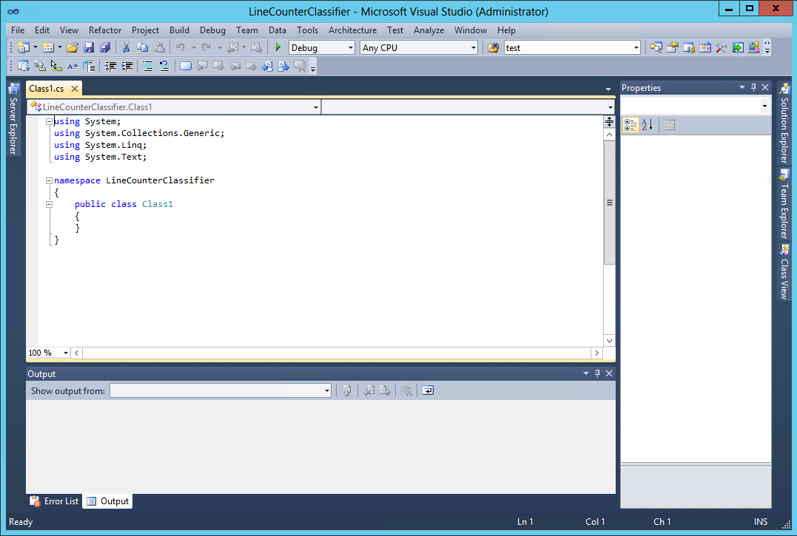
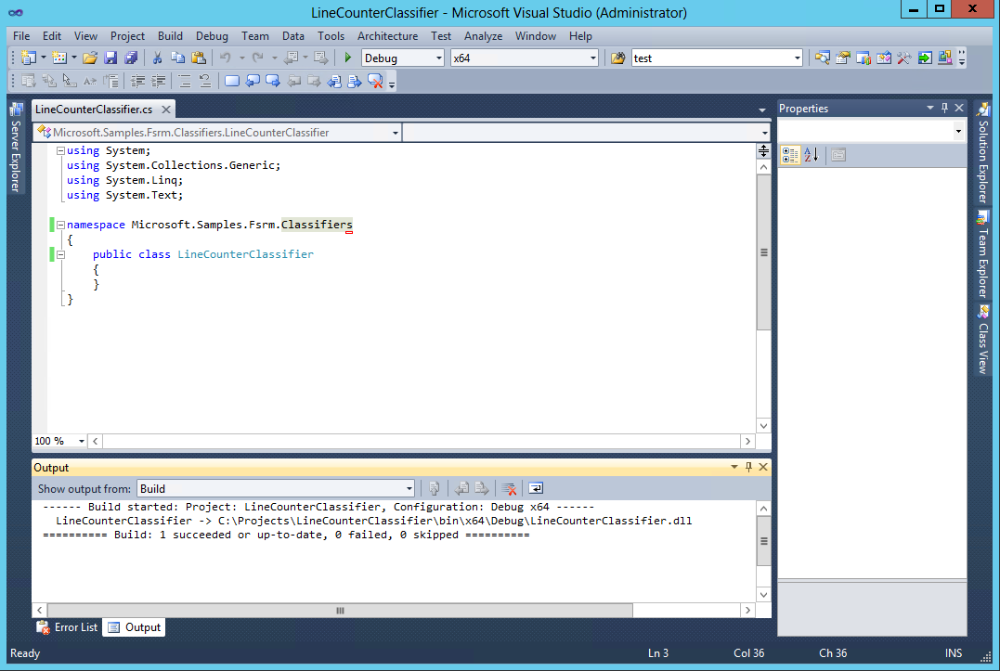
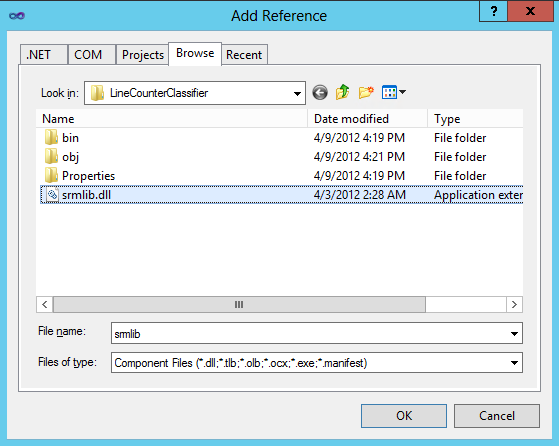
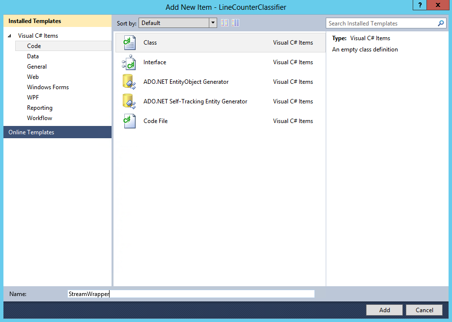
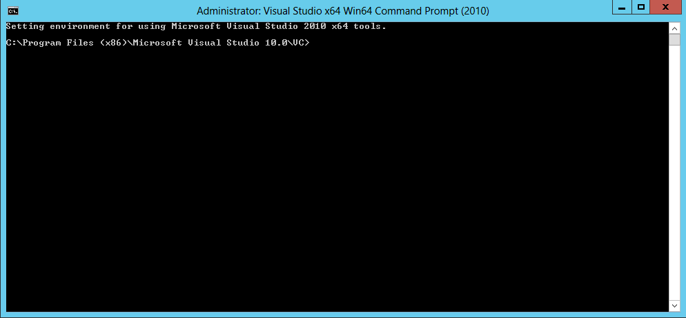
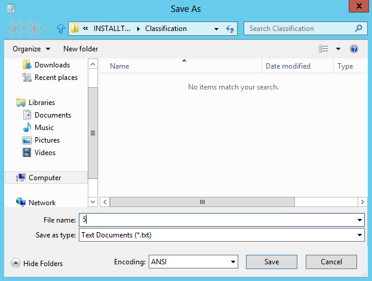
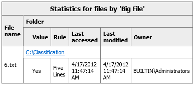
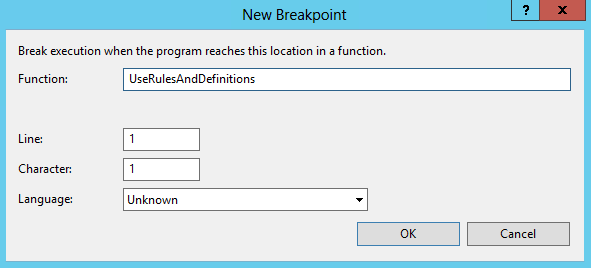
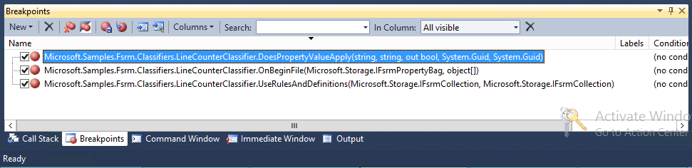

# How to develop a custom FCI classifier in managed code

-   [Introduction](#introduction)
-   [Prerequisites](#prerequisites)
-   [Implementing the classifier](#implementing-the-classifier)
    -   [Creating the Microsoft Visual Studio project](#creating-the-microsoft-visual-studio-project)
    -   [Implementing the IFsrmClassifierModuleImplementation interface](#implementing-the-ifsrmclassifiermoduleimplementation-interface)
-   [Installing the classifier](#installing-the-classifier)
    -   [Installing files](#installing-files)
    -   [Registering with COM](#registering-with-com)
    -   [Registering with FCI](#registering-with-fci)
-   [Using the classifier](#using-the-classifier)
    -   [Creating test files](#creating-test-files)
    -   [Defining a new property](#defining-a-new-property)
    -   [Defining a new rule](#defining-a-new-rule)
    -   [Running classification on the set of test files](#running-classification-on-the-set-of-test-files)
-   [Debugging the classifier](#debugging-the-classifier)
    -   [Configuring FCI module debugging](#configuring-fci-module-debugging)
    -   [Attaching the debugger](#attaching-the-debugger)

## Introduction

This is a step-by-step tutorial on how to write a custom classifier from scratch using managed code and how to install and debug it on Windows Server 2012. The classifier will be written in C# using Microsoft Visual Studio 2010, but the code can be easily ported to Visual Basic or any other language that supports the CLR.

You will learn how to:

-   Set up a Visual Studio 2010 project for implementing the custom classifier module.
-   Work with FCI module and rule parameters.
-   Read the contents of a file being classified.
-   Determine if a rule applies to a file based on its contents.
-   Install and register the classifier.
-   Set up and use the built-in FCI module debugging support.

The knowledge gained during this tutorial will make it easy for you to implement other types of FCI modules, using other programming languages—for example, to implement a native code storage module in C or C++.

## Prerequisites

-   Windows Server 2012 with the following roles/features and applications installed:

    -   FSRM role
    -   Visual Studio 2010 (with Visual C#)
    -   Local administrator access to the server.

-   Understanding of the FCI feature as documented in [File Server Resource Manager](file-server-resource-manager-portal.md).
-   Familiarity with the Windows Registry Editor.

## Implementing the classifier

We will implement a simple classifier that will apply an FCI property to every text file that contains more than a specific number of lines of text.

### Creating the Microsoft Visual Studio project

1.  Create a directory named ‘Projects’ at the root of your "C:" drive.

    This is where we will create our new project.

2.  Launch Visual Studio 2010.

3.  Select the **File**-&gt;**New**-&gt;**Project** menu item.

    The **New Project** dialog box should open.

4.  In the left panel, click **Installed Templates** and double-click **Visual C#** to expand it (if not already expanded), then click **Windows**.

5.  In the right panel, click **Class Library**.

    Make sure you have **.NET Framework 4** selected in the combo box at the top-left of the panel.

6.  In the **Name** text box, type "LineCounterClassifier".

7.  In the **Location** text box, type "C:\\Projects".

    Make sure the **Create directory for solution** check box is not checked.

    At this point, your dialog box should look like this:

    

8.  Click **OK**.

    Your project should be created and your environment should look similar to this:

    

    We will now change the name of the source file created in this project.

9.  On the right side of the application window, click **Solution Explorer**. In the **Solution Explorer** panel, expand **LineCounterClassifier**—if not already expanded, right-click Class1.cs, select **Rename**, type "LineCounterClassifier.cs" and press Enter.

    In the dialog box asking for renaming all references to "Class1" code element, click **Yes**.

10. In the "LineCounterClassifier.cs" file, change the namespace to **Microsoft.Samples.Fsrm.Classifiers**.

    Because our server is 64-bit, let’s change our solution’s platform to 64-bit.

11. Expand the solution platforms combo—the one that contains “Any CPU” text, right below the menu bar—and select “Configuration Manager.” You should see the dialog box below:

    

12. Expand the combo under **Active solution platform** and select **&lt;New…&gt;**. You should see the **New Solution Platform** dialog box.

13. In the **Type or select the new platform** combo box, select **x64**. Make sure the **Create new project platforms** check box is checked:

    

14. Click **OK**, then, in the **Configuration Manager** dialog box, click **Close**.

    At this point, our initial project is ready. Before we save everything, let’s compile it, just to make sure everything is ok.

15. Select **Build Solution** from the **Build** menu.

    Build should succeed, and your project should look like this:

    

16. Select **Save All** from the **File** menu.

    This saves everything in the project. Make sure you do this step after each section below so that you won’t lose your work.

### Implementing the IFsrmClassifierModuleImplementation interface

In order for our code to work as an FCI classifier module, we need to expose a COM object that implements the [**IFsrmClassifierModuleImplementation**](/windows/previous-versions/Fsrm/nn-fsrmpipeline-ifsrmclassifiermoduleimplementation?branch=master) interface.

Let’s first make this interface definition available to our project by referencing the FSRM assembly.

1.  Using Windows Explorer or other method of your choice, copy "C:\\Windows\\System32\\srmlib.dll" file to "C:\\Projects\\LineCounterClassifier".

2.  Go back to our project in Visual Studio and select **Add Reference** from the **Project** menu.

    You should see the **Add Reference** dialog box.

3.  Select the **Browse** tab and select "srmlib.dll" from the list of files and folders:

    

4.  Click **OK**.

5.  In the "LineCounterClassifier.cs" file, reference the FSRM namespace by adding the following line before the namespace declaration:

    ```CSharp
    using Microsoft.Storage;
    ```

    

6.  Derive the `LineCounterClassifier` class from the [**IFsrmClassifierModuleImplementation**](/windows/previous-versions/Fsrm/nn-fsrmpipeline-ifsrmclassifiermoduleimplementation?branch=master) interface:

    ```CSharp
    public class LineCounterClassifier : IFsrmClassifierModuleImplementation
    ```

    

7.  Now we are going to make `LineCounterClassifier` class visible to COM.

    Reference **System.Runtime.InteropServices** namespace:

    ```CSharp
    using System.Runtime.InteropServices;
    ```

    

8.  Just before the class declaration, add the following line:

    ```CSharp
    [ComVisible(true), Guid("")]
    ```

    

9.  We will now generate a new **GUID** to serve as our COM class’s **CLSID**.

    Select **Create GUID** from the **Tools** menu.

    You should see the **Create GUID** dialog box.

10. Select **Registry Format**:

    

    You will get another **GUID**, so your dialog box will not look exactly the same.

11. Click **Copy** then **Exit**.

    Do not copy anything to the clipboard before completing the next step.

12. Put the cursor between the double quotes of the **Guid** attribute constructor and select **Paste** from the **Edit** menu.

13. Delete the curly brackets surrounding the new **GUID**.

    Now your code should look like this:

    

    Your code will not be identical to this due to the different **GUID**.

    If we try to compile our solution now, we will get quite a few errors. This is because our class needs to implement all of the [**IFsrmClassifierModuleImplementation**](/windows/previous-versions/Fsrm/nn-fsrmpipeline-ifsrmclassifiermoduleimplementation?branch=master) interface’s methods and properties. This is what we’re going to do next. Don’t forget to save your changes, though.

14. Select **Save All** from the **File** menu.

### Module design

There are some important concepts in classifier module design.

### Module and rule parameters

A module parameter is simply a name-value pair that is specified in the module definition, when the module is registered with FCI. Module definitions can contain zero or more parameters, the meaning of which is totally at the discretion of the module designer. Using module parameters allows the author to pass additional information to the module; that information can be used to change the general behavior of the module. In our case, we will define one parameter—which we’ll call "Encoding"—that will tell the module what encoding to use when reading from the text files being classified. This gives administrators control over the type of text files that can be classified by the module. The module will use the same encoding for all files, regardless of what rules they are classified under.

Rule parameters are similar to module parameters, a set of zero or more name-value pairs whose meaning is defined by the module designer. They are stored in the rule definition and convey additional information to a rule. Rule parameters are especially useful in rules using custom classifiers—where there are no implicit file matching criteria—as they can be used to control or even fully define the matching criteria themselves. Our classifier will count the lines of text in each file being classified and assign properties to those files that exceed a specified number of lines. We want to be flexible and allow each rule to specify its own line count threshold, independent of any other rules that use our classifier. We will thus define one rule parameter—called "Threshold"—that will contain the number of lines of text a file must exceed in order to match the rule. In other words, a rule using our classifier that has a threshold parameter value of "5" will match all files with 6 or more lines of text.

### FCI pipelines

FCI can process files in parallel—using one or more "pipelines". Each pipeline maintains its own set of module instances. Every time FCI needs to create a new pipeline to meet the processing demands, new instances of all modules used by all rules are loaded (module objects are instantiated and [**OnLoad**](/windows/previous-versions/fsrmpipeline/nf-fsrmpipeline-ifsrmpipelinemoduleimplementation-onload?branch=master) method is called) and initialized ([**UseRulesAndDefinitions**](/windows/previous-versions/fsrmpipeline/nf-fsrmpipeline-ifsrmclassifiermoduleimplementation-userulesanddefinitions?branch=master) method is called). When there is not much classification activity in the system, FCI reclaims pipelines that have been idle for a while, which cause all modules used by those pipelines to be unloaded ([**OnUnload**](/windows/previous-versions/fsrmpipeline/nf-fsrmpipeline-ifsrmpipelinemoduleimplementation-onunload?branch=master) method is called and module objects are destroyed). Thus, a module can be loaded and initialized, then unloaded many times while the server is running.

Although there can be several instances of a specific module running at any given time, each instance is hosted in a separate process. That is, all modules used by a specific pipeline are hosted in one or more processes that are unique to that pipeline. If the module accesses any system-wide shared resources that need to be protected against concurrent access, you will have to use a cross-process synchronization mechanism (for example, a named mutex).

### OnLoad method

Let’s start with implementing the [**OnLoad**](/windows/previous-versions/fsrmpipeline/nf-fsrmpipeline-ifsrmpipelinemoduleimplementation-onload?branch=master) method. This method is called by the FCI runtime when our classifier is loaded and initialized, so this is where one-time, per-instance, module-wide initialization code should be performed. If the module uses module parameters, this is where they should be parsed. Although there can only be one instance of a module running in one particular host process, it is good practice to keep all module state in member variables of our module class.

As mentioned, we will be using a module parameter named "Encoding" that will tell us what encoding to use when reading from the text files we’ll be classifying. Each parameter is accessible in the module at load time as a string in the form "Name=value". So let’s go ahead and add the following members to our classifier class:


```CSharp
  // Delimiter used while parsing module or rule parameters
  private const string ParamDelimiter  = "=";
  // Module parameter names
  private const string ParamEncoding   = "Encoding";

  // Encoding parameter values
  private const string EncodingAscii   = "ascii";
  private const string EncodingUnicode = "unicode";
  private const string EncodingUtf32   = "utf32";
  private const string EncodingUtf7    = "utf7";
  private const string EncodingUtf8    = "utf8";

  private Encoding m_encoding;
```


The constants define the name of our module parameter and its possible values, while the variable will store the encoding selected by the module parameter. We can now start implementing our [**OnLoad**](/windows/previous-versions/fsrmpipeline/nf-fsrmpipeline-ifsrmpipelinemoduleimplementation-onload?branch=master) method:


```CSharp
  public void OnLoad(IFsrmPipelineModuleDefinition moduleDefinition, out FsrmPipelineModuleConnector moduleConnector)
   {
   }
```


The `moduleDefinition` argument is a reference to the module definition object that contains all defined module parameters. This is what we’re going to use to parse our parameters. We just need to split each module parameter string at the first equals sign; everything on the left is the parameter name, and everything on the right is its value. To be flexible, we’ll use case-insensitive comparisons during parsing. It is a good idea to ignore unknown parameters to allow for future extensibility. Here is the code:


```CSharp
  m_encoding = null;

  // Parse module parameters
  foreach (string param in moduleDefinition.Parameters)
   {
    string[] pair = param.Split(ParamDelimiter.ToCharArray(), 2);

    if (pair.Length != 2)
     {
      throw new ArgumentException("Module parameter not formatted properly");
     }

    // pair[0] is the key, pair[1] is the value
    if (pair[0].Equals(ParamEncoding, StringComparison.OrdinalIgnoreCase))
     {
      if (pair[1].Equals(EncodingAscii,        StringComparison.OrdinalIgnoreCase))
       {
        m_encoding = new ASCIIEncoding();
       }
      else if (pair[1].Equals(EncodingUnicode, StringComparison.OrdinalIgnoreCase))
       {
        m_encoding = new UnicodeEncoding();
       }
      else if (pair[1].Equals(EncodingUtf32,   StringComparison.OrdinalIgnoreCase))
       {
        m_encoding = new UTF32Encoding();
       }
      else if (pair[1].Equals(EncodingUtf7,    StringComparison.OrdinalIgnoreCase))
       {
        m_encoding = new UTF7Encoding();
       }
      else if (pair[1].Equals(EncodingUtf8,    StringComparison.OrdinalIgnoreCase))
       {
        m_encoding = new UTF8Encoding();
       }
      else
       {
        throw new ArgumentException("Unknown encoding parameter", pair[1]);
       }

      break;
     }
   }

  if (m_encoding == null) 
   {
    throw new ArgumentException( "Encoding is not specified" );
   }
```


Make sure the **System.Text** namespace is referenced:


```CSharp
using System.Text;
```


Our module is going to be plugged into one of the FCI's pipelines mentioned above. But the pipeline does not work directly with the module; instead, it works with a module "connector". A well-behaved module will create the connector object and bind the module instance to it before returning. The last lines do just that:


```CSharp
  // Create the FSRM pipeline module connector and bind it to this object
  FsrmPipelineModuleConnector connector = new FsrmPipelineModuleConnector();
  connector.Bind(moduleDefinition, this);
  moduleConnector = connector;
```


The module initialization is now complete.

### UseRulesAndDefinitions method

After the [**OnLoad**](/windows/previous-versions/fsrmpipeline/nf-fsrmpipeline-ifsrmpipelinemoduleimplementation-onload?branch=master) method completes successfully, the pipeline calls the [**UseRulesAndDefinitions**](/windows/previous-versions/fsrmpipeline/nf-fsrmpipeline-ifsrmclassifiermoduleimplementation-userulesanddefinitions?branch=master) method and presents the module with all the FCI rules and property definitions that are interesting to it; that is, with all the rules that are using our classifier, and all the properties referenced by those rules. If a module requires rule parameters—which is usually the case—this is where they need to be processed. Remember that we decided to use a rule parameter named "Threshold", the value of which is the number of lines above which the file will be assigned a property.

There can be more than one rule using our module, each with its own line threshold. For each such rule, we need to parse the threshold parameter and save that in our module’s state, to be used later, when we receive files for classification. To simplify the implementation of our module, let’s define a class for parsing the rule parameter and holding the result. We will use the same paradigm as for parsing module parameters. Here’s the **Rule** class implementation:


```CSharp
  private class Rule
   {
    // Rule parameter names
    private const string ParamThreshold = "Threshold";

    private uint m_threshold;

    public Rule(IFsrmClassificationRule rule)
     {
      bool thresholdSpecified = false;

      foreach (string param in rule.Parameters)
       {
        string[] pair = param.Split(ParamDelimiter.ToCharArray(), 2);

        if (pair.Length != 2)
         {
          throw new ArgumentException("Rule parameter not formatted properly");
         }

        // pair[0] is the key, pair[1] is the value
        if (pair[0].Equals(ParamThreshold, StringComparison.OrdinalIgnoreCase))
         {
          m_threshold = uint.Parse(pair[1], CultureInfo.InvariantCulture);
          thresholdSpecified = true;
          break;
         }
       }

      if (!thresholdSpecified)
       {
        throw new ArgumentException("Line threshold not specified");
       }
     }

    public bool Matches(uint lineCount)
     {
      return lineCount > m_threshold;
     }
   }
```


We are referencing the **System.Globalization.CultureInfo** class here, so we need to add a reference to that namespace:


```CSharp
using System.Globalization;
```


Rule parameters are stored in rule definitions. Our rule class constructor takes the rule’s definition, parses the parameter—which must be present for the rule to work—and stores the result for later use. Note that we are again ignoring unknown rule parameters to allow for future extensibility.

The `Matches` method simply determines if a file with a certain number of lines of text meets the condition of this rule.

There is something else a module needs to do in the [**UseRulesAndDefinitions**](/windows/previous-versions/fsrmpipeline/nf-fsrmpipeline-ifsrmclassifiermoduleimplementation-userulesanddefinitions?branch=master) method. During classification, the pipeline presents our module with files and, for each rule, asks the module if that rule applies to the file currently processed. The pipeline refers to a rule using that rule's identifier, which is a **GUID**. At that time, the module needs to resolve the rule ID to the corresponding rule configuration (including the property used by the rule and rule parameters). In our case, we need to resolve the rule ID to the corresponding instance of the **Rule** class, so we will use a dictionary:


```CSharp
private Dictionary<Guid, Rule> m_rules = new Dictionary<Guid, Rule>();
```


We need to populate the rule container with all our rules interest:


```CSharp
  public void UseRulesAndDefinitions(IFsrmCollection rules, IFsrmCollection propertyDefinitions)
   {
    m_rules.Clear();

    // Cache all rules so we can look them up later by their IDs
    foreach (IFsrmClassificationRule rule in rules) 
     {
      m_rules.Add(rule.id, new Rule(rule));
     }
   }
```


Note that we are not interested in the properties our rules use. This is because we’ll design our classifier to not provide actual property values during classification. All we need to do is determine whether or not a file meets a rule’s condition. The rule definition, in this case, will have to contain the actual value to be assigned to the file, should the rule match. This way, our classifier can be used with any property, of any type, and any value. More on this later.

### OnBeginFile method

The [**OnBeginFile**](/windows/previous-versions/fsrmpipeline/nf-fsrmpipeline-ifsrmclassifiermoduleimplementation-onbeginfile?branch=master) method is called by the FCI pipeline for every file that is under the scope of at least one of our module’s rules. The file is represented by a "property bag", an object that holds all the properties of the file and that can provide access to the file’s contents, should the classifier require that.

The method is only called once for every file, regardless of the number of rules in scope. If we needed to access the file’s contents or properties when evaluating a rule, we’d most probably have to hold on to the property bag. However, to evaluate rules, the only piece of information we need for each file is the number of lines of text it contains. We will store this per-file data in a module member variable:


```CSharp
private uint m_currentFileLineCount;
```


When a property bag is presented to us, we’ll use it to get access to the file’s contents, count the number of lines it contains, and store that for later:


```CSharp
  public void OnBeginFile(IFsrmPropertyBag propertyBag, object[] ruleIds)
   {
    m_currentFileLineCount = 0;

    IStream comStream = (IStream)propertyBag.GetFileStreamInterface(_FsrmFileStreamingMode.FsrmFileStreamingMode_Read, 
                                                                    _FsrmFileStreamingInterfaceType.FsrmFileStreamingInterfaceType_IStream);

    // Wrap the IStream object in a Stream object and count the lines in the file
    using (StreamWrapper stream = new StreamWrapper(comStream))
     {
      using (StreamReader streamReader = new StreamReader(stream, m_encoding))
       {
        while (streamReader.ReadLine() != null)
         {
          ++m_currentFileLineCount;
         }
       }
     }
   }
```


Make sure you reference the following namespaces for the code above to work:


```CSharp
using System.IO;
using System.Runtime.InteropServices.ComTypes;
```


There is a little complication we need to take care of.

Native code uses [**IStream**](https://msdn.microsoft.com/library/windows/desktop/aa380034) or [**ILockBytes**](https://msdn.microsoft.com/library/windows/desktop/aa379238) interfaces to access file contents, and this is what the FCI pipeline is using. Managed code, on the other side, uses **System.IO.Stream** abstract class for that. We need to wrap the **IStream** object we get from the pipeline with our own implementation of **System.IO.Stream**. This is what **StreamWrapper** class does. Let’s add this class to our project:

1.  Select **Add Class** from the **Project** menu.

    You should see the **Add New Item – LineCounterClassifier** dialog box.

2.  In the left panel, click **Installed Templates**.

3.  Make sure **Visual C# Items** is expanded by double-clicking it, then select **Code**.

4.  In the right panel, select **Class**.

5.  At the bottom of the dialog box, in the **Name** text box, type **StreamWrapper**.

    Your dialog box should now look like this:

    

6.  Click **Add**.

    A new file named StreamWrapper.cs should be added to the project.

7.  Replace the contents of StreamWrapper.cs file with the code in [StreamWrapper Class](streamwrapper-class.md).

Save your project.

### DoesPropertyValueApply method

As mentioned above, there are two types of classifiers:

-   Classifiers that need explicit values

    These classifiers do not provide values for the properties themselves. Instead, any rule that uses this kind of classifier must specify the property value to assign to the file when the rule matches. The pipeline simply asks the classifier if a file matches a rule by calling the [**DoesPropertyValueApply**](/windows/previous-versions/fsrmpipeline/nf-fsrmpipeline-ifsrmclassifiermoduleimplementation-doespropertyvalueapply?branch=master) method. The classifier responds with **True** or **False**; if the answer is **True**, the pipeline assigns the property value specified in the rule to the file. In a normal case, when the classifier does not impose any restrictions on the predetermined property name and value, the rule designer has total control in choosing the property and the value to apply.

    A classifier of this type has the [**NeedsExplicitValue**](/windows/previous-versions/FsrmPipeline/nf-fsrmpipeline-ifsrmclassifiermoduledefinition-get_needsexplicitvalue?branch=master) property in the module registration object ([**IFsrmClassifierModuleDefinition**](/windows/previous-versions/Fsrm/nn-fsrmpipeline-ifsrmclassifiermoduledefinition?branch=master) interface) set to **True**.

-   Classifiers that provide their own values

    These classifiers determine the property values to assign to files. A rule that uses such a classifier only identifies the property to assign to a matching file, but not the value. In other words, only the property name—and thus the type—is predetermined by the rule, not the value (as is the case with the classifiers that need explicit values). The pipeline calls the [**GetPropertyValueToApply**](/windows/previous-versions/fsrmpipeline/nf-fsrmpipeline-ifsrmclassifiermoduleimplementation-getpropertyvaluetoapply?branch=master) method in this case. The classifier evaluates the rule on the specified file and determines, using any logic it sees fit, whether the property needs to be assigned to the file and what value that property will have. This design offers classifiers more flexibility in choosing property values tailored to each particular file, but implementation is usually more complex.

    A classifier of this type has the [**NeedsExplicitValue**](/windows/previous-versions/FsrmPipeline/nf-fsrmpipeline-ifsrmclassifiermoduledefinition-get_needsexplicitvalue?branch=master) property set to **False**.

Based on the type of classifier specified in the module definition, the pipeline calls, for each rule and each file, either [**DoesPropertyValueApply**](/windows/previous-versions/fsrmpipeline/nf-fsrmpipeline-ifsrmclassifiermoduleimplementation-doespropertyvalueapply?branch=master) or [**GetPropertyValueToApply**](/windows/previous-versions/fsrmpipeline/nf-fsrmpipeline-ifsrmclassifiermoduleimplementation-getpropertyvaluetoapply?branch=master) method, never both.

We suggested earlier that our classifier is one that needs an explicit value. The classifier simply determines if the property and the value specified in the rule are to be assigned to a particular file based on the number of lines of text in the file; that is, the property is assigned if and only if the line count exceeds the threshold specified in the "Threshold" rule parameter. We will thus implement [**DoesPropertyValueApply**](/windows/previous-versions/fsrmpipeline/nf-fsrmpipeline-ifsrmclassifiermoduleimplementation-doespropertyvalueapply?branch=master) method.

(If we needed to assign a property named say "LineCount" that contained the number of lines of text in the file, we would have to provide the property value in the classifier, so our classifier would have to be of the latter type.)

By the time [**DoesPropertyValueApply**](/windows/previous-versions/fsrmpipeline/nf-fsrmpipeline-ifsrmclassifiermoduleimplementation-doespropertyvalueapply?branch=master) is called, we must already have the set of rules that use our classifier—passed in [**UseRulesAndDefinitions**](/windows/previous-versions/fsrmpipeline/nf-fsrmpipeline-ifsrmclassifiermoduleimplementation-userulesanddefinitions?branch=master) method—and must have already counted the number of lines of text in the file being classified in [**OnBeginFile**](/windows/previous-versions/fsrmpipeline/nf-fsrmpipeline-ifsrmclassifiermoduleimplementation-onbeginfile?branch=master) method. All we need to do here is search for the rule we are evaluating in our rule dictionary and ask it if the number of lines in this file exceeds the rule’s threshold, and that’s a one-liner. Add the following method to our classifier class, back in the "LineCounterClassifier.cs"” file:


```CSharp
  public void DoesPropertyValueApply(string property, string Value, out bool applyValue, Guid ruleId, Guid propertyDefinitionId)
   {
    applyValue = m_rules[ruleId].Matches(m_currentFileLineCount);
   }
```


Again, to allow users full flexibility in designing their rules using our classifier, we don’t want to impose any artificial restrictions on the properties to assign to files or their values, so our method is only interested in `ruleId` and `applyValue` arguments.

If the rule with the passed-in ID is not in our dictionary, the indexing operator will throw a **KeyNotFoundException** object, but if we built the dictionary correctly, that should never be the case.

This completes the bulk of our classifier implementation, but there are a few other methods and properties we need to take care of before we are done, which will be discussed in the next section. Save your project now.

### Other methods

Let’s implement the rest of the methods and properties that make up a complete classifier.

-   [**OnUnload**](/windows/previous-versions/fsrmpipeline/nf-fsrmpipeline-ifsrmpipelinemoduleimplementation-onunload?branch=master) Method

    This method is called when our classifier instance is about to be unloaded. Classifiers should free any unmanaged resources (for example, database connections, files, streams, handles) that were allocated during [**OnLoad**](/windows/previous-versions/fsrmpipeline/nf-fsrmpipeline-ifsrmpipelinemoduleimplementation-onload?branch=master), [**UseRulesAndDefinitions**](/windows/previous-versions/fsrmpipeline/nf-fsrmpipeline-ifsrmclassifiermoduleimplementation-userulesanddefinitions?branch=master) or during the lifetime of the module. We don’t have any such resources to get rid of, and we’ll just let the garbage collector deal with our managed resources—mainly the rule dictionary. We can leave this one empty.

    ```CSharp
      public void OnUnload()
       {
       }
    ```

    

-   [**GetPropertyValueToApply**](/windows/previous-versions/fsrmpipeline/nf-fsrmpipeline-ifsrmclassifiermoduleimplementation-getpropertyvaluetoapply?branch=master) method

    Only classifiers that provide their own property values need to implement this method. Our classifier implements [**DoesPropertyValueApply**](/windows/previous-versions/fsrmpipeline/nf-fsrmpipeline-ifsrmclassifiermoduleimplementation-doespropertyvalueapply?branch=master) instead—these two are mutually exclusive—so this method should never be called.

    ```CSharp
      public void GetPropertyValueToApply(string property, out string Value, Guid idRule, Guid idPropDef)
       {
        throw new NotSupportedException();
       }
    ```

    

-   [**OnEndFile**](/windows/previous-versions/fsrmpipeline/nf-fsrmpipeline-ifsrmclassifiermoduleimplementation-onendfile?branch=master) method

    This method is called when all the rules applicable to a file have been evaluated and the pipeline is ready to move on to the next file, if any. Classifiers should clean up any file-specific information cached during [**OnBeginFile**](/windows/previous-versions/fsrmpipeline/nf-fsrmpipeline-ifsrmclassifiermoduleimplementation-onbeginfile?branch=master) or [**DoesPropertyValueApply**](/windows/previous-versions/fsrmpipeline/nf-fsrmpipeline-ifsrmclassifiermoduleimplementation-doespropertyvalueapply?branch=master)/[**GetPropertyValueToApply**](/windows/previous-versions/fsrmpipeline/nf-fsrmpipeline-ifsrmclassifiermoduleimplementation-getpropertyvaluetoapply?branch=master). The only per-file state we maintain is the line count. We reset this count in **OnBeginFile**, before we start counting the lines in the new file, so there is nothing else to do here:

    ```CSharp
      public void OnEndFile()
       {
       }
    ```

    

-   [**LastModified**](ifsrmclassifiermoduleimplementation-lastmodified.md) property

    FCI makes sure all affected files are re-classified if anything that might alter the classification outcome changes, that is, when the set of rules changes (a rule is added, deleted or modified). However, there could be classifiers out there that depend on resources that are not under FCI’s control. For example, some classifiers may use a script contained in an external file; others may use registry entries that change their behavior. When these entries change, all files affected by the rules using those classifier may need reclassification. This property provides a way for classifier modules to tell the pipeline when their configuration last changed. In case of a classifiers using an external file, for example, the time when the file was last modified can be used. If a classifier does not rely on any such external resources, it should return zero to tell the pipeline its configuration never changes. This is our case:

    ```CSharp
      public object LastModified
       {
        get
         {
          return Decimal.Zero;
         }
       }
    ```

    

This completes our classifier implementation. Build your project and make sure there are no errors or warnings.

After a successful build, the following two files should be in the "C:\\Projects\\LineCounterClassifier\\bin\\x64\\Debug" folder:

-   LineCounterClassifier.dll

    This is the executable file that implements our classifier; we will use it to install and register the classifier in the next section.

-   LineCounterClassifier.pdb

    This file contains the debugger symbols for LineCounterClassifier.dll; we will use it to debug our classifier in the debugging section.

## Installing the classifier

Now that we built our classifier, we need to install and register it before we can use it in an FCI rule. You will need administrator privileges for this part.

### Installing files

The first step in making our classifier available to FCI is to install the required files to a location known to the system. All we need to do is to copy "LineCounterClassifier.dll" to "C:\\Windows\\System32" using the method of your choice. We do not need to add our assembly to the GAC if FCI is the only component using it.

### Registering with COM

All FCI classifiers are COM objects, and ours is no exception. The first step in making the classifier visible to FCI is to register it with COM. We will use RegAsm.exe tool to generate a Registry script file, which we will run to perform the actual registration.

1.  Launch "Visual Studio x64 Win64 Command Prompt (2010)" as Administrator.

    The command prompt should look like this:

    

2.  Run the following command:

    ``` syntax
    cd /d C:\Windows\System32
    ```

    This will change our current working directory to "C:\\Windows\\System32".

3.  Run the command:

    ``` syntax
    RegAsm.exe LineCounterClassifier.dll /regfile
    ```

    You should see the message:

    ``` syntax
    Registry script 'C:\Windows\System32\LineCounterClassifier.reg' generated successfully
    ```

4.  Run the command:

    ``` syntax
    LineCounterClassifier.reg
    ```

    You should see the **Registry Editor** confirmation dialog box:

    

5.  Click **Yes**.

    If everything went well, you should see the following output:

    

6.  Press **OK**.

Our classifier should now be registered with COM. Note that we have not added the classifier to the GAC, so it will not be available to all applications. If you try to create an instance of the classifier with COM, you will probably get a "file not found" error. However, FCI components reside in "C:\\Windows\\System32", where we copied the classifier executable, so FCI will have no problems creating instances of our classifier.

The next step is to register it with FCI.

### Registering with FCI

<dl> <dt>

<span id="ModuleClsid"></span><span id="moduleclsid"></span><span id="MODULECLSID"></span>ModuleClsid
</dt> <dd>

This is the **CLSID** of the COM object that implements the module.

</dd> <dt>

<span id="Name"></span><span id="name"></span><span id="NAME"></span>Name
</dt> <dd>

This is the "friendly name" that uniquely identifies the module to the pipeline. All modules registered with FCI need to have unique names. A rule references its classifier using this name.

</dd> <dt>

<span id="Company"></span><span id="company"></span><span id="COMPANY"></span>Company
</dt> <dd>

This is the name of the company that owns the classifier.

</dd> <dt>

<span id="Version"></span><span id="version"></span><span id="VERSION"></span>Version
</dt> <dd>

This is the version of the classifier. Its value is a string, used only for reference purposes; FCI does not validate it in any way.

</dd> <dt>

<span id="ModuleType"></span><span id="moduletype"></span><span id="MODULETYPE"></span>ModuleType
</dt> <dd>

This is the type of the module. There are two types, storage modules and classifier modules:

**FsrmPipelineModuleType\_Storage** (1)

**FsrmPipelineModuleType\_Classifier** (2)

This attribute is read-only and must be specified when the module definition object is created. Since we are writing a classifier, we’ll use a value of 2 for this attribute.

</dd> <dt>

<span id="Enabled"></span><span id="enabled"></span><span id="ENABLED"></span>Enabled
</dt> <dd>

This is a flag indicating whether the module is enabled or not. It is possible to register a module without enabling it.

</dd> <dt>

<span id="NeedsFileContent"></span><span id="needsfilecontent"></span><span id="NEEDSFILECONTENT"></span>NeedsFileContent
</dt> <dd>

This flag indicates whether the classifier needs to read the contents of the files it classifies. Only classifiers that set this attribute to ‘true’ can obtain a stream interface to a file during classification.

</dd> <dt>

<span id="Account"></span><span id="account"></span><span id="ACCOUNT"></span>Account
</dt> <dd>

This attribute specifies the security context in which the classifier should run. Custom classifiers can use one of the following values:

**FsrmAccountType\_NetworkService** (1)

**FsrmAccountType\_LocalService** (2)

**FsrmAccountType\_LocalSystem** (3)

**FsrmAccountType\_External** (5)

**FsrmAccountType\_Automatic** (500)

**FsrmAccountType\_Automatic** is equivalent to **FsrmAccountType\_LocalService** and is the recommended value. This attribute does not affect the module’s ability to access files in any way since the pipeline provides a streaming interface to the file being classified to modules that need file contents. Thus, unless your classifier’s security requirements extend beyond "Local Service", you should always register it as automatic.

If the module is registered as **FsrmAccountType\_External**, FCI just instantiates the module as an out-of-process COM object, and the security context in which the module runs is determined by the COM registration. For any other values, the module is hosted in a dedicated process (FsdmHost.exe), owned by FCI, which is started in the context specified by the attribute value. In this case, the module is instantiated as an in-process COM object inside the host process, so the module’s COM registration becomes a lot simpler.

</dd> <dt>

<span id="SupportedExtensions"></span><span id="supportedextensions"></span><span id="SUPPORTEDEXTENSIONS"></span>SupportedExtensions
</dt> <dd>

This attribute specifies an array of file extensions that the classifier can handle. If a non-empty value is used, the pipeline will send files to the classifier only if they have one of the specified extensions. If the array is empty (the default value), the classifier receives all files.

</dd> <dt>

<span id="Parameters"></span><span id="parameters"></span><span id="PARAMETERS"></span>Parameters
</dt> <dd>

This attribute is an array that contains the module parameters mentioned earlier. Each string is in the form "*name*=*value*", where *name* and *value* are defined by the module developer.

</dd> <dt>

<span id="PropertiesAffected"></span><span id="propertiesaffected"></span><span id="PROPERTIESAFFECTED"></span>PropertiesAffected
</dt> <dd>

This property contains the names of FCI properties the classifier is allowed to set. When a rule is created that uses the classifier, the property modified by the rule must be on this list. If empty (the default value), the classifier can set any property.

</dd> <dt>

<span id="PropertiesUsed"></span><span id="propertiesused"></span><span id="PROPERTIESUSED"></span>PropertiesUsed
</dt> <dd>

This property contains the names of FCI properties the classifier uses when determining the value of the properties it sets. It is just informational; FCI does not use it in any way.

</dd> <dt>

<span id="NeedsExplicitValue"></span><span id="needsexplicitvalue"></span><span id="NEEDSEXPLICITVALUE"></span>NeedsExplicitValue
</dt> <dd>

This flag indicates whether the classifier needs an explicit value, that is, if rules using the classifier need to specify a value for the affected property. This was discussed in detail earlier.

</dd> </dl>

We will do this by using FCI’s automation support from a PowerShell prompt.

1.  Start Windows PowerShell as Administrator.

2.  Create a FSRM classification manager object by running the following command:

    ```PowerShell
    $mgr = New-Object -ComObject Fsrm.FsrmClassificationManager
    ```

    

3.  Using the manager object, create a new module definition object:

    ```PowerShell
    $module = $mgr.CreateModuleDefinition(2)
    ```

    

    2 is the value of **FsrmPipelineModuleType\_Classifier** enumeration and tells the manager to create a classifier module definition.

4.  Set up the new module’s **CLSID**:

    ```PowerShell
    $module.ModuleClsid = ‘{6C03CAED-A027-4682-9BED-42926B135FD2}’
    ```

    

    Make sure you use the **GUID** you generated when creating the Visual Studio project—not the one above. You can find it either in the code ("C:\\Projects\\ LineCounterClassifier\\LineCounterClassifier.cs" file) or in the registry script generated during installation ("C:\\Windows\\System32\\LineCounterClassifier.reg" file; it is the **GUID** that appears many times).

5.  Set the rest of the module’s parameters as follows. Enter one command at a time:

    ```PowerShell
    $module.Name = 'Line Counter Classifier'
    $module.Description = 'Classifies text files with a line count greater than the threshold specified in the rule.'
    $module.Company = 'Microsoft Corporation'
    $module.Version = '1.0.0.0'
    $module.NeedsFileContent = $true
    $module.Parameters = @('Encoding=ascii')
    $module.Account = 500
    $module.SupportedExtensions = @('txt')
    $module.NeedsExplicitValue = $true
    $module.Enabled = $true
    ```

    

    This tells FCI that our module:

    -   needs to read file contents
    -   runs in an "automatic" (**FsrmAccountType\_Automatic**) account – that is, will be hosted by the default FCI hosting process running as "Local Service"
    -   only processes files with an extension of "txt"
    -   needs an explicit value

6.  Commit the module by running:

    ```PowerShell
    $module.Commit()
    ```

    

    This is important. If we don’t commit the new object, it will not be added to the FCI configuration.

7.  To verify that our module is now added to the configuration, run the following command:

    ```PowerShell
    $mgr.GetModuleDefinition('Line Counter Classifier', 2)
    ```

    

    This should list our module’s properties, as we’ve set them.

    See [**FsrmPipelineModuleType**](/windows/previous-versions/FsrmEnums/ne-fsrmenums-_fsrmpipelinemoduletype?branch=master) and [**FsrmAccountType**](/windows/previous-versions/FsrmEnums/ne-fsrmenums-_fsrmaccounttype?branch=master) for more information on those enumerations.

Our module is now ready to be used with FCI. We will do that in the next section.

## Using the classifier

To put our classifier to the test, we will:

-   Create two test files, one with five lines of text, the other with six.
-   Create a Boolean property named "Big File" that will be set by our classifier whenever a file’s line count exceeds a specific threshold.
-   Create a classification rule named "Five Lines" that uses our classifier and sets the "Big File" property to "True" if a file has more than five lines of text.
-   Manually run classification on the two files.
-   Verify that the file with six lines—and only that file—has been assigned the property "Big File" with a value of "True".

### Creating test files

1.  Create "C:\\Classification" folder using the method of your choice.

2.  Create a text file named "5.txt" with five lines of text using Notepad or other text editor of your choice and save it under "C:\\Classification".

    If you are using Notepad, make sure "ANSI" is selected in the **Encoding** combo box in the **Save As** dialog box; that should be the default setting:

    

3.  Create a text file named "6.txt" with six lines of text using Notepad or other text editor of your choice and save it under "C:\\Classification".

### Defining a new property

1.  Start "File Server Resource Manager".

    You should see the "File Server Resource Manager" management console:

    

2.  In the left panel, expand **Classification Management**, then click **Classification Properties**.

3.  In the right panel, click **Create Local Property**.

    You should see the “**Create Local Classification Property**” dialog box.

4.  In the **Name** text box, type "Big File".

5.  In the **Property type** combo box, select **Yes/No**.

    Your dialog box should look like this:

    

6.  Click **OK**.

    You should now see the property we’ve just created in the list of defined properties, in the middle panel.

Don’t close the FSRM console yet; this is where we will define our rule.

### Defining a new rule

1.  In the left panel, expand **Classification Management** and click **Classification Rules**.

2.  In the right panel, click **Create Classification Rule**.

    The **Create Classification Rule** dialog box should open.

3.  In the **Rule name** text box, type "Five Lines":

    

    Now we need to tell the rule where to look for files.

4.  Select the **Scope** tab.

5.  Click **Add**.

6.  In the **Browse For Folder** dialog box, navigate to and select "C:\\Classification" folder:

    

7.  Click **OK**.

8.  Select the **Classification** tab.

9.  In the **Choose a method to assign a property to files** combo box, select **Line Counter Classifier**.

10. In the **Choose a property to assign to files** combo, select **Big File**.

11. In the “Specify a value:” combo, select “Yes”.

    Your dialog box should now look like this:

    

    Now we need to add a rule parameter that specifies the line count threshold.

12. Click**Configure**.

    The **Classification Parameters** dialog box should open.

13. In the table under **Specify any name/value parameters recognized by the selected classification method**, type "Threshold" in the **Name** column and "5" in the **Value** column:

    

14. Click **OK**.

15. In the **Create Classification Rule** dialog box click **OK**.

We are now ready to run classification on our two files. We will use the same FSRM console, so don’t close it yet.

### Running classification on the set of test files

1.  In the "File Server Resource Manager" console, make sure **Classification Management** is expanded in the right panel and **Classification Rules** is selected.

2.  In the right panel, select **Run Classification With All Rules Now**.

3.  In the **Run Classification** dialog box, select **Wait for classification to complete**:

    

4.  Click **OK**.

    You should see the **Running Classification** progress dialog box. When that is complete, the classification report should open in Internet Explorer. (If you are prompted to choose an application with which to view the report, select **Internet Explorer**.)

    The report should show that only one file out of our two files was classified:

    

    If we scroll down, we will see that file "6.txt" was assigned property "Big File" with a value of "Yes":

    

This confirms our classifier is working as expected.

If you are writing a more complex classifier, you will most probably get to a point when you need to debug your code. The next section describes how to set up module debugging and how to connect a debugger to the classifier we’ve just tested.

## Debugging the classifier

Debugging an FCI module is challenging for several reasons:

-   Modules can be hosted in different processes, depending on the module registration’s **Account** property value. Modules registered as external run in the application registered with COM; for any other type of registration, they run in the FCI’s default hosting process (FsdmHost.exe). To debug a module, you would need to know what process to attach a debugger to.
-   There can be several instances of the same module running at the same time, one for each active FCI pipeline. Each instance runs in a different host process, and there is no way to determine which pipeline FCI will choose when classifying a file. You would have to attach a debugger to all running host processes. Moreover, when running classification with all rules, FCI refreshes all pipelines to make sure they use the latest configuration; this terminates all active host processes and starts new ones.
-   There are other server components that use the same executable—FsdmHost.exe—as a host process. There is no way to tell if a running FsdmHost.exe process belongs to FCI – other than attaching a debugger to it and inspecting the list of loaded DLLs.

With FCI’s built-in module debugging support, you can debug any type of modules you may need to develop, including storage and classification modules, whether they are written in native (for example, C/C++) or managed (for example, C#) code. You can use any debugger that supports attaching to processes by PID, including WinDbg.exe and Visual Studio. There is no need to know what process to attach and when; all you need to know is your module’s name, as specified in the module definition object, and the debugger of your choice will start and attach to the correct process before the code you need to debug is to execute.

You can do more than just attaching a debugger to the right process, though. Suppose you need to break into one of the classifier methods you have implemented. Before you can do that, you may have to request an initial break point at the time the debugger attaches to the host process, then request a breakpoint when the module’s DLL is loaded. FCI makes this job a lot easier by supporting a number of predefined break points that can be enabled independently (through registry entries), one for each method implemented in a module:

-   [**LoadProperties**](/windows/previous-versions/fsrmpipeline/nf-fsrmpipeline-ifsrmstoragemoduleimplementation-loadproperties?branch=master)
-   [**SaveProperties**](/windows/previous-versions/fsrmpipeline/nf-fsrmpipeline-ifsrmstoragemoduleimplementation-saveproperties?branch=master)
-   [**UseRulesAndDefinitions**](/windows/previous-versions/fsrmpipeline/nf-fsrmpipeline-ifsrmclassifiermoduleimplementation-userulesanddefinitions?branch=master)
-   [**OnBeginFile**](/windows/previous-versions/fsrmpipeline/nf-fsrmpipeline-ifsrmclassifiermoduleimplementation-onbeginfile?branch=master)
-   [**OnEndFile**](/windows/previous-versions/fsrmpipeline/nf-fsrmpipeline-ifsrmclassifiermoduleimplementation-onendfile?branch=master)
-   [**DoesPropertyValueApply**](/windows/previous-versions/fsrmpipeline/nf-fsrmpipeline-ifsrmclassifiermoduleimplementation-doespropertyvalueapply?branch=master)
-   [**GetPropertyValueToApply**](/windows/previous-versions/fsrmpipeline/nf-fsrmpipeline-ifsrmclassifiermoduleimplementation-getpropertyvaluetoapply?branch=master)

([**LoadProperties**](/windows/previous-versions/fsrmpipeline/nf-fsrmpipeline-ifsrmstoragemoduleimplementation-loadproperties?branch=master) and [**SaveProperties**](/windows/previous-versions/fsrmpipeline/nf-fsrmpipeline-ifsrmstoragemoduleimplementation-saveproperties?branch=master) breakpoints are relevant only for storage modules. Enabling them for a classifier has no effect. Conversely, enabling [**UseRulesAndDefinitions**](/windows/previous-versions/fsrmpipeline/nf-fsrmpipeline-ifsrmclassifiermoduleimplementation-userulesanddefinitions?branch=master), [**DoesPropertyValueApply**](/windows/previous-versions/fsrmpipeline/nf-fsrmpipeline-ifsrmclassifiermoduleimplementation-doespropertyvalueapply?branch=master) or [**GetPropertyValueToApply**](/windows/previous-versions/fsrmpipeline/nf-fsrmpipeline-ifsrmclassifiermoduleimplementation-getpropertyvaluetoapply?branch=master) for a classifier has no effect.)

If, for example, you need to debug into [**UseRulesAndDefinitions**](/windows/previous-versions/fsrmpipeline/nf-fsrmpipeline-ifsrmclassifiermoduleimplementation-userulesanddefinitions?branch=master) method, you can turn on the break point with this name and the pipeline will issue a debug break just before calling into the method. At that point, you can set whatever breakpoints you may need – including one at the start of **UseRulesAndDefinitions** itself.

Note that you cannot automatically break before the [**OnLoad**](/windows/previous-versions/fsrmpipeline/nf-fsrmpipeline-ifsrmpipelinemoduleimplementation-onload?branch=master) method. This is because FCI needs to call this method before plugging the module into its pipeline; until after that call, FCI does not know the PID of the process hosting the module. If you need to debug into **OnLoad**, you will have to manually attach the debugger to the host process when it starts, or at least before the classifier DLL is loaded.

### Configuring FCI module debugging

1.  Start the Registry editor RegEdit.exe.

    You need to run the editor as a local administrator.

2.  Navigate to **HKEY\_LOCAL\_MACHINE\\SYSTEM\\CurrentControlSet\\Services\\SrmSvc\\Settings**.

    This is where FSRM service settings are stored.

3.  Create a new key named **ModuleDebug** and navigate to it.

    We will now specify the command that will start the debugger. Since our classifier is written in C#, we need the ability to debug managed code, so we will use Visual Studio as a debugger.

4.  Create a string (**REG\_SZ**) value named "Command" with the following value:

    **VsJITDebugger.exe -p \[pid\]**

    VsJITDebugger.exe is the executable that starts the Visual Studio debugger.

    The "\[pid\]" string is a placeholder for the PID of the process hosting the module—FsdmHost.exe in our case. A command without this is not a valid command.

    If you need to specify an environment variable in the command (e.g. **%ProgramFiles%\\MyCompany\\MyDebugger.exe \[pid\]**), you can do so by creating an expandable string (**REG\_EXPAND\_SZ**) value instead of a plain string value. You can use any defined environment variables, including user-specific ones; the FSRM service will use the currently-logged-on-user’s environment settings when starting the debugger.

5.  Create a string (**REG\_SZ**) value named "ModuleName" with a value of "Line Counter Classifier".

    The FCI pipeline will only break into a module if the module’s name, as specified during module registration in the “Name” attribute, matches this value. You can debug only one module at a time.

    Now let’s say we need to debug into [**UseRulesAndDefinitions**](/windows/previous-versions/fsrmpipeline/nf-fsrmpipeline-ifsrmclassifiermoduleimplementation-userulesanddefinitions?branch=master), [**OnBeginFile**](/windows/previous-versions/fsrmpipeline/nf-fsrmpipeline-ifsrmclassifiermoduleimplementation-onbeginfile?branch=master) and [**DoesPropertyValueApply**](/windows/previous-versions/fsrmpipeline/nf-fsrmpipeline-ifsrmclassifiermoduleimplementation-doespropertyvalueapply?branch=master) methods of our [**IFsrmClassifierModuleImplementation**](/windows/previous-versions/Fsrm/nn-fsrmpipeline-ifsrmclassifiermoduleimplementation?branch=master) interface implementation. **UseRulesAndDefinitions** is the first method in the list to be invoked, so we will request a breakpoint before that method alone. We do that by creating a **DWORD** registry value with a name matching the name of the method and setting its value to "1".

6.  Create a **DWORD** (**REG\_DWORD**) value named "UseRulesAndDefinitions" with a value of "1".

    Your registry settings should look like this:

    

We have configured the debugger to break before calling into our classifier’s [**UseRulesAndDefinitions**](/windows/previous-versions/fsrmpipeline/nf-fsrmpipeline-ifsrmclassifiermoduleimplementation-userulesanddefinitions?branch=master) method. You can repeat step 6 for every built-in break point you need to enable. To disable a break point that was previously enabled, all you need to do is to set the corresponding registry value to "0", without deleting the value altogether.

Next, we will manually run classification again and wait for the debugger to start.

### Attaching the debugger

1.  Delete any files in "C:\\Classification" folder.

2.  Create a new text file in "C:\\Classification" folder with a few lines of text.

    This is the file that we will be classifying under the debugger.

3.  Start "File Server Resource Manager".

4.  In the left panel, expand **Classification Management**, then select **Classification Rules**.

5.  In the right panel, select **Run Classification With All Rules Now**.

6.  In the **Run Classification** dialog box, select **Wait for classification to complete** and click **OK**.

    Now wait until the **Visual Studio Just-In-Time Debugger** window appears. If the window appears in the background, it will only be visible in the taskbar:

    

    If that’s the case, select it on the taskbar to bring it to foreground.

7.  In the **Possible Debuggers** list, select **New Instance of Microsoft Visual Studio 2010**.

8.  Select the **Manually choose the debugging engines** check box:

    

9.  Click **Yes**.

    The Visual Studio Debugger should start and the **Attach to Process** dialog box should appear.

10. Make sure the **Managed (v4.0)** check box is selected:

    

11. Click **OK**.

    > \[!Warning\]  
    > You have about one minute to complete steps 5 through 9 after the **Visual Studio Just-In-Time Debugger** window appears. This is how long the pipeline waits for a debugger to attach to the process. If there is no debugger attached after one minute, the pipeline moves on and the debugger will attach to the process after the code we need to break at has executed. If this happens (and the debugger does not break into our module), start again from step 4.

     

    The debugger should now start and attach to the host process.

12. If the **Find Source: debug.c** (or similar) dialog box appears, click **Cancel**:

    

13. When the following dialog box appears, click **Break**:

    

14. Select the **Output** pane on the bottom of the debugger window and scroll down; you should see the message "FSRM Debug support: break before 'UseRulesAndDefinitions' in module 'Line Counter Classifier'":

    

    This confirms that the pipeline is just about to call into our implementation of [**UseRulesAndDefinitions**](/windows/previous-versions/fsrmpipeline/nf-fsrmpipeline-ifsrmclassifiermoduleimplementation-userulesanddefinitions?branch=master) method. However, this break is in native code; before we continue execution, let’s set all our managed code breakpoints.

15. Select the **Breakpoints** tab at the bottom of the debugger window.

    If there is no such panel, open the **Debug** menu, select **Windows** and then **Breakpoints**.

16. In the **Breakpoints** pane, select **Break at function** from the **New** menu.

    The **New Breakpoint** dialog box should appear.

17. In the **Function** text box, type "UseRulesAndDefinitions":

    

18. Click **OK**.

    You should now see the fully qualified breakpoint name in the **Breakpoints** pane.

19. Repeat steps 13 through 15 to set the next two breakpoints we need ([**BeginFile**](/windows/previous-versions/fsrmpipeline/nf-fsrmpipeline-ifsrmclassifiermoduleimplementation-onbeginfile?branch=master) and [**DoesPropertyValueApply**](/windows/previous-versions/fsrmpipeline/nf-fsrmpipeline-ifsrmclassifiermoduleimplementation-doespropertyvalueapply?branch=master)).

    All of our breakpoints should now be set:

    

20. Select **Continue** from the **Debug** menu to continue execution.

    The **Find Source** dialog box should open again.

21. Navigate to "C:\\Projects\\LineCounterClassifier". At this point, the debugger should automatically open the "LineCounterClassifier.cs" file and break at the [**UseRulesAndDefinitions**](/windows/previous-versions/fsrmpipeline/nf-fsrmpipeline-ifsrmclassifiermoduleimplementation-userulesanddefinitions?branch=master) method:

    

    Now you can step through the code and inspect variables. After you continue execution, the debugger will break at [**OnBeginFile**](/windows/previous-versions/fsrmpipeline/nf-fsrmpipeline-ifsrmclassifiermoduleimplementation-onbeginfile?branch=master) and [**DoesPropertyValueApply**](/windows/previous-versions/fsrmpipeline/nf-fsrmpipeline-ifsrmclassifiermoduleimplementation-doespropertyvalueapply?branch=master), in this order.

 

 


