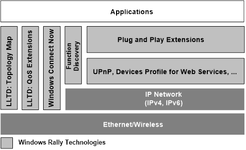

# Windows Rally Technologies

Microsoft® Windows® Rally™ technologies provide device manufacturers with an architecture and toolset for improving the security, reliability, and usability of network-connected devices. Windows Rally technologies enable effortless setup and more secure and manageable connectivity to other devices and PCs.

Devices that incorporate Windows Rally technologies give users access to richer, more secure experiences. Windows Rally technologies enable easier integration of devices with the end user’s digital environment, while advancing control of network Quality of Service (QoS) and diagnostics.

The Microsoft program that offers licensing of Windows Rally technologies will help manufacturers reduce development and support costs, while enhancing their brand identity for devices that connect to and interact with PCs running Microsoft Windows® operating systems.

What does the Windows Rally program deliver?

-   Access to the technologies

    Windows Rally technologies make device connectivity simple, robust, and more secure through discovery, configuration, and end-to-end tech¬nolo¬gies such as Link Layer Topology Discovery (LLTD), Windows Connect Now (WCN), Devices Profile for Web Services (DPWS), and Plug and Play Extensions (PnP X).

-   A simple, unified, royalty-free license

    This model consolidates licensing of several Windows networking and device-configuration technologies. This unified license establishes a simple process for manufacturers who want to imple¬ment these technologies in their devices. This license is royalty free and readily available through the Microsoft Web site for Windows Rally, together with all specifications, tools, and technical papers.

-   Guidance for applying the technologies

    Microsoft provides design and implementation guidelines for Windows Rally technologies to help make network connectivity seamless for end users. In addition, Microsoft provides guidance for implementation of industry standards such as Network Address Translation (NAT), Internet Protocol version 6 (IPv6), and network traffic prioritization via 802.1p.

## Configuration technologies

Windows Connect Now technologies enable simple and secure configuration of wireless networks and provisioning of wireless hardware. Windows Connect Now NET (WCN-NET) supports configuration of devices on out-of-band Ethernet and in-band wireless networks. WCN-NET is the Microsoft implementation of the Wi-Fi Simple Configuration Protocol, a Wi-Fi Alliance standard.

Windows Connect Now technologies include specifications and tools to enable simple and secure configuration of Wi-Fi networks and for provisioning of wireless devices such as:

-   Wireless access points, PCs, and servers
-   Network printers, printer bridges, digital still cameras, and game consoles
-   Digital media receivers, set-top boxes, electronic picture frames, and personal digital assistants (PDAs)

Windows Connect Now technologies include the following:

-   WCN-NET. Configuration of devices on out-of-band Ethernet and in-band wireless networks. WCN NET in Windows Vista communicates with access points and wireless stations by using UPnP, authenticates with the devices by using a personal identification number (PIN), and provides wireless settings that are based on user selection. Direct wireless in-band communication of stations is done via proxy from a Windows Connect Now-enabled wireless AP or wireless router.
-   WCN-UFD. USB flash drive (UFD)-based method for configuring secure wireless networks. Provides a configuration API and an XML-based format that work with a wizard in Windows Vista and Windows XP to write configuration files to a UFD. WCN UFD enables a simple and secure mechanism for users to configure wireless networks that include one or more Windows PCs.
-   WCN-MTP. Media Transport Protocol (MTP) extensions for wireless configuration. Enables an MTP initiator to provide an MTP responder with configuration parameters for joining a wireless network. This technology and Network Association Extensions for MTP are currently licensed through the MTP Porting Kit, as described in [Building Devices with the MTP Porting Kit](https://www.bing.com/search?q=Building Devices with the MTP Porting Kit).

With Windows Connect Now technologies, a user whose PC runs Windows Vista or Windows XP can create network configuration settings and transmit them to the AP by one of these methods:

-   Ethernet connection. Supported in Windows Vista as a common option for devices such as wireless APs, wireless digital media adapters, and Media Center Extenders.
-   UFD. Note that this is the only solution that Windows XP supports.
-   Temporary USB cable connection. Supported in Windows Vista, but only for MTP-class devices such as portable media, digital cameras, and so on.

The user can also print the configuration settings for reference when manually configuring a device that has an interactive display, such as a PC running an earlier version of Windows or another operating system.

The simplicity of configuration with Windows Connect Now allows non-technical users to quickly create a wireless network and add devices to it. By easing the wireless device installation process, Windows Connect Now makes wireless networking a realistic possibility for non-technical customers who otherwise might not purchase your device. Finally, Windows Connect Now improves customer satisfaction while it reduces your support costs.

## Discovery Technologies

"Discovery" describes how Windows determines that a device is present. For physically connected devices, discovery occurs through PCI, USB, and other physical bus enumerators. For network-connected devices, Windows uses network communication protocols to discover the presence of a device.

Under Windows Vista and Windows 7, Plug and Play Extensions (PnP-X) allows network-connected devices to be discovered and installed on a PC client as if they were connected physically.

To take advantage of PnP-X, the device manufacturer must support either Devices Profile for Web Services or UPnP 1.0. Specifically, PnP-X relies on the discovery of network-connected devices by using SSDP and WS-Discovery.

See these topics:

-   [PnP-X](pnp-x.md)
-   [Function Discovery](fd-portal.md)

## LLTD and QoS for Media Experiences

Defining priorities for managing bandwidth on A/V networks, through the LLTD protocol.

See these topics:

-   [Link Layer Topology Discovery](https://msdn.microsoft.com/library/windows/desktop/dn594471)
-   [Quality Windows Audio/Video Experience (qWAVE)](https://msdn.microsoft.com/library/windows/desktop/aa374110)

## Universal Plug and Play

Architecture for pervasive peer-to-peer network connectivity of PCs of all form factors, intelligent appliances, and wireless devices. See [UPnP APIs](https://msdn.microsoft.com/library/windows/desktop/aa382303).

## Web Services on Devices

Devices profile for Web Services for basic interoperability between IP-capable devices and Web services. See [Web Services on Devices](https://msdn.microsoft.com/library/windows/desktop/aa826001).

## Related Technologies for Network-Connected Devices

**MTP Extensions for Wireless Devices**

The Media Transport Protocol (MTP) is a protocol for communication and control of portable media devices. MTP enables object exchange, object description, and device management in a standard and extensible way.

MTP is a binary protocol that uses an initiator-responder model. The initiator must initiate any communication request, and the responder replies. The initiator then builds a model of the responder contents.

Although MTP is transport neutral, the basic protocol works for a device that is physically connected to a computer by using a bus such as USB. As a result, MTP as it was originally designed had no mechanism for provisioning wireless devices—providing them with network configuration data—so that they can connect to hosts over 802.11 wireless networks. These capabilities are available through extensions that are provided in the MTP Porting Kit, as described in this section.

Network Association Extensions for MTP

Network Association MTP Extension allows MTP initiators and responders to exchange information that enables a range of connection security options between hosts and devices in subsequent sessions over public and private IP networks. This specification:

-   Defines the Network Association Extension.
-   Describes the Network Association Extension operation.
-   Prescribes the conventions for host and device behavior during network association and subsequent IP connection negotiation.
-   Provides implementation notes and guidelines.

Before establishing a session over an IP network, a host and device might be required to participate in a secure exchange of information known as “network association” or “device bonding.” This information exchange is supported in these ways:

-   Through out-of-band mechanisms if the link is implicitly trusted, such as by way of a USB cable.
-   By in-band mechanisms if the link security is established based on some mutually supported mechanism, such as digest authentication by using a passcode known only to the responder and the user.

The Network Association Extension defines several authentication options to accommodate the wide range of device connection scenarios, including zero authentication, nominal authentication, secure authentication, and network association.

**Wi-Fi Provisioning Extensions for MTP**

Wi-Fi Provisioning MTP Extension defines a new MTP object format and a new MTP operation. Together, the new format and operation enable Wi-Fi provisioning for MTP devices.

This extension enables an MTP initiator to provide an MTP responder with the configuration parameters that are required to join a wireless LAN. This extension defines a new MTP object format for Wireless Configuration File (WCF) objects. A WCF object contains the network settings that allow the responder to join a wireless network. An initiator creates the WFC object and transfers it to the device. Each WCF object represents the settings for a single wireless network. The responder may receive multiple WCF objects over time. Each object has the same name as the service set identifier (SSID) of the network. In addition to the new object format, this extension also defines a new MTP operation that instructs the responder to process a WCF object that the responder has received and stored. By processing the WCF object, the responder validates the syntax and confirms support for the contents of that object. The initiator performs this operation each time it sends or updates a WCF object. However, the WCF object is available for use by the responder at any time, even if, for some reason, the initiator neglects to perform this operation. The device implementer determines how WCF profiles are used. For example:

-   The device can detect available wireless networks and automatically select the wireless settings from the list of WCF objects on the device.
-   The device requires that the user select from a list of available profiles and the device activates only the selected profile.
-   The device accepts only one WCF profile at a time. The device replaces any existing profile with the latest one that it received from the initiator.

**Media Transfer Protocol Porting Kit**

MTP first shipped as part of the Windows Media Device Manager 10 SDK. The MTP Porting Kit includes the complete MTP specification, design documentation, sample source code, software to implement a PC-based MTP simulator, and MTP test tools. See [Building Devices with the MTP Porting Kit](https://www.bing.com/search?q=Building Devices with the MTP Porting Kit).

**IPSec and IPv6—Next-Generation Internet Protocol**

Windows Rally technologies have been designed with IPv6 and Internet Protocol security (IPsec) in mind. IPv6, the next-generation protocol designed to replace the existing network (IPv4), results in a vastly larger number of IP addresses and supports hierarchical address¬ing structure, security, and mobility. IPv6 is required for new classes of computing and communications paradigms that are difficult to deliver by using IPv4. See [IPsec Configuration](https://msdn.microsoft.com/library/windows/desktop/bb736264).

 

 

