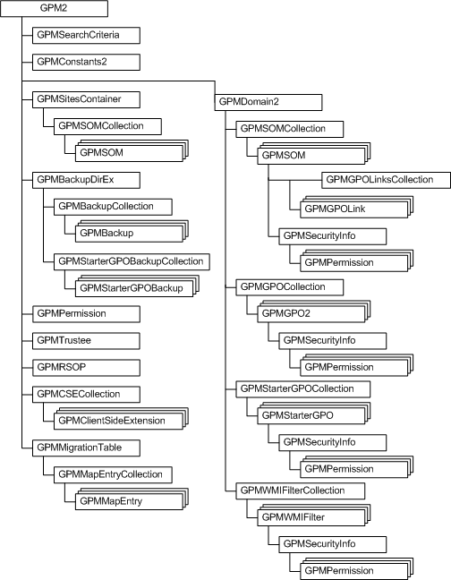
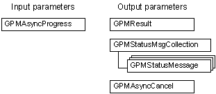

# GPMC Object Model

The following illustration describes the Group Policy Management Console (GPMC) object model.

For more information, see the ["GPMC Objects and Associated Tasks"](#gpmc-objects-and-associated-tasks) section of this topic.

The following objects represent parameters related to Group Policy object (GPO) copy operations, backup operations, and restore operations.

## GPMC Objects and Associated Tasks

The following table lists the GPMC objects and the typical tasks that are associated with those objects.

| Object                                                      | What you can do with this object                                                                                                                                                                                                                                                                                                                                                                                                                                                                           |
|-------------------------------------------------------------|------------------------------------------------------------------------------------------------------------------------------------------------------------------------------------------------------------------------------------------------------------------------------------------------------------------------------------------------------------------------------------------------------------------------------------------------------------------------------------------------------------|
| [**GPM2**](igpm.md)                                        | Create [**GPMDomain2**](igpmdomain.md), [**GPMSitesContainer**](igpmsitescontainer.md), [**GPMPermission**](igpmpermission.md), [**GPMSearchCriteria**](igpmsearchcriteria.md), [**GPMBackupDirEx**](igpmbackupdir.md), [**GPMRSOP**](igpmrsop.md), [**GPMClientSideExtension**](igpmclientsideextension.md), [**GPMCSECollection**](igpmcsecollection.md), [**GPMTrustee**](igpmtrustee.md), [**GPMMigrationTable**](igpmmigrationtable.md) and [**GPMConstants2**](igpmconstants.md) objects. |
| [**GPMAsyncCancel**](igpmasynccancel.md)                   | Cancel an asynchronous GPMC operation, such as a backup, restore, import, or copy operation. Not available through scripting.                                                                                                                                                                                                                                                                                                                                                                              |
| [**GPMAsyncProgress**](igpmasyncprogress.md)               | Enable client notification about the progress of asynchronous operations. Not available through scripting.                                                                                                                                                                                                                                                                                                                                                                                                 |
| [**GPMBackup**](igpmbackup.md)                             | Delete GPO backups. Retrieve the properties of GPO backup objects. Generate reports of the settings in a GPO backup.                                                                                                                                                                                                                                                                                                                                                                                       |
| [**GPMBackupCollection**](igpmbackupcollection.md)         | Access a collection of GPO backups.                                                                                                                                                                                                                                                                                                                                                                                                                                                                        |
| [**GPMBackupDirEx**](igpmbackupdir.md)                     | Query GPO backups, GPO backup collections, Starter GPO backups, and Starter GPO backup collections.                                                                                                                                                                                                                                                                                                                                                                                                        |
| [**GPMClientSideExtension**](igpmclientsideextension.md)   | Query client-side extension properties such as the ID and the display name.                                                                                                                                                                                                                                                                                                                                                                                                                                |
| [**GPMConstants**](igpmconstants.md)                       | Retrieve the values of GPMC constants.                                                                                                                                                                                                                                                                                                                                                                                                                                                                     |
| [**GPMCSECollection**](igpmcsecollection.md)               | Access a collection of client-side extension objects.                                                                                                                                                                                                                                                                                                                                                                                                                                                      |
| [**GPMDomain2**](igpmdomain.md)                            | Query scope of management (SOM) objects. Create, restore, and query GPOs and Starter GPOs. Create and query Windows Management Instrumentation (WMI) filters. WMI filter queries are specified using WMI Query Language (WQL).                                                                                                                                                                                                                                                                             |
| [**GPMGPO2**](igpmgpo.md)                                  | Manage an individual GPO. Enable or disable a GPO for users or for computers. Delete a GPO. Retrieve and set security information for a GPO. Retrieve GPO properties. Back up, import, and copy GPOs. Generate a report of settings in a GPO backup.                                                                                                                                                                                                                                                       |
| [**GPMGPOCollection**](igpmgpocollection.md)               | Access a collection of GPOs.                                                                                                                                                                                                                                                                                                                                                                                                                                                                               |
| [**GPMGPOLink**](igpmgpolink.md)                           | Manage GPO links from a SOM. Set and retrieve the properties of GPO links, such as the link order and whether a link is enabled or enforced.                                                                                                                                                                                                                                                                                                                                                               |
| [**GPMStarterGPO**](igpmstartergpo.md)                     | Manage an individual Starter GPO. Delete a Starter GPO. Retrieve and set security information for a Starter GPO. Retrieve Starter GPO properties. Backup, import, and copy Starter GPOs. Generate a report of settings in a Starter GPO backup.                                                                                                                                                                                                                                                            |
| [**GPMStarterGPOCollection**](igpmstartergpocollection.md) | Access a collection of Starter GPOs.                                                                                                                                                                                                                                                                                                                                                                                                                                                                       |
| [**GPMGPOLinksCollection**](igpmgpolinkscollection.md)     | Access a collection of GPO links.                                                                                                                                                                                                                                                                                                                                                                                                                                                                          |
| [**GPMPermission**](igpmpermission.md)                     | Retrieve permission properties.                                                                                                                                                                                                                                                                                                                                                                                                                                                                            |
| [**GPMResult**](igpmresult.md)                             | Retrieve status message information while performing GPMC operations, such as restore, import, backup, and copy operations of GPOs.                                                                                                                                                                                                                                                                                                                                                                        |
| [**GPMRSOP**](igpmrsop.md)                                 | Query Resultant Set of Policy (RSoP) in logging or planning mode. Generate a report of RSoP data.                                                                                                                                                                                                                                                                                                                                                                                                          |
| [**GPMSearchCriteria**](igpmsearchcriteria.md)             | Define the criteria to use for search operations.                                                                                                                                                                                                                                                                                                                                                                                                                                                          |
| [**GPMSecurityInfo**](igpmsecurityinfo.md)                 | Define the set of permissions that exist on a particular SOM, GPO, or WMI filter. Remove and add permissions.                                                                                                                                                                                                                                                                                                                                                                                              |
| [**GPMSitesContainer**](igpmsitescontainer.md)             | Access the scope of management (SOM) objects that represent sites in a forest.                                                                                                                                                                                                                                                                                                                                                                                                                             |
| [**GPMSOM**](igpmsom.md)                                   | Create and retrieve GPO links for a SOM. Set and retrieve security attributes and properties for a SOM.                                                                                                                                                                                                                                                                                                                                                                                                    |
| [**GPMSOMCollection**](igpmsomcollection.md)               | Access a collection of SOMs.                                                                                                                                                                                                                                                                                                                                                                                                                                                                               |
| [**GPMStatusMessage**](igpmstatusmessage.md)               | Retrieve the properties of status messages that are related to GPO operations.                                                                                                                                                                                                                                                                                                                                                                                                                             |
| [**GPMStatusMsgCollection**](igpmstatusmsgcollection.md)   | Access a collection of status messages.                                                                                                                                                                                                                                                                                                                                                                                                                                                                    |
| [**GPMTrustee**](igpmtrustee.md)                           | Retrieve information about a trustee that is a user, group, or computer in the domain.                                                                                                                                                                                                                                                                                                                                                                                                                     |
| [**GPMWMIFilter**](igpmwmifilter.md)                       | Set and retrieve security attributes and properties for a WMI filter.                                                                                                                                                                                                                                                                                                                                                                                                                                      |
| [**GPMWMIFilterCollection**](igpmwmifiltercollection.md)   | Access a collection of WMI filters.                                                                                                                                                                                                                                                                                                                                                                                                                                                                        |

 

 

 

