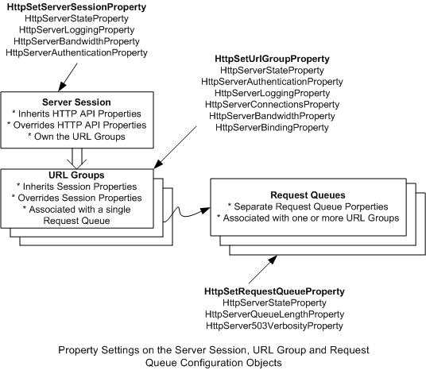

# Configuring Properties

The HTTP Server version 2.0 API allows applications to manually configure request queues, server sessions, and URL groups. The server session is the top-level object that contains configuration information that applies to all the URL groups created under them. The application creates a server session with one or more URL groups under it, and then associates the URL group with a request queue.

For more information about specific configuration objects in HTTP Server version 2.0 API, see:

-   [Configuring the Server Session](configuring-the-server-session.md)
-   [Configuring the URL Group](configuring-the-url-group.md)
-   [Configuring the HTTP Server API Wide Timers](configuring-the-http-server-api-wide-timers.md)

Properties for the configuration objects are set with the [**HttpSetServerSessionProperty**](/windows/desktop/api/Http/nf-http-httpsetserversessionproperty), the [**HttpSetUrlGroupProperty**](/windows/desktop/api/Http/nf-http-httpseturlgroupproperty) and the [**HttpSetRequestQueueProperty**](/windows/desktop/api/Http/nf-http-httpsetrequestqueueproperty) as shown in the diagram below. The association between the request queue and the URL Group can be changed on demand whereas the association between the Server Session and the URL Groups cannot be changed. The URL Groups must be associated with a request queue to receive requests.

The following table lists the properties that can be set on each configuration object. In general, if no property configuration is set by the application, the HTTP Server API default configurations apply. The configuration properties set by the application on the server session override the HTTP Server API-wide configurations. The configurations set on the URL group override the server session configurations and the request queue configurations override the HTTP Server API default configurations.

| Configuration Object | Property                                                                                                                                                      |
|----------------------|---------------------------------------------------------------------------------------------------------------------------------------------------------------|
| Server Session       | HttpServerStateProperty HttpServerLoggingProperty HttpServerQosProperty HttpServerTimeoutsProperty HttpServerAuthenticationProperty                           |
| URL Group            | HttpServerStateProperty HttpServerAuthenticationProperty HttpServerLoggingProperty HttpServerQosProperty HttpServerBindingProperty HttpServerTimeoutsProperty |
| Request Queue        | HttpServerStateProperty HttpServerQueueLengthProperty HttpServer503VerbosityProperty                                                                          |

 

The server session properties are defined in the [HTTP\_SERVER\_PROPERTY](/windows/desktop/api/Http/ne-http-http_server_property) enumeration. The following table lists the property structures that are set for each property type and the HTTP Server API default when these properties are not set by the application.

| Property                                                    | Structure                                                                     | HTTP Server API Default    |
|-------------------------------------------------------------|-------------------------------------------------------------------------------|----------------------------|
| HttpServerAuthenticatonProperty                             | [**HTTP\_SERVER\_AUTHENTICATION\_INFO**](/windows/desktop/api/Http/ns-http-http_server_authentication_info) | No Authentication          |
| HttpServerLoggingProperty                                   | [**HTTP\_LOGGING\_INFO**](/windows/desktop/api/Http/ns-http-http_logging_info)                              | No Logging                 |
| HttpServerQosProperty->HttpQosSettingTypeConnectionLimit | [**HTTP\_CONNECTION\_LIMIT\_INFO**](/windows/desktop/api/Http/ns-http-http_connection_limit_info)           | No Limit                   |
| HttpServerTimeoutsProperty                                  | [**HTTP\_TIMEOUT\_LIMIT\_INFO**](/windows/desktop/api/Http/ns-http-http_timeout_limit_info)                 | 120 sec.                   |
| HttpServerQosProperty->HttpQosSettingTypeBandwidth       | [**HTTP\_BANDWIDTH\_LIMIT\_INFO**](/windows/desktop/api/Http/ns-http-http_bandwidth_limit_info)             | No Limit                   |
| HttpServerQueueLengthProperty                               | ULONG                                                                         | 1000                       |
| HttpServerStateProperty                                     | [**HTTP\_STATE\_INFO**](/windows/desktop/api/Http/ns-http-http_state_info)                                  | Enabled                    |
| HttpServer503VerbosityProperty                              | [**HTTP\_503\_RESPONSE\_VERBOSITY**](/windows/desktop/api/Http/ne-http-http_503_response_verbosity)         | HttpResponseVerbosityBasic |
| HttpServerBindingProperty                                   | [**HTTP\_BINDING\_INFO**](/windows/desktop/api/Http/ns-http-http_binding_info)                              | None                       |

 

The following table lists the minimum and and maximum values for the HTTP Server API configurations.

| Property                                              | HTTP Server API Maximum and Minimum                        |
|-------------------------------------------------------|------------------------------------------------------------|
| HttpServerQosProperty->HttpQosSettingTypeBandwidth | Min = MIN\_ALLOWED\_BANDWIDTH\_THROTTLING\_RATE Max = none |
| HttpServerQueueLengthProperty                         | Min = 0xA Max = 0xFFFF                                     |

 

 

 

