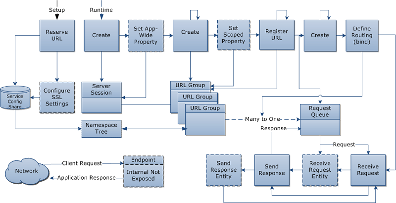

# Programming Model

The HTTP Server API programming model includes five groups of activities:

-   [Setup configuration](setup-configuration.md)
-   [Run-time configuration](run-time-configuration.md)
-   [Creating and binding to a request queue](creating-and-binding-to-a-request-queue.md)
-   [Processing requests](processing-requests.md)
-   [Shutdown and cleanup](shutdown-and-cleanup.md)

For a sample application that shows how to handle the HTTP GET and POST request actions and how to send a 503 (**NOT\_IMPLEMENTED**) error if actions are present in the request that the application does not handle, see [HTTP Server Sample Application](http-server-sample-application.md).

 

 

