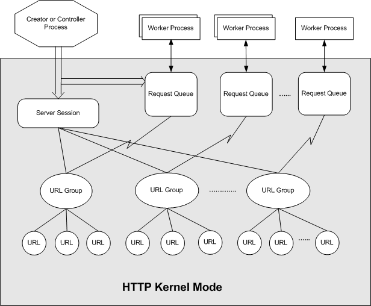

# Architecture (HTTP Server API)

The server session, request queue, and URL group configuration objects enable applications to configure the HTTP service. The properties set on these objects override the HTTP Server API wide default configurations.

-   Server Session: The top-level configuration object that defines configurations for all the URL groups created under the session.
-   URL Group: The URL group, created under the server session, contains a set of URLs that inherit the configurations set on the server session. The URL group configurations override the server session configurations when set by the application. The URL group defines a portion of the namespace that the application is listening on and configures that portion of the namespace.
-   Request Queue: This object configures settings specific to the request queue. These configurations are applied to all the URLs in the groups associated with the request queue.

The diagram below shows the relationship between the configuration objects and the application. Typically, a single server session is created for each application with one or more URL groups created under it. The request queues are created independent of the URL group or server session. URL groups must be associated with a request queue to receive requests.

The named request queue feature of the HTTP Server version 2.0 API allows multiple worker processes to receive requests on a request queue. The request queue is created by a controller process that identifies the worker processes granted access to the request queue. For more information, see the [Named Request Queue](named-request-queue.md) topic

## Property Configuration

For more information about setting properties on the configuration objects, see the following topics:

-   [Configuring the Request Queue](configuring-the-request-queue.md)
-   [Configuring the Server Session](configuring-the-server-session.md)
-   [Configuring the URL Group](configuring-the-url-group.md)

The following table lists properties that are set on the configuration objects. For more information about property configurations, see the [Configuring Properties in HTTP Version 2.0](configuring-properties-in-http-version-2-0.md) topic.

| Name           | Property                                                                                                                                                                                                                                                                      |
|----------------|-------------------------------------------------------------------------------------------------------------------------------------------------------------------------------------------------------------------------------------------------------------------------------|
| Server Session | HttpServerStateProperty  HttpServerLoggingProperty  HttpServerBandwidthProperty  HttpServerTimeoutsProperty  HttpServerAuthenticatonProperty                                                                                |
| URL Group      | HttpServerStateProperty  HttpServerAuthenticatonProperty  HttpServerLoggingProperty  HttpServerConnectionsProperty  HttpServerBandwidthProperty  HttpServerBindingProperty  HttpServerTimeoutsProperty  |
| Request Queue  | HttpServerStateProperty  HttpServerQueueLengthProperty  HttpServer503VerbosityProperty                                                                                                                                                          |

 

 

 

