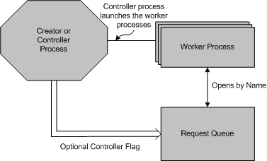

# Named Request Queue

The HTTP Server version 2.0 API named request queue feature allows multiple applications, operating under separate processes and user accounts, access to the request queue. The request queue is opened by name, and secured using Access Control Lists (ACLs) to ensure that applications are not able to access each others data. A single process creates the request queue, and grants permission to other processes to use the request queue. Thus, other processes on the computer access the request queue with the least privilege necessary to service requests. Possible damage to the HTTP service, due to vulnerabilities in third party code, is minimized when applications are running under least privileges.

The named request queue is created with the [**HttpCreateRequestQueue**](/windows/desktop/api/Http/nf-http-httpcreaterequestqueue) function. When the request queue is created, the application specifies the ACL in the *pSecurityAttribute* parameter. The ACL, which can only be set when the request queue is created, allows worker processes to open the request queue, receive requests, and send responses. By default, processes are not allowed to open a request queue unless they have been granted permission in the ACL. Applications do not require administrative privileges to create the request queue.

The request queue must be created with a name specified in the *pName* parameter of [**HttpCreateRequestQueue**](/windows/desktop/api/Http/nf-http-httpcreaterequestqueue) for other processes to open the request queue. If *pName* is **NULL**, an unnamed request queue is created and no other processes can open it.

## Creator and Controller Processes

When the request queue is created, the application can open it as a controller process or a creator process. The controller and creator processes both act as administrators for the request queue, but the controller does not perform I/O operations on it. The application indicates that it is a controller process when the request queue is created by specifying **HTTP\_CREATE\_REQUEST\_QUEUE\_FLAG\_CONTROLLER** in the *Flags* parameter of [**HttpCreateRequestQueue**](/windows/desktop/api/Http/nf-http-httpcreaterequestqueue). If the **HTTP\_CREATE\_REQUEST\_QUEUE\_FLAG\_CONTROLLER** flag is not set, the application is a creator process.

The following list contains tasks performed by the controller process and the creator process:

-   Create the request queue and specify the name.
-   Configure the request queue using the [**HttpSetRequestQueueProperty**](/windows/desktop/api/Http/nf-http-httpsetrequestqueueproperty) function.
-   Query the request queue configuration parameters using the [**HttpQueryRequestQueueProperty**](/windows/desktop/api/Http/nf-http-httpqueryrequestqueueproperty) function.
-   Create URL Groups and associates them with a request queue.
-   Set the ACL specifying the worker processes that are allowed to receive I/O on the request queue.
-   Call [**HttpWaitForDemandStart**](/windows/desktop/api/Http/nf-http-httpwaitfordemandstart) to delay the instantiation of worker processes until the first request arrives on the request queue.

In addition to these tasks, the creator process can also perform I/O operations on the request queue.

## Worker Processes

A worker process can open an existing request queue only if they have been granted access to it in the ACL. Worker processes operating under least privileges can open a request queue and perform I/O on it. Applications open an existing request queue by calling [**HttpCreateRequestQueue**](/windows/desktop/api/Http/nf-http-httpcreaterequestqueue) with the **HTTP\_CREATE\_REQUEST\_QUEUE\_FLAG\_OPEN\_EXISTING** in the *Flags* parameter, and the name of the request queue in the *pName* parameter.

The worker process performs the following functions:

-   Receive requests and send responses on the request queue.
-   Open an existing request queue by name. The handle to the request queue returned to the worker process cannot be used to configure the request queue.
-   Query the request queue configuration parameters.

The following diagram shows the worker process model for request queues. The request queue can have several worker processes that process I/O, and one creator processes that configures the request queue.

 

 

