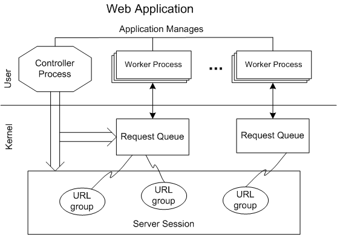

# Process Isolation

The HTTP Server version 2.0 API provides the ability to build a safer, more reliable service by isolating worker processes that are servicing requests on the request queue. The request queue is created and administrated by a controller or creator process that strictly controls access to it. The controller process launches one or more separate worker processes that perform I/O on the request queue. The controller process runs with administrative privilege and configures the request queue, while the lower privilege worker processes access and service requests from the request queue. This architecture supports the policy of applications running under "least privilege" and reduces the possibility of security vulnerabilities introduced by third-party code that may be running in worker processes.

Access to the request queue is granted when the controller process creates the request queue with a name and an Access Control List (ACL). Web applications that are included in the ACL can open an existing request queue by name. The creator process may also be a worker process on the request queue. For more information, see the [Named Request Queue](named-request-queue.md) topic. The following diagram shows the architecture of a typical HTTP application running with the worker process model:

Individual worker processes within the application are isolated from other worker processes, and the health of each the worker processes can be monitored by the controller process. The controller process is isolated from the worker processes. The components of the HTTP architecture are described below:

-   Creator or controller process: The controller process can run with, or without, administrative privileges to monitor the health and configure the service. The controller process typically creates a single server session for the service and defines the URL groups under the server session. The URL group that a particular URL is associated with determines which request queue services the namespace denoted by the particular URL. The controller process also creates the request queue and launches the worker processes that can access the request queue.
-   Worker Process: The worker processes, launched by the controller process, perform IO on the request queue that is associated with the URLs they service. The web application is granted access to the request queue by the controller process in the ACL when the request queue is created. Unless the web application is also the creator process, it does not manage the service or configure the request queue. The controller process communicates the name of the request queue to the worker process and the worker process opens the request queue by name. Worker processes can load third party web applications without introducing security vulnerabilities in other parts of the application.
-   Request Queue: The request queue is created and configured by the controller process. The controller specifies the processes that are allowed access to the request queue in the ACL when the request queue is created.
-   Server Session: The controller process typically creates and configures a single server session for the application. The server session maintains the configuration properties for the entire application. URL groups are created under the server session by the controller process.
-   URL Group: The controller process creates the URL groups under the server session, and configures the URL group independent of the server session. URLs are added to the group by the controller process. Requests are routed to the request queue that the URL group is associated with.

 

 

