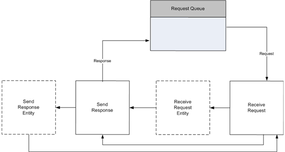

# Processing Requests

Processing requests includes four steps:

-   Receiving a request
-   Handling the request
-   Sending the response
-   Canceling requests that cannot be processed

## Receiving a Request

The HTTP Server API supplies a request structure to store the parsed incoming request. This structure is allocated by the application, and initialized when an incoming request is received. The application calls the [**HttpReceiveHttpRequest**](/windows/desktop/api/Http/nf-http-httpreceivehttprequest) function to receive the request. If the request buffer is too small to receive the request, the application can increase the buffer size and call **HttpReceiveHttpRequest** again to receive the entire request.

If the request includes entity body data to be received, the applications calls [**HttpReceiveRequestEntityBody**](/windows/desktop/api/Http/nf-http-httpreceiverequestentitybody) with the request ID returned in the *pRequestBuffer* parameter during the call to [**HttpReceiveHttpRequest**](/windows/desktop/api/Http/nf-http-httpreceivehttprequest).

## Handling the Request

The application performs application-specific processing of the request and formulates a response. The HTTP Server API imposes no timeout on this process.

## Sending the Response

When the application is finished handling the request and formulating the response, it calls the [**HttpSendHttpResponse**](/windows/desktop/api/Http/nf-http-httpsendhttpresponse) function to send the response. If the response includes entity body data to send, the application also calls [HttpSendResponseEntityBody](/windows/desktop/api/Http/nf-http-httpsendresponseentitybody).

## Canceling Requests

After the application has received a request ID from its call to [**HttpReceiveHttpRequest**](/windows/desktop/api/Http/nf-http-httpreceivehttprequest), it can at any time cancel the request by calling [HttpCancelHttpRequest](/windows/desktop/api/Http/nf-http-httpcancelhttprequest).

 

 

