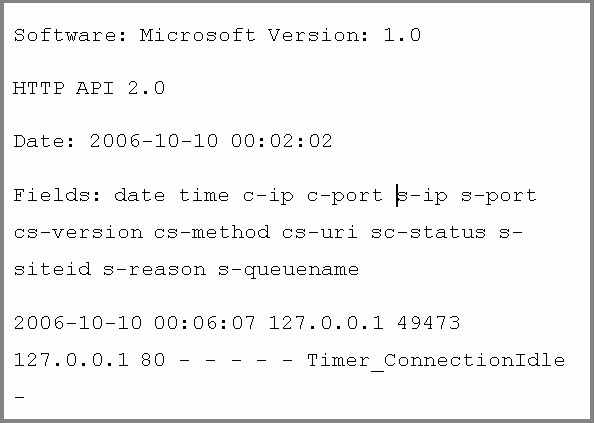
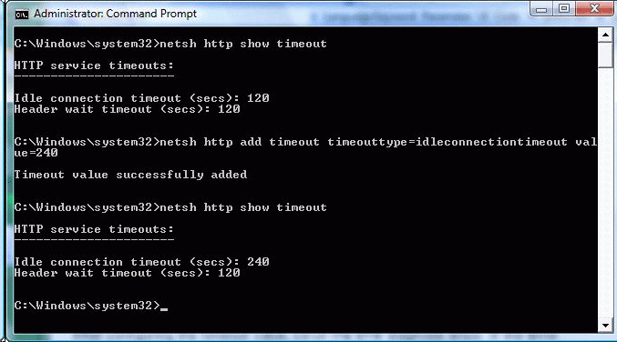

# Scenario 1: HTTP Timeout Example Using ETW Tracing and Netsh Commands

Through ETW tracing, the flow of data through the HTTP Server API component can be inspected to diagnose problems. For example, users of a web application may see error messages in their browser that a web page cannot display. On the server hosting the web application, the IT professional also sees a connection timeout entry within the HTTP Error Log, as shown in Figure 1 below. The HTTP Error Log can be found in the following directory: %windir%\\System32\\LogFiles\\HTTPERR\\.

Figure 1: HTTP Error Log for Timeout

## Generating an ETW Trace Report

To generate an ETW trace report for the HTTP Server API component, run the steps below from the command prompt. In this example, the trace is run on the server since it is hosting the web application.

The steps below generate a trace called httptrace.etl and then convert the trace into a CSV file called httptrace.csv. As shown below, the ETW provider for the HTTP Server API is called Microsoft-Windows-HttpService. The 0xFFF command-line option indicates that all ETW events for this provider should be captured.

**Generate an ETW Trace Report**

1.  Start ETW trace for HTTP Server API component: l**ogman.exe start httptrace -p Microsoft-Windows-HttpService 0xFFFF -o httptrace.etl –ets**
2.  Reproduce the issue so that it can be captured in the trace. In this example, access the web application from a client machine, resulting in the "**page cannot be displayed**" message being shown on the client.
3.  Now that the issue has been reproduced, stop the trace: **logman.exe stop httptrace –ets**
4.  Convert the report into CSV format: **tracerpt.exe httptrace.etl -of CSV -o httptrace.csv**
5.  View the trace report. An excerpt from a CSV trace is shown below in Table 1.

## Viewing the Trace and Diagnosing

The resulting CSV file for traces can be viewed in Excel or any tool that supports the CSV format. Table 1 below shows excerpts from a sample trace file (httptrace.csv). In the trace report, the "Level" column shows an entry with a value of "3", which corresponds to a warning in ETW. The HTTP Server API component follows the ETW Levels defined in the following article: (https://msdn2.microsoft.com/library/aa382793.aspx). The ETW levels include:

| Level | Meaning      |
|-------|--------------|
| 1     | Critical     |
| 2     | Error        |
| 3     | Warning      |
| 4     | Infomational |
| 5     | Verbose      |

 

With this warning, the event type (Type column) reports "ConnTimedOut". In the subsequent columns for the ConnTimeOut event, the specific timer that expired is reported as "Timer\_ConnectionIdle". Note the column with the "Timer\_ConnectionIdle" entry is not included in the table for the sake brevity and to avoid excerpting noncontiguous columns.

| Event name                    | Type            | Event ID | Version | Channel | Level |
|-------------------------------|-----------------|----------|---------|---------|-------|
| EventTrace                    | Header          | 0        | 2       | 0       | 0     |
| Microsoft-Windows-HttpService | ChgUrlGrpProp   | 28       | 0       | 16      | 4     |
| Microsoft-Windows-HttpService | AddUrl          | 31       | 0       | 16      | 4     |
| Microsoft-Windows-HttpService | ChgReqQueueProp | 30       | 0       | 16      | 4     |
| Microsoft-Windows-HttpService | ChgUrlGrpProp   | 28       | 0       | 16      | 4     |
| Microsoft-Windows-HttpService | ChgSrvSesProp   | 29       | 0       | 16      | 4     |
| Microsoft-Windows-HttpService | ChgSrvSesProp   | 29       | 0       | 16      | 4     |
| Microsoft-Windows-HttpService | ConnConnect     | 21       | 0       | 16      | 4     |
| Microsoft-Windows-HttpService | ConnIdAssgn     | 22       | 0       | 16      | 4     |
| Microsoft-Windows-HttpService | RecvReq         | 1        | 0       | 16      | 4     |
| Microsoft-Windows-HttpService | Parse           | 2        | 0       | 16      | 4     |
| Microsoft-Windows-HttpService | LogFileWrite    | 51       | 0       | 16      | 4     |
| Microsoft-Windows-HttpService | ConnCleanup     | 24       | 0       | 16      | 4     |
| Microsoft-Windows-HttpService | ConnTimedOut    | 53       | 0       | 16      | 3     |

 

Table 1: Excerpts from a Sample Trace Report for a Timer Issue

In this example, the expiration (ConnTimeOut event) of the header timer (Timer\_ConnectionIdle) is the reason end-users see the "page cannot be displayed" message in their web clients. A potential reason for the timeout may be that Web clients are sending slowly due to slow connections. To address this issue, the timeout value can be adjusted through Netsh commands.

## Adjusting Timeout through Netsh and Verifying the Solution

The Netsh commands for HTTP listed below allow an IT professional to view and configure setting values on the HTTP Server API component. Changes through Netsh HTTP commands affect all server applications hosted by the HTTP Server API component for that machine. These changes persist across restarts of the component and reboots of the machine. The Netsh HTTP commands are available in Windows Vista and Windows Server 2008 and replace the Windows Server 2003 Resource Kit's HttpCfg.exe tool when running on Windows Vista and Windows Server 2008. In this scenario, we will adjust a timeout value and then verify the solution. Timers exist in the HTTP Server API component to ensure availability and protect against overconsumption by a misconfigured or malicious user. Adjusting timers from default values should be carefully evaluated against a potential DoS attack.

In this example, the web clients are behind a slow network connection, resulting in the Timer\_ConnectionIdle ETW event. After consideration of the cause of the timeouts and balancing with the impact on the server's load, the decision is made to increase the timeout values to a value of 240 seconds. You can view and then configure the timer with the following procedure.

**Configure the idle connection timer (Timer\_ConnectionIdle) with Netsh**

1.  On the server, open an elevated command window and run the steps below to view and configure the timeout value. A screenshot of the Netsh HTTP command is shown in Figure 2 below.
2.  Show the current timeout values: **Netsh http show timeout**
3.  Configure the Timer\_ConnectionIdle timeout value. In this example, the value is changed to 240 seconds: **Netsh http add timeout timeouttype=idleconnectiontimeout value=240**

Figure 2: Netsh HTTP command window

After configuring the timeout value, rerun the ETW diagnosis steps. If the error condition is corrected, the ETW trace should no longer show a timeout with an ETW level of "3" for the connection idle timer.

 

 

