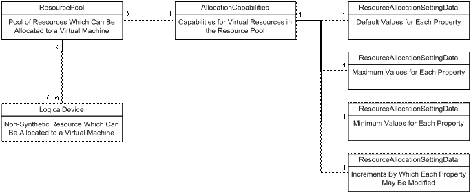

# Resource management service

The Resource Virtualization Profile provides the means by which a client can discover the virtual resources supported by the virtualization system. It also describes the capacity—or number of allocations—that is supported for each type of virtual resource. The following illustration shows the Resource Virtualization Profile.

Two different classes of virtual resources are defined by the Resource Virtualization Profile:

-   Shared Resource: Represents the resources of the host that are, or are capable of being shared among multiple virtual machines. [**Msvm\_Processor**](msvm-processor.md) is an example of a shared resource.
-   Synthetic Resource: Represents the virtual resources that have no corresponding host resource. [**Msvm\_EmulatedEthernetPort**](msvm-emulatedethernetport.md) is an example of a synthetic resource.

The resource pool is used to collect a class of host resources so that it can be easily discovered while its capabilities and settings can be described in a central location. There is no limit to how basic or advanced an implementation of the collected resource can be.

From the resource pool, the client may access the associated Allocation Capabilities (AC). This class describes the capabilities of the resource described by this resource pool. For instance, it may indicate whether the [**Msvm\_EmulatedEthernetPort**](msvm-emulatedethernetport.md) represented by this resource pool supports virtual LANs (VLANs) or filters.

The AC Profile defines the means by which a client can discover the valid range of and default settings for a given virtual resource. An AC object is associated with each resource pool. Four Resource Allocation Setting Data (RASD) objects are associated with the AC object to describe the minimum, maximum, default and incremental values for the given resource's allocation. Together, these classes describe the overall range of supported capabilities. The [**Msvm\_AllocationCapabilities**](msvm-allocationcapabilities.md) instance provides an anchor point for the set of [**Msvm\_ResourceAllocationSettingData**](msvm-resourceallocationsettingdata.md) instances that specify the default and valid range of settings for a virtual resource. The [**Msvm\_SettingsDefineCapabilities**](msvm-settingsdefinecapabilities.md) association class provides the link between the AC instance and the minimum, maximum, incremental and default settings for a resource supported by the virtualization platform.

 

 

