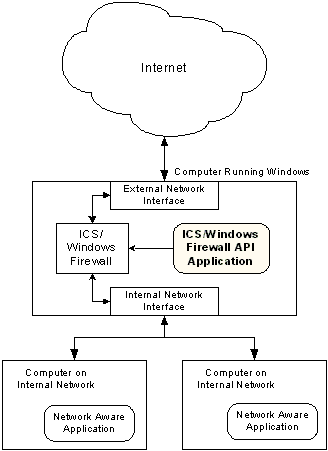
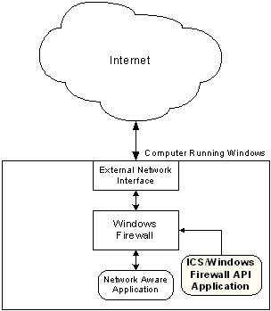

# Diagram of Internet Connection Sharing and Internet Connection Firewall

\[Internet Connection Firewall may be altered or unavailable in subsequent versions. Instead, use the [Windows Firewall API](windows-firewall-start-page.md).\]

The [Internet Connection Sharing](internet-connection-sharing-and-internet-connection-firewall-reference.md) (ICS) API should be used for applications that run on the computer that has Internet Connection Sharing enabled. Such computers are typically performing the role of an Internet gateway for a home or small business LAN.

Computers that are not serving as Internet gateways do not need to use the Internet Connection Sharing feature. In this case, only the Internet Connection Firewall functionality is required. The following diagram depicts this scenario.

To configure a remote Internet Gateway Device on the local network, use [Network Address Translation Traversal](network-address-translation-traversal.md).

 

 

