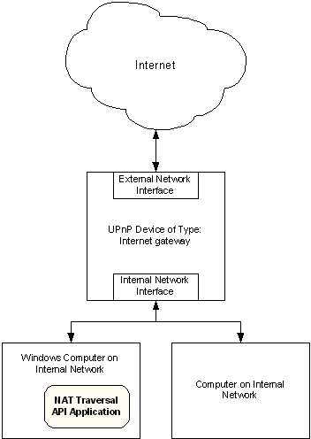

# About Network Address Translation Traversal

The [Network Address Translation (NAT) Traversal API](network-address-translation-traversal-reference.md) makes it possible for applications to configure a remote Internet Gateway Device (IGD) on the local network. In this scenario, the application is running on a client computer on an internal network as shown in the following diagram.

The application running on the Windows computer calls the NAT Traversal API. The NAT Traversal API configures the remote Internet gateway.

NAT operating conditions include the following.

-   If Windows Firewall is enabled, applications must open the UPnP ports 1900 and 2869 before using the NAT Traversal API. Use the [Windows Firewall API](windows-firewall-start-page.md) for this.
-   When an application opens the UPnP ports, time is required for UPnP to discover the NAT. It is recommended that the application wait for 3 seconds after opening the UPnP firewall ports before calling the NAT Traversal API to ensure that the NAT is discovered. This wait time is only required if the firewall ports haven't previously been opened.
-   The NAT API will not function if disabled through the Group Policy management interface.
-   The NAT API will not work if Windows Firewall is in shielded mode.

<!-- -->

-   The NAT Traversal API will not function correctly if the UPnP ports are blocked through Windows Firewall group policy. This can be done in one of three ways:

    -   Disabling UPnP using the "Allow UPnP" group policy option.
    -   Disabling the two UPnP ports through the "Define port exceptions" group policy option.
    -   The firewall is forced into On with No Exceptions Mode through the "Do not allow exceptions" group policy option.

    **Note**  The last "Do not allow exceptions" option is also true for local policy in addition to group policy.

 

 

