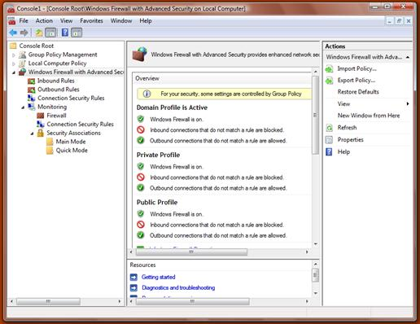

# Rule Authoring

At this point you should have collected all the information necessary to start authoring firewall rules.

## Logical Firewall Rule Grouping

The next step is to categorize rules based on the high-level function they contribute to. The most common way to group firewall rules is as follows:

-   Core feature functionality
-   Remote management
-   Ancillary functionality

Add the group name to the table that you have created while identifying the Network Requirements for later reference. You will need the group names when translating the firewall policy into firewall API calls.

## Windows Firewall with Advanced Security MMC Snap-In

Start authoring the firewall rules for the product in the Windows Firewall with Advanced Security MMC snap-in.

Using the network requirements that you have gathered for your product, you should use the firewall MMC snap-in to translate them into actual firewall rules that you can test your product against.

Start by authoring a group of rules for your core deployment scenario. Focus on inbound rules; outbound rules are optional. Test the scenario locally and remotely against the rules, and update the rules until your core scenario works perfectly.

Repeat this process for the next set of scenarios until your product has firewall rules covering all of its scenarios and features.

As you author the rules you should keep the following guidelines in mind:

-   Create "custom rules" in the MMC snap-in as they offer the most flexibility.
-   Scope your rules so that they offer the least amount of attack surface. For example, if your product requires TCP port 80 to be open, make sure to scope the port to a specific application.
-   Do not specify local or remote address ranges, since they are known only at product deployment time.
-   Rules should apply to all profiles.

Save a copy of the policy that you have authored in the Firewall MMC for future reference.

## Firewall Rule Strings

Firewall rules require three strings for each and every rule. These three strings are:

-   *Rule name.* Must be unique and should follow this format: "&lt;Name of the feature&gt; - &lt;Subfeature&gt; (&lt;Protocol&gt;-&lt;Dir&gt;-&lt;Counter&gt;)"
-   *Rule description.* Should follow this format in order to provide the administrator a good understanding of the purpose for the rule: "&lt;Dir&gt;bound rule for &lt;Name of the feature&gt; to allow ... \[&lt;UDP/TCP&gt; &lt;Port&gt;\]"
-   *Group name.* Should follow this format: "&lt;Name of the feature&gt;"

These strings should be indirect MUI-localizable strings referencing a resource library with the absolute path indicated, such as "@C:\\Program Files\\Contoso Storefront\\StorefrontRes.dll,-1234".

> [!Note]  
> Direct strings are not recommended since they do not allow for globalization and will prevent rules from being backwards-compatible if the product name or text changes in the future.

 

Resource paths must be normalized in the rules you add. Two different indirect strings may seem equivalent if they refer to the same resource ID within the same DLL, but via a different path. For instance, "@C:\\Progra~1\\Contos~1\\Storefro~1.dll,-1234" refers to the same resource as "@C:\\Program Files\\Contoso Storefront\\StorefrontRes.dll,-1234". However, the firewall does not consider these indirect strings to be equal, so the Group name that you use in all your rules should be normalized. If it is not, [**INetFwPolicy2::IsRuleGroupEnabled**](inetfwpolicy2-isrulegroupenabled.md) and [**INetFwPolicy2::EnableRuleGroup**](inetfwpolicy2-enablerulegroup.md) will not work correctly and your application performance may be impacted.

Normalizing the paths is made easier when you create all of your rules at once, when your application is installed, rather than dynamically adding and removing rules later. Disable the rules that you do not need.

These strings will be resolved at system startup, so to minimize performance impact, all of the strings should be contained within a single resource binary used only for these strings.

## Additional Restrictions and Scoping for Firewall Rules

When constructing a firewall rule, the best practice is to utilize as many of the available filtering parameters as possible in order to minimize the attack surface that will be exposed when the rule is enabled.

Firewall rules can be restricted to a set of interfaces, interface types, local addresses, or remote addresses.

The purpose of each of these restrictive parameters is described in the table below.

| Restriction      | Usage                                                                                                                                                                                                                                                                                                                                                                           |
|------------------|---------------------------------------------------------------------------------------------------------------------------------------------------------------------------------------------------------------------------------------------------------------------------------------------------------------------------------------------------------------------------------|
| Interfaces       | This parameter allows the specification of an array of interface LUIDs. This is commonly used by USB RNDIS devices to restrict traffic to the specific non-routable interface.                                                                                                                                                                                                  |
| Interface Types  | This parameter allows the specification of friendly interface types such as Wireless, LAN, or Remote Access. This is typically not specified by components and more often used by the administrator.                                                                                                                                                                            |
| Local Addresses  | This parameter restricts traffic to the local addresses of network interfaces on the local system. This is typically not specified by components and more often used by the administrator.                                                                                                                                                                                      |
| Remote Addresses | This iparameter restricts traffic coming from a particular remote address range. This is typically used in specific scenarios such as home networks to restrict traffic to the Local Subnet or Local Link. This can be done by using keywords such as **NET\_FW\_SCOPE\_LOCAL\_SUBNET**. For a complete list of keywords, see the [**NET\_FW\_SCOPE**](net-fw-scope.md) topic. |

 

## Edge Traversal

The Edge Traversal flag can be set on a firewall rule to indicate that this traffic is permitted over an edge traversal interface such as Teredo. This will allow any IPv6 traffic to be tunneled through NAT devices and other edge security devices. This will not work for any IPv4-only traffic.

## Outbound Rules

By default, Windows Firewall allows outbound traffic. However, an administrator may change the default behavior of the firewall to block outbound traffic as well. For applications and services that need outbound connectivity, appropriate outbound rules should be created in order to explicitly allow outbound traffic.

## Related topics

<dl> <dt>

[**INetFwPolicy2::IsRuleGroupEnabled**](inetfwpolicy2-isrulegroupenabled.md)
</dt> <dt>

[**INetFwPolicy2::EnableRuleGroup**](inetfwpolicy2-enablerulegroup.md)
</dt> </dl>

 

 

